# OpenCode Services 依赖关系图

> 基于源码中的 `Layer.effect` / `yield*` / `Layer.provide` 静态分析生成。
> 箭头方向：A → B 表示 A 依赖 B。

## 完整依赖图

%%{init: {'securityLevel': 'loose', 'theme': 'default', 'flowchart': {'useMaxWidth': false}}}%%

<button id="zoom-in">Zoom +</button>
<button id="zoom-out">Zoom -</button>
<button id="fit">Fit</button>

```mermaid
graph TD
    %% ========== 样式定义 ==========
    classDef core fill:#e1f5fe,stroke:#01579b
    classDef v2 fill:#f3e5f5,stroke:#4a148c
    classDef auth fill:#e8f5e9,stroke:#1b5e20
    classDef config fill:#fff3e0,stroke:#e65100
    classDef project fill:#e0f2f1,stroke:#004d40
    classDef session fill:#fce4ec,stroke:#880e4f
    classDef tool fill:#fff8e1,stroke:#f57f17
    classDef provider fill:#e8eaf6,stroke:#1a237e
    classDef mcp fill:#fbe9e7,stroke:#bf360c
    classDef lspf fill:#f1f8e9,stroke:#33691e
    classDef file fill:#e0f7fa,stroke:#006064
    classDef pty fill:#ede7f6,stroke:#311b92
    classDef perm fill:#efebe9,stroke:#3e2723
    classDef skill fill:#e8eaf6,stroke:#283593
    classDef event fill:#fff9c4,stroke:#f9a825
    classDef share fill:#f3e5f5,stroke:#6a1b9a
    classDef plugin fill:#e1bee7,stroke:#4a148c
    classDef agent fill:#c8e6c9,stroke:#2e7d32
    classDef misc fill:#eceff1,stroke:#37474f
    classDef tui fill:#ffccbc,stroke:#d84315
    classDef server fill:#b2dfdb,stroke:#00695c

    %% ========== 基础层 (core) ==========
    subgraph core ["基础层 (core)"]
        AppFileSystem["AppFileSystem<br/>@opencode/FileSystem"]
        AppProcess["AppProcess<br/>@opencode/AppProcess"]
        Global["Global<br/>@opencode/Global"]
        Location["Location<br/>@opencode/Location"]
        EventV2["Event<br/>@opencode/Event"]
        Npm["Npm<br/>@opencode/Npm"]
        EffectFlock["EffectFlock<br/>EffectFlock"]
    end
    class AppFileSystem,AppProcess,Global,Location,EventV2,Npm,EffectFlock core

    %% ========== v2 基础设施 ==========
    subgraph v2 ["v2 基础设施"]
        AISDK["AISDK<br/>@opencode/v2/AISDK"]
        Catalog["Catalog<br/>@opencode/v2/Catalog"]
        AuthV2["Auth<br/>@opencode/v2/Auth"]
        PluginV2["Plugin<br/>@opencode/v2/Plugin"]
        PluginBoot["PluginBoot<br/>@opencode/v2/PluginBoot"]
        ModelsDev["ModelsDev<br/>@opencode/ModelsDev"]
    end
    class AISDK,Catalog,AuthV2,PluginV2,PluginBoot,ModelsDev v2

    %% ========== 账户与认证 ==========
    subgraph auth ["账户与认证"]
        Auth["Auth<br/>@opencode/Auth"]
        Account["Account<br/>@opencode/Account"]
        AccountRepo["AccountRepo<br/>@opencode/AccountRepo"]
        Env["Env<br/>@opencode/Env"]
        Installation["Installation<br/>@opencode/Installation"]
        DataMigration["DataMigration<br/>@opencode/DataMigration"]
    end
    class Auth,Account,AccountRepo,Env,Installation,DataMigration auth

    %% ========== 配置与安装 ==========
    subgraph config ["配置与安装"]
        Config["Config<br/>@opencode/Config"]
        TuiConfig["TuiConfig<br/>@opencode/TuiConfig"]
    end
    class Config,TuiConfig config

    %% ========== 项目与版本控制 ==========
    subgraph project ["项目与版本控制"]
        Project["Project<br/>@opencode/Project"]
        Vcs["Vcs<br/>@opencode/Vcs"]
        Git["Git<br/>@opencode/Git"]
        Worktree["Worktree<br/>@opencode/Worktree"]
        Workspace["Workspace<br/>@opencode/Workspace"]
        InstanceStore["InstanceStore<br/>@opencode/InstanceStore"]
        InstanceBootstrap["InstanceBootstrap<br/>@opencode/InstanceBootstrap"]
    end
    class Project,Vcs,Git,Worktree,Workspace,InstanceStore,InstanceBootstrap project

    %% ========== Session 体系 ==========
    subgraph session ["Session 体系"]
        Session["Session<br/>@opencode/Session"]
        SessionPrompt["SessionPrompt<br/>@opencode/SessionPrompt"]
        SessionProcessor["SessionProcessor<br/>@opencode/SessionProcessor"]
        SessionCompaction["SessionCompaction<br/>@opencode/SessionCompaction"]
        SessionSummary["SessionSummary<br/>@opencode/SessionSummary"]
        SessionRevert["SessionRevert<br/>@opencode/SessionRevert"]
        SessionStatus["SessionStatus<br/>@opencode/SessionStatus"]
        SessionTodo["SessionTodo<br/>@opencode/SessionTodo"]
        SessionRunState["SessionRunState<br/>@opencode/SessionRunState"]
        LLM["LLM<br/>@opencode/LLM"]
        SystemPrompt["SystemPrompt<br/>@opencode/SystemPrompt"]
        Instruction["Instruction<br/>@opencode/Instruction"]
        SessionV2["v2/Session<br/>@opencode/v2/Session"]
    end
    class Session,SessionPrompt,SessionProcessor,SessionCompaction,SessionSummary,SessionRevert,SessionStatus,SessionTodo,SessionRunState,LLM,SystemPrompt,Instruction,SessionV2 session

    %% ========== 工具系统 ==========
    subgraph tool ["工具系统"]
        ToolRegistry["ToolRegistry<br/>@opencode/ToolRegistry"]
        Truncate["Truncate<br/>@opencode/Truncate"]
    end
    class ToolRegistry,Truncate tool

    %% ========== Provider 体系 ==========
    subgraph provider ["Provider 体系"]
        Provider["Provider<br/>@opencode/Provider"]
        ProviderAuth["ProviderAuth<br/>@opencode/ProviderAuth"]
    end
    class Provider,ProviderAuth provider

    %% ========== MCP ==========
    subgraph mcp ["MCP"]
        MCP["MCP<br/>@opencode/MCP"]
        McpAuth["McpAuth<br/>@opencode/McpAuth"]
    end
    class MCP,McpAuth mcp

    %% ========== LSP / 格式化 ==========
    subgraph lspf ["LSP / 格式化"]
        LSP["LSP<br/>@opencode/LSP"]
        Format["Format<br/>@opencode/Format"]
    end
    class LSP,Format lspf

    %% ========== 文件与搜索 ==========
    subgraph file ["文件与搜索"]
        File["File<br/>@opencode/File"]
        FileWatcher["FileWatcher<br/>@opencode/FileWatcher"]
        Ripgrep["Ripgrep<br/>@opencode/Ripgrep"]
    end
    class File,FileWatcher,Ripgrep file

    %% ========== 终端与 Shell ==========
    subgraph pty ["终端与 Shell"]
        Pty["Pty<br/>@opencode/Pty"]
        PtyTicket["PtyTicket<br/>@opencode/PtyTicket"]
    end
    class Pty,PtyTicket pty

    %% ========== 权限 ==========
    subgraph perm ["权限"]
        Permission["Permission<br/>@opencode/Permission"]
    end
    class Permission perm

    %% ========== 技能与命令 ==========
    subgraph skill ["技能与命令"]
        Skill["Skill<br/>@opencode/Skill"]
        SkillDiscovery["SkillDiscovery<br/>@opencode/SkillDiscovery"]
        Command["Command<br/>@opencode/Command"]
    end
    class Skill,SkillDiscovery,Command skill

    %% ========== 事件与通信 ==========
    subgraph event ["事件与通信"]
        Bus["Bus<br/>@opencode/Bus"]
        EventV2Bridge["EventV2Bridge<br/>@opencode/EventV2Bridge"]
        SyncEvent["SyncEvent<br/>@opencode/SyncEvent"]
    end
    class Bus,EventV2Bridge,SyncEvent event

    %% ========== 共享与协作 ==========
    subgraph share ["共享与协作"]
        SessionShare["SessionShare<br/>@opencode/SessionShare"]
        ShareNext["ShareNext<br/>@opencode/ShareNext"]
    end
    class SessionShare,ShareNext share

    %% ========== 插件 ==========
    subgraph plugin ["插件"]
        Plugin["Plugin<br/>@opencode/Plugin"]
    end
    class Plugin plugin

    %% ========== Agent ==========
    subgraph agent ["Agent"]
        Agent["Agent<br/>@opencode/Agent"]
    end
    class Agent agent

    %% ========== 其他 ==========
    subgraph misc ["其他"]
        Image["Image<br/>@opencode/Image"]
        Snapshot["Snapshot<br/>@opencode/Snapshot"]
        Question["Question<br/>@opencode/Question"]
        BackgroundJob["BackgroundJob<br/>@opencode/BackgroundJob"]
        Reference["Reference<br/>@opencode/Reference"]
        Storage["Storage<br/>@opencode/Storage"]
    end
    class Image,Snapshot,Question,BackgroundJob,Reference,Storage misc

    %% ========== Server ==========
    subgraph server ["Server 层"]
        WebSocketTracker["WebSocketTracker<br/>@opencode/HttpApiWebSocketTracker"]
    end
    class WebSocketTracker server

    %% ========== TUI ==========
    subgraph tui ["TUI 配置"]
    end
    class TuiConfig tui

    %% ==================== 依赖关系 ====================

    %% --- 基础层内部 ---
    Npm --> AppFileSystem
    Npm --> Global
    Npm --> EffectFlock
    EffectFlock --> Global
    EffectFlock --> AppFileSystem
    EventV2 -.-> Location

    %% --- v2 内部 ---
    AISDK --> PluginV2
    Catalog --> Location
    Catalog --> PluginV2
    Catalog --> EventV2
    AuthV2 --> AppFileSystem
    AuthV2 --> Global
    PluginBoot --> Catalog
    PluginBoot --> PluginV2
    PluginBoot --> AuthV2
    PluginBoot --> Npm
    ModelsDev --> AppFileSystem

    %% --- 账户认证 ---
    Auth --> AppFileSystem
    Account --> AccountRepo
    Installation --> AppProcess

    %% --- 配置 ---
    Config --> AppFileSystem
    Config --> Auth
    Config --> Account
    Config --> Env
    Config --> Npm
    Config --> EffectFlock

    %% --- 项目/VCS ---
    Project --> AppFileSystem
    Project --> Bus
    Vcs --> Git
    Vcs --> Bus
    Git --> AppProcess
    Worktree --> AppFileSystem
    Worktree --> AppProcess
    Worktree --> Git
    Worktree --> Project
    Worktree --> InstanceStore
    Workspace --> Auth
    Workspace --> Session
    Workspace --> SessionPrompt
    Workspace --> SyncEvent
    Workspace --> Vcs
    Workspace --> AppFileSystem
    InstanceStore --> Project
    InstanceStore --> InstanceBootstrap

    %% --- Session 体系 ---
    Session --> BackgroundJob
    Session --> Bus
    Session --> Storage
    Session --> SyncEvent
    SessionPrompt --> Bus
    SessionPrompt --> SessionStatus
    SessionPrompt --> Session
    SessionPrompt --> Agent
    SessionPrompt --> Provider
    SessionPrompt --> SessionProcessor
    SessionPrompt --> SessionCompaction
    SessionPrompt --> Plugin
    SessionPrompt --> Command
    SessionPrompt --> Config
    SessionPrompt --> Permission
    SessionPrompt --> AppFileSystem
    SessionPrompt --> MCP
    SessionPrompt --> LSP
    SessionPrompt --> ToolRegistry
    SessionPrompt --> Truncate
    SessionPrompt --> Image
    SessionPrompt --> Instruction
    SessionPrompt --> SessionRunState
    SessionPrompt --> SessionRevert
    SessionPrompt --> SessionSummary
    SessionPrompt --> SystemPrompt
    SessionPrompt --> LLM
    SessionPrompt --> Reference
    SessionPrompt --> EventV2Bridge
    SessionProcessor --> Session
    SessionProcessor --> Config
    SessionProcessor --> Bus
    SessionProcessor --> Snapshot
    SessionProcessor --> Agent
    SessionProcessor --> LLM
    SessionProcessor --> Permission
    SessionProcessor --> Plugin
    SessionProcessor --> SessionSummary
    SessionProcessor --> SessionStatus
    SessionProcessor --> Image
    SessionProcessor --> EventV2Bridge
    SessionCompaction --> Bus
    SessionCompaction --> Config
    SessionCompaction --> Session
    SessionCompaction --> Agent
    SessionCompaction --> Plugin
    SessionCompaction --> SessionProcessor
    SessionCompaction --> Provider
    SessionCompaction --> EventV2Bridge
    SessionSummary --> Session
    SessionSummary --> Snapshot
    SessionSummary --> Storage
    SessionSummary --> Bus
    SessionRevert --> Session
    SessionRevert --> Snapshot
    SessionRevert --> Storage
    SessionRevert --> Bus
    SessionRevert --> SessionSummary
    SessionRevert --> SessionRunState
    SessionRevert --> SyncEvent
    SessionStatus --> Bus
    SessionTodo --> Bus
    SessionRunState --> BackgroundJob
    SessionRunState --> SessionStatus
    LLM --> Auth
    LLM --> Config
    LLM --> Provider
    LLM --> Plugin
    LLM --> Permission
    SystemPrompt --> Skill
    Instruction --> Config
    Instruction --> AppFileSystem
    Instruction --> Global
    SessionV2 --> EventV2Bridge

    %% --- 工具系统 ---
    ToolRegistry --> Config
    ToolRegistry --> Plugin
    ToolRegistry --> Agent
    ToolRegistry --> Skill
    ToolRegistry --> Session
    ToolRegistry --> SessionStatus
    ToolRegistry --> BackgroundJob
    ToolRegistry --> Provider
    ToolRegistry --> Git
    ToolRegistry --> Reference
    ToolRegistry --> LSP
    ToolRegistry --> Instruction
    ToolRegistry --> AppFileSystem
    ToolRegistry --> Bus
    ToolRegistry --> Ripgrep
    ToolRegistry --> Format
    ToolRegistry --> Truncate
    Truncate --> AppFileSystem
    Truncate --> Config

    %% --- Provider ---
    Provider --> AppFileSystem
    Provider --> Config
    Provider --> Auth
    Provider --> Env
    Provider --> Plugin
    Provider --> ModelsDev
    ProviderAuth --> Auth
    ProviderAuth --> Plugin

    %% --- MCP ---
    MCP --> McpAuth
    MCP --> Bus
    MCP --> Config
    MCP --> AppFileSystem
    McpAuth --> AppFileSystem

    %% --- LSP / 格式化 ---
    LSP --> Config
    Format --> Config
    Format --> AppProcess

    %% --- 文件与搜索 ---
    File --> AppFileSystem
    File --> Ripgrep
    File --> Git
    FileWatcher --> Config
    FileWatcher --> Git
    Ripgrep --> AppFileSystem

    %% --- 终端 ---
    Pty --> Config
    Pty --> Bus
    Pty --> Plugin

    %% --- 权限 ---
    Permission --> Config
    Permission --> Bus
    Permission --> EventV2Bridge

    %% --- 技能与命令 ---
    Skill --> SkillDiscovery
    SkillDiscovery --> Config
    Command --> Config
    Command --> Bus
    Command --> SyncEvent
    Command --> Project

    %% --- 事件与通信 ---
    SyncEvent --> Bus
    SyncEvent --> Config
    SyncEvent --> Plugin
    SyncEvent --> Session

    %% --- 共享 ---
    SessionShare --> ShareNext
    SessionShare --> Session
    SessionShare --> Config
    SessionShare --> SyncEvent
    ShareNext --> Bus
    ShareNext --> Account
    ShareNext --> Config
    ShareNext --> Provider
    ShareNext --> Session

    %% --- 插件 ---
    Plugin --> Config

    %% --- Agent ---
    Agent --> Bus
    Agent --> Config
    Agent --> Permission
    Agent --> Skill
    Agent --> SyncEvent
    Agent --> Plugin
    Agent --> Command
    Agent --> Session

    %% --- 其他 ---
    Image --> Config
    Snapshot --> AppProcess
    Snapshot --> AppFileSystem
    Snapshot --> Config
    Question --> Bus
    Reference --> Config
    Reference --> AppFileSystem
    Reference --> Git
    Storage --> AppFileSystem
    Storage --> Git

    %% --- TUI ---
    TuiConfig --> Config
    TuiConfig --> Session
    TuiConfig --> Provider
    TuiConfig --> Auth
    TuiConfig --> MCP
    TuiConfig --> Skill
    TuiConfig --> Plugin
    TuiConfig --> Command
    TuiConfig --> Agent
    TuiConfig --> Project
    TuiConfig --> Bus
    TuiConfig --> SyncEvent
    TuiConfig --> EventV2Bridge
    TuiConfig --> Permission
    TuiConfig --> Snapshot
    TuiConfig --> Format
    TuiConfig --> Pty
    TuiConfig --> Question
    TuiConfig --> Global
    TuiConfig --> Installation
```

**最依赖他人的服务 Top 5**:
1. **SessionPrompt** — 依赖 27 个服务
2. **ToolRegistry** — 依赖 17 个服务
3. **TuiConfig** — 依赖 17 个服务
4. **SessionProcessor** — 依赖 12 个服务
5. **SessionCompaction** — 依赖 9 个服务
