# OpenCode Services 依赖关系图

> 基于源码中的 `Layer.effect` / `yield*` / `Layer.provide` 静态分析生成。
> 箭头方向：A → B 表示 A 依赖 B。

## 完整依赖图

<!-- Auto-generated SVG exported from the Mermaid source. -->

**最依赖他人的服务 Top 5**:
1. **SessionPrompt** — 依赖 27 个服务
2. **ToolRegistry** — 依赖 17 个服务
3. **TuiConfig** — 依赖 17 个服务
4. **SessionProcessor** — 依赖 12 个服务
5. **SessionCompaction** — 依赖 9 个服务
