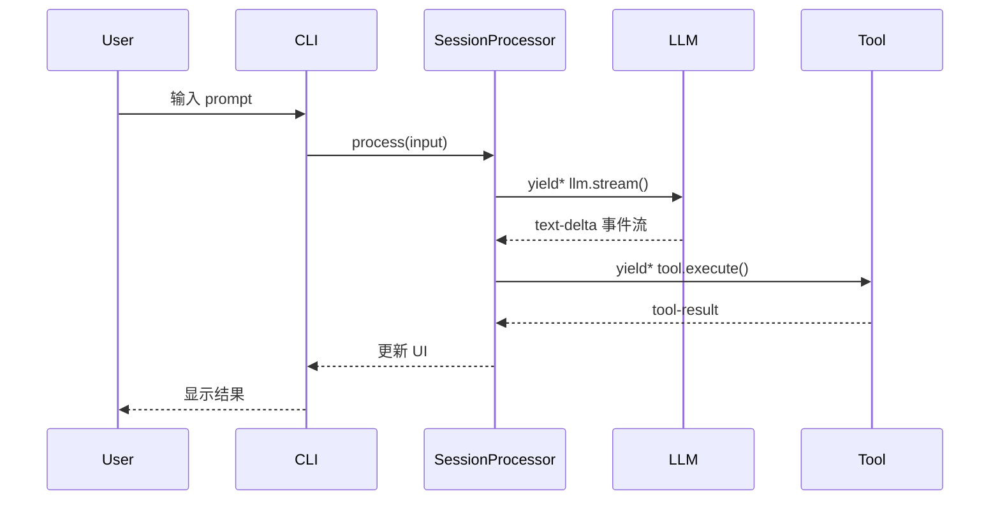

# Implementation Plan: 《Effect-TS 实战：从零构建 OpenCode AI 编程工具》

> **Status**: pending approval
> **Created**: 2026-06-19
> **Base outline**: `docs/book-deep/00-outline-effect-opencode.md`
> **Target directory**: `docs/book-deep/`

---

## Requirements Summary

编写一本深入浅出讲解如何使用 Effect-TS 开发 OpenCode 的书。全书 16 章 + 4 附录，按七大部分组织。面向有 TypeScript 基础的开发者，以 OpenCode 源码为蓝本，用自然语言讲解为主，必要时辅以少量代码和时序图，同时介绍开发人员必须掌握的相关知识与技能。

### 关键约束

1. **语言风格**：自然语言为主，代码为辅（仅关键片段）
2. **图表**：关键流程使用时序图（Mermaid 格式）
3. **目标读者**：TypeScript 开发者（不限于 Java 背景）
4. **与现有内容的关系**：`docs/core/book/` 已有 12 章面向 Java 开发者的内容，本书定位不同——面向更广泛的 TS 开发者，以 opencode 项目本身为主线
5. **技能覆盖**：每章需包含"开发人员必须掌握的知识与技能"小节
6. **Effect-TS 函数讲解**：每章必须包含专门的"Effect-TS 函数详解"小节，讲解该章涉及的 Effect-TS 核心函数的签名、用途、与普通 TypeScript 的对比。Effect-TS 的编程范式与普通 TS 差异巨大（惰性求值、Generator do-notation、Layer 依赖注入、Stream 流处理等），读者若无此讲解将难以理解代码

---

## Acceptance Criteria

- [ ] 16 个章节全部完成，每章保存为 `docs/book-deep/XX-chapter-title.md`
- [ ] 4 个附录完成
- [ ] 每章代码引用指向真实存在的文件和行号
- [ ] 关键流程包含 Mermaid 时序图（至少 8 处）
- [ ] 每章包含"必备知识与技能"小节
- [ ] 每章包含"Effect-TS 函数详解"小节（讲解该章涉及的 Effect 核心函数）
- [ ] 自然语言占比 > 70%，代码片段 < 30%
- [ ] 所有 Effect-TS 概念有通俗解释
- [ ] 全书术语一致（Effect、Layer、Fiber、Stream 等翻译统一）

---

## Writing Principles

### 语言风格

- **先说"为什么"，再说"是什么"，最后说"怎么做"**
- 用生活类比解释抽象概念（如：Effect 是"食谱"，Promise 是"端上桌的菜"）
- 代码片段控制在 15-30 行，只展示关键逻辑
- 避免大段粘贴源码，改为"代码走读"式讲解（指出文件和行号，摘录核心片段）

### 章节结构模板

```markdown
# 第 X 章：标题

> **本章目标**：一句话说明学完能做什么
> **涉及文件**：`packages/xxx/src/xxx.ts`
> **必备知识**：列出需要的前置知识

## X.1 场景引入（自然语言）
[从实际开发场景切入，说明"为什么需要这个"]

## X.2 核心概念（自然语言 + 少量代码）
[讲解核心概念，配合关键代码片段]

## X.3 Effect-TS 函数详解
[本章涉及的 Effect-TS 核心函数，每个函数包含：
 - 函数签名（简化版）
 - 用途说明（一句话）
 - 与普通 TypeScript 的对比（普通 TS 怎么做 → Effect-TS 怎么做）
 - 在 opencode 中的实际使用位置
 至少覆盖 3-5 个函数]

## X.4 实现剖析（代码走读 + 时序图）
[深入 opencode 源码，展示实际实现]

## X.5 开发人员必备知识与技能
[总结本章涉及的技术栈、工具、最佳实践]

## X.6 本章小结
[3-5 句话回顾核心要点]
```

### 时序图规范

使用 Mermaid `sequenceDiagram`，标注关键 Effect 操作（yield*、fork、retry 等）：



---

## Chapter-by-Chapter Plan

### 第一部分：Effect-TS 核心概念与 OpenCode 架构总览

#### 第 1 章：为什么选择 Effect-TS 构建 AI 编程工具

- **内容要点**：
  - AI 编程工具的五大技术挑战（不确定性、并发、持久化、成本、安全）
  - Promise 的四个不足（不可取消、错误丢失、无结构化并发、隐式副作用）
  - Effect<A, E, R> 三维模型通俗解释
  - 惰性求值：从"立即执行"到"描述计算"
  - 代码走读：`processor.ts:86-104` 的 12 个依赖注入
- **Effect-TS 函数详解**：
  - `Effect<A, E, R>` 类型 — 与 `Promise<T>` 的对比
  - `Effect.gen(function* () { ... })` — Generator do-notation，与 `async/await` 的对比
  - `yield*` 操作符 — 展平 Effect 层，与 `await` 的对比
  - `Effect.runPromise` — 惰性求值的"执行按钮"，与 `new Promise(...)` 的对比
  - `Effect.succeed` / `Effect.fail` — 创建成功/失败 Effect
- **时序图**：Promise vs Effect 的错误处理流程对比
- **必备技能**：函数式编程基础概念（纯函数、副作用、单子）
- **预估字数**：3500-4500 字

#### 第 2 章：开发环境与项目结构

- **内容要点**：
  - Monorepo 全景（Turbo + Bun + 20+ 包）
  - 核心包职责：core（基础设施）、opencode（业务逻辑）、llm（AI SDK 集成）
  - Effect v4 关键特性：`Effect.gen` vs `pipe`
  - `/effect` 目录导览：`instance-state.ts`、`runtime.ts`、`bridge.ts`
  - 从 `makeRuntime` 到 `runPromise` 的启动流程
  - Layer 组装：`AppLayer` 合并 40+ 服务的全景图
- **Effect-TS 函数详解**：
  - `Context.Service` — 定义带 Tag 的服务类，与普通 TS `class` 的对比
  - `Layer.effect` / `Layer.provide` / `Layer.mergeAll` — 依赖注入层组装，与手动 `new` 实例化的对比
  - `ManagedRuntime.make` — 从 Layer 创建运行时
  - `pipe` 操作符 — 链式组合 Effect，与 `.then()` 链的对比
  - `Effect.gen` vs `pipe` — 两种编写风格的对比和选择
- **必备技能**：Bun 运行时、Turbo monorepo 工具、Effect 项目结构最佳实践
- **预估字数**：3000-4000 字

---

### 第二部分：LLM 调用核心 —— Session 系统

#### 第 3 章：Session 生命周期管理

- **内容要点**：
  - Session 数据模型：品牌类型（SessionID、MessageID、PartID）
  - Drizzle ORM + SQLite 的 Effect 集成
  - `Session.create()` 完整流程：DB INSERT → EventV2 发布
  - `SynchronizedRef` 保证原子性（对比 Java `@Transactional`）
  - `--continue` 和 `--fork` 的 CLI 实现
  - 代码走读：`run.ts:394-473` session 恢复流程
  - Session 状态机：idle → busy → retry → idle
- **Effect-TS 函数详解**：
  - `SynchronizedRef` — 原子可变状态，与普通 `let` 变量的对比
  - `SynchronizedRef.modify` / `modifyEffect` — 原子读写操作
  - `Effect.fn` / `Effect.fnUntraced` — 命名 Effect 函数（用于追踪和调试）
  - `Schema.TaggedErrorClass` — 带标签的错误类型定义，与普通 `Error` 的对比
  - `Context.Tag` / `Context.Service` — 类型安全的依赖注入 Tag
- **时序图**：用户输入 → busy → LLM 流 → retry(可选) → idle
- **必备技能**：SQLite/Drizzle ORM、品牌类型（Branded Types）、状态机设计
- **预估字数**：4000-5000 字

#### 第 4 章：LLM 流处理 —— SessionProcessor 的核心

- **内容要点**：
  - `SessionProcessor.handle()` 完整链路（`processor.ts:721-789`）
  - `Effect.gen` 编排 16 种 LLM 事件
  - `Stream.tap` + `Stream.takeUntil` + `Stream.runDrain` 流处理模式
  - `LLM.Service` 的 6 个依赖注入（`llm.ts:62-74`）
  - `Effect.all({ concurrency: "unbounded" })` 并行获取 provider/config/auth
  - AI SDK 缓存策略：Map 缓存 LanguageModel
  - 事件分发：text-start → text-delta(多次) → text-end
  - `Session.updatePartDelta()` 增量更新
- **Effect-TS 函数详解**：
  - `Stream.fromAsyncIterable` — 将 AI SDK 的异步迭代器转为 Effect Stream
  - `Stream.tap` — 对每个事件执行副作用（更新 UI），与 `for await` 循环的对比
  - `Stream.takeUntil` — 条件终止流（溢出时提前结束）
  - `Stream.runDrain` — 消费整个流直到结束
  - `Effect.all({ concurrency })` — 结构化并行执行，与 `Promise.all` 的对比
  - `Stream.scoped` + `Effect.acquireRelease` — 资源安全的流包装
- **时序图**：LLM 流事件完整处理链路（从 AI SDK 到 UI 更新）
- **必备技能**：SSE (Server-Sent Events)、Stream 编程模式、增量更新策略
- **预估字数**：4500-5500 字

#### 第 5 章：工具调用系统（Tool System）

- **内容要点**：
  - 工具注册：`tool/` 目录下 10+ 内置工具
  - `ToolRegistry` 的 Effect 封装和懒加载
  - 代码走读：`processor.ts:321-379` tool-call 事件处理 + doom loop 检测
  - 权限控制：`allow` / `deny` / `ask` 三值逻辑
  - `Wildcard.match()` 模式匹配
  - 代码走读：`processor.ts:382-439` tool-result 处理
  - 图片附件规范化（`Image.Service`）
  - 工具执行失败恢复
- **Effect-TS 函数详解**：
  - `Schema.decodeUnknownEffect` — Schema 验证 + Effect 集成，与 `JSON.parse` + 手动校验的对比
  - `Effect.withSpan` — OpenTelemetry 追踪集成
  - `Effect.forEach({ concurrency })` — 并行遍历执行，与 `for` 循环 + `Promise.all` 的对比
  - `Effect.timeout` — 超时控制，与 `AbortController` + `setTimeout` 的对比
  - `Effect.ignore` — 忽略错误继续执行
- **时序图**：LLM 调用工具 → 权限检查 → 执行 → 结果返回的完整流程
- **必备技能**：工具注册模式、权限系统设计、Schema 验证
- **预估字数**：4000-5000 字

---

### 第三部分：Agent 系统与编排

#### 第 6 章：Agent 定义与执行循环

- **内容要点**：
  - Agent 数据模型：`Agent.Info` Schema（`agent.ts:28-49`）
  - `mode` 字段：`subagent` / `primary` / `all`
  - 系统提示模板体系：`generate.txt`、`compaction.txt`、`explore.txt` 等
  - 主循环实现：`run.ts:637-759` 的事件驱动循环
  - `for await (const event of events.stream)` 模式
  - 事件类型处理：message.updated、session.error、permission.asked 等
  - 子 Agent 权限隔离（`subagent-permissions.ts`）
  - `Effect.fork` 管理子 Agent 生命周期
  - Doom Loop 检测：连续 3 次相同 tool-call 触发
- **Effect-TS 函数详解**：
  - `Effect.fork` / `Effect.forkIn` / `Effect.forkScoped` — 三种 Fork 方式的区别和选择
  - `Fiber` — 轻量级绿色线程，与 `Worker` / `child_process` 的对比
  - `Effect.ensuring` — 无论成败都执行的清理逻辑，与 `try/finally` 的对比
  - `Effect.onInterrupt` — 中断处理钩子
  - `Cause.hasInterruptsOnly` — 区分中断和真实错误
- **时序图**：用户输入 → Agent Loop → LLM 流 → 工具调用（多轮）→ 完成
- **必备技能**：Agent 架构设计、提示工程基础、循环检测策略
- **预估字数**：4500-5500 字

#### 第 7 章：多 Agent 协作

- **内容要点**：
  - `task` 工具：Agent 委派子任务
  - Effect Fiber 隔离：每个 Agent 在独立 Fiber 中运行
  - 结果收集与合并策略
  - ACP (Agent Communication Protocol)：`acp/` 目录
  - 基于 `@agentclientprotocol/sdk` 的标准协议
  - Effect Stream 实现 ACP 消息流
  - Plan Mode：Agent 生成计划 → 逐步执行 → 验证
  - `GeneratedAgent` Schema（`agent.ts:51-56`）
- **Effect-TS 函数详解**：
  - `Effect.forkChild` — 父 Fiber 等待子 Fiber 完成
  - `Fiber.join` / `Fiber.interrupt` — 等待/中断 Fiber
  - `Queue` — 并发安全的消息队列，Agent 间通信
  - `Effect.race` — 竞速执行（多个 Agent 取最先完成者）
  - `Scope` — 资源生命周期作用域，子 Agent 的沙箱边界
- **时序图**：主 Agent 委派子任务 → 子 Agent 执行 → 结果返回
- **必备技能**：多 Agent 协作模式、ACP 协议、Fiber 隔离原理
- **预估字数**：3500-4500 字

---

### 第四部分：记忆管理与会话压缩

#### 第 8 章：上下文管理

- **内容要点**：
  - 消息模型：Part 联合类型（TextPart、ToolPart、ReasoningPart、StepPart）
  - 消息增量更新：`updatePartDelta()`
  - 记忆状态机：`memory()` 函数（`core/src/session-message-updater.ts`）
  - 活跃消息索引：activeAssistantIndex、activeCompactionIndex
  - 上下文溢出检测：`isOverflow()` — 20+ 提供商模式匹配
  - 多提供商上下文窗口差异（Anthropic 200K vs OpenAI 128K vs others）
- **Effect-TS 函数详解**：
  - `Schema.Union` / `Schema.Literal` — 联合类型与标签类型定义
  - `Schema.brand` — 品牌类型（SessionID、MessageID 等）
  - `Option` — 可选值处理，与 `null` / `undefined` 的对比
  - `Effect.catchIf` — 条件错误捕获，与 `if (error instanceof X)` 的对比
  - `Config` / `ConfigProvider` — 环境配置读取
- **必备技能**：Token 计算原理、上下文窗口管理、消息模型设计
- **预估字数**：3500-4500 字

#### 第 9 章：会话压缩（Compaction）

- **内容要点**：
  - 为什么需要压缩：上下文窗口有限，长对话信息衰减
  - 压缩策略：`PRUNE_MINIMUM = 20000`、`PRUNE_PROTECT = 40000`
  - 受保护工具（skill）不裁剪
  - `Compaction.generateSummary()` — 调用 LLM 生成摘要
  - `Compaction.apply()` — 替换原始消息为摘要
  - Effect Scope 管理压缩过程中的资源
- **Effect-TS 函数详解**：
  - `Effect.acquireRelease` — 资源获取与释放保证，与 `try-with-resources` 的对比
  - `Scope` — 资源作用域，管理一组资源的生命周期
  - `Effect.addFinalizer` — 注册清理回调
  - `Effect.forkIn(scope)` — 在指定 Scope 中 Fork 后台任务
  - `Stream.runCollect` — 收集流的所有元素为数组
- **时序图**：溢出检测 → 触发压缩 → LLM 摘要 → 消息替换 → 继续对话
- **必备技能**：摘要生成策略、Token 估算、Scope 资源管理
- **预估字数**：3500-4500 字

---

### 第五部分：成本控制与限流

#### 第 10 章：Token 与成本管理

- **内容要点**：
  - Token 统计模型：`getUsage()` — input/output/reasoning/cache_read/cache_write
  - Cost 计算：根据 provider 定价模型
  - 分 tier 定价：标准 / 大上下文（200K+）
  - 缓存分层定价：cache_read vs cache_write
  - `SynchronizedRef` 原子更新用量数据
  - 用量告警：EventV2 发布告警事件
- **Effect-TS 函数详解**：
  - `SynchronizedRef.updateEffect` — 原子更新（读-改-写），与 `let x += delta` 的并发对比
  - `Effect.map` / `Effect.flatMap` — 值转换与链式调用
  - `Effect.sync` — 包装同步操作为 Effect
  - `Effect.try` — 包装可能抛异常的同步操作为 Effect
  - `Config.boolean` / `Config.string` / `Config.withDefault` — 声明式配置
- **必备技能**：LLM 定价模型理解、成本估算、原子状态更新
- **预估字数**：3000-4000 字

#### 第 11 章：限流与重试策略

- **内容要点**：
  - HTTP 429 检测 + `retry-after-ms` header 解析
  - `Effect.Schedule` 自定义重试策略（`retry.ts:34-40`）
  - 指数退避：2s → 4s → 8s（`RETRY_BACKOFF_FACTOR = 2`）
  - 提供商自适应：不同提供商不同重试策略
  - 三层超时架构：chunk-level → request-level → session-level
  - `wrapSSE()` 实现（`core/src/aisdk.ts:11-57`）
- **Effect-TS 函数详解**：
  - `Schedule` — 重试/重复策略抽象，与手写 `for` 循环重试的对比
  - `Schedule.exponential` — 指数退避策略
  - `Schedule.fromStepWithMetadata` — 自定义动态 Schedule
  - `Effect.retry(schedule)` — 按策略重试失败的 Effect
  - `Effect.timeout` — 超时中断，与 `AbortSignal.timeout` 的对比
  - `Duration` — 类型安全的时间间隔，与 `setTimeout` 毫秒数的对比
- **时序图**：LLM 请求 → 429 响应 → 指数退避重试 → 成功/失败
- **必备技能**：HTTP 限流协议、指数退避算法、超时分层设计
- **预估字数**：3500-4500 字

---

### 第六部分：安全围栏与失败恢复

#### 第 12 章：权限系统（Permission Guard）

- **内容要点**：
  - 权限模型：Rule/Action Schema（`permission/index.ts:19-48`）
  - 三值逻辑：`allow` / `deny` / `ask`
  - `Wildcard.match()` 通配符匹配
  - 规则评估（`evaluate.ts`）+ 优先级排序（`arity.ts`）
  - `Permission.ask()` → EventV2 → 用户确认/拒绝
  - `Deferred` 实现请求-回复模式
  - 代码走读：`run.ts:736-756` 权限的 CLI 处理
  - 安全围栏最佳实践：白名单、黑名单、上下文溢出安全
- **Effect-TS 函数详解**：
  - `Deferred` — 一次性异步协调原语，与 `Promise` 的对比（Deferred 可中断、类型安全）
  - `Deferred.make` / `Deferred.succeed` / `Deferred.fail` / `Deferred.await`
  - `Effect.ensuring(cleanup, effect)` — 保证清理逻辑执行
  - `Effect.catchTag` — 按标签精确捕获错误，与 `try/catch` + `instanceof` 的对比
  - `PubSub` — 发布订阅，与 `EventEmitter` 的对比
- **时序图**：工具调用 → 权限检查 → Deferred 等待 → 用户确认 → 执行
- **必备技能**：权限模型设计、通配符匹配算法、安全围栏策略
- **预估字数**：4000-5000 字

#### 第 13 章：失败恢复与容错

- **内容要点**：
  - Effect 错误处理三层：预期错误（E）、缺陷（Defect）、中断（Interrupt）
  - 会话级恢复：`Effect.retry` + `SessionRetry.policy`
  - 错误分类：context_overflow / api_error / rate_limit
  - 快照系统：`Snapshot.track()` → `Snapshot.patch()` → `Snapshot.revert()`
  - Effect Scope 自动管理快照生命周期
  - 优雅降级：提供商不可用 → 备选提供商；模型限流 → 小模型
- **Effect-TS 函数详解**：
  - `Cause` — 错误原因类型，区分 Error / Defect / Interrupt
  - `Cause.hasInterruptsOnly` / `Cause.squash` — 中断检测与原因展平
  - `Effect.catchCauseIf` — 按 Cause 条件捕获
  - `Effect.orDie` — 将错误转为 Defect（不可恢复）
  - `Exit` — Effect 执行结果（Success / Failure），与 `try/catch` 的对比
  - `Effect.acquireRelease` — 资源安全获取与释放（快照的 git 操作）
- **时序图**：LLM 调用失败 → 错误分类 → 重试/降级/回滚决策树
- **必备技能**：错误分类策略、快照/回滚模式、优雅降级设计
- **预估字数**：4000-5000 字

---

### 第七部分：高级 Effect 模式在 OpenCode 中的运用

#### 第 14 章：并发控制与 Fiber 管理

- **内容要点**：
  - 三种并发场景：并行工具执行、后台摘要生成、多会话处理
  - `Effect.forEach({ concurrency: "unbounded" })` 的实际使用
  - `Effect.forkIn` / `forkScoped` / `forkChild` 的区别和选择
  - `InstanceState`：按目录隔离的服务实例（`ScopedCache` 实现）
  - `EffectBridge`：原生回调与 Effect 的双向桥接
  - `@parcel/watcher`、`node-pty` 等原生库的接入
- **Effect-TS 函数详解**：
  - `Fiber` — 用户态绿色线程，与 OS 线程/Worker 的对比
  - `Fiber.join` / `Fiber.interrupt` / `Fiber.await` — Fiber 生命周期控制
  - `ScopedCache` — 带 Scope 的缓存，自动清理
  - `Semaphore` — 并发许可控制，与 `Mutex` / `synchronized` 的对比
  - `Context.Reference` — Fiber 本地上下文传播
  - `Effect.callback` — 将回调式 API 转为 Effect
- **必备技能**：Fiber 模型理解、并发控制策略、Effect 与 Node.js 生态桥接
- **预估字数**：4000-5000 字

#### 第 15 章：事件驱动架构

- **内容要点**：
  - EventV2：基于 PubSub 的全局事件总线
  - SessionEvent 类型体系：Created、Text.Started、Tool.Called、Step.Ended…
  - sync handler vs subscribe 的选择策略
  - Bus.Service：实例级事件总线
  - EventV2Bridge：连接 core 和 opencode 的事件系统
  - 审计日志通过 EventV2.sync 同步写入
- **Effect-TS 函数详解**：
  - `PubSub` — 发布订阅原语，与 Node `EventEmitter` 的对比
  - `PubSub.unbounded` / `PubSub.publish` / `PubSub.subscribe`
  - `Stream.fromPubSub` — 将 PubSub 转为 Effect Stream
  - `Stream.runForEach` — 对每个流事件执行 Effect
  - `Stream.fromSubscription` — 从 PubSub 订阅创建 Stream
  - `Effect.forkScoped` — 在 Scope 中 Fork 后台订阅处理器
- **时序图**：事件从产生 → PubSub 发布 → sync 处理 → subscribe 消费的完整链路
- **必备技能**：PubSub 模式、事件溯源基础、审计日志设计
- **预估字数**：3500-4500 字

#### 第 16 章：测试与调试

- **内容要点**：
  - Effect 的可测试性：替换 Layer 注入 Mock 依赖
  - `Global.layerWith()` 覆盖文件系统路径
  - 测试文件结构：`test/session/`、`test/tool/`、`test/agent/`
  - `TestClock` 测试重试策略
  - 调试技巧：`Effect.fn` 命名追踪、`--log-level DEBUG`、`--print-logs`
  - `opencode debug agent` 测试特定 Agent
- **Effect-TS 函数详解**：
  - `Layer.succeed` — 创建静态值 Layer（Mock 注入）
  - `TestClock` — 模拟时间，与 `jest.useFakeTimers()` 的对比
  - `Effect.provide` / `Effect.provideService` — 覆盖依赖
  - `Effect.runSync` — 同步执行纯 Effect（测试中快速验证）
  - `Effect.runPromiseExit` — 获取 Exit 结果（不抛异常，安全检查）
  - `Effect.withSpan` / `Effect.fn` — 命名追踪与 OpenTelemetry 集成
- **必备技能**：Effect 测试框架、Mock 策略、调试工具链
- **预估字数**：3000-4000 字

---

### 附录

#### 附录 A：OpenCode 配置详解
- 完整配置项说明（providers、model、experimental 等）
- 预估字数：1000-1500 字

#### 附录 B：Effect-TS API 速查表
- 常用 API 分类速查（Effect、Layer、Stream、Schedule、Fiber、Ref 等）
- 预估字数：1500-2000 字

#### 附录 C：部署指南
- Docker Compose 部署、开发环境搭建
- 预估字数：1000-1500 字

#### 附录 D：错误代码参考
- 常见错误类型、来源、处理方式
- 预估字数：800-1000 字

---

## Implementation Steps

### Phase 1: 准备工作
1. 确认 Effect-TS 版本和关键依赖版本 → verify: 与 `packages/opencode/package.json` 一致
2. 验证大纲中所有代码引用（文件路径 + 行号）的准确性 → verify: 每个引用可定位到实际代码
3. 建立术语表（中英文对照，全书统一） → verify: 术语表完成

### Phase 2: 第一部分（第 1-2 章）
4. 写第 1 章 → verify: 对照大纲检查覆盖度，代码引用准确
5. 写第 2 章 → verify: 对照大纲检查覆盖度，代码引用准确

### Phase 3: 第二部分（第 3-5 章）
6. 写第 3 章 → verify: 时序图正确，代码引用准确
7. 写第 4 章 → verify: 时序图正确，流处理模式讲解清晰
8. 写第 5 章 → verify: 工具系统覆盖完整

### Phase 4: 第三部分（第 6-7 章）
9. 写第 6 章 → verify: Agent Loop 时序图正确
10. 写第 7 章 → verify: 多 Agent 协作流程清晰

### Phase 5: 第四部分（第 8-9 章）
11. 写第 8 章 → verify: 消息模型讲解完整
12. 写第 9 章 → verify: 压缩时序图正确

### Phase 6: 第五部分（第 10-11 章）
13. 写第 10 章 → verify: Token 计算逻辑准确
14. 写第 11 章 → verify: 重试策略代码引用准确

### Phase 7: 第六部分（第 12-13 章）
15. 写第 12 章 → verify: 权限时序图正确
16. 写第 13 章 → verify: 错误处理层次清晰

### Phase 8: 第七部分（第 14-16 章）
17. 写第 14 章 → verify: Fiber 管理模式讲解清晰
18. 写第 15 章 → verify: 事件驱动架构完整
19. 写第 16 章 → verify: 测试调试技巧实用

### Phase 9: 附录 + 终审
20. 写附录 A-D → verify: 内容准确完整
21. 全书通读，术语一致性检查 → verify: 无术语冲突
22. 所有代码引用最终验证 → verify: 100% 引用可定位

---

## Risks and Mitigations

| 风险 | 影响 | 缓解措施 |
|------|------|----------|
| 代码引用行号因版本更新偏移 | 读者找不到对应代码 | 引用时标注 commit hash 或使用符号名而非行号 |
| 与 `docs/core/book/` 内容重叠 | 读者困惑 | 明确两本书定位差异：core/book 面向 Java 开发者对比教学，book-deep 面向 TS 开发者以 opencode 为主线 |
| Effect-TS API 仍在演进（beta 版本） | 部分 API 描述过时 | 聚焦核心概念而非具体 API 细节，前言中声明版本 |
| 章节篇幅失控 | 部分章节过长或过短 | 每章写完后检查字数，控制在 2500-5000 字范围 |
| 时序图过于复杂 | 读者难以理解 | 每个时序图控制在 10 个参与者以内，关键步骤加注释 |

---

## Verification Steps

1. **每章完成后**：对照大纲检查覆盖度，确保所有子节都有对应内容
2. **代码引用验证**：使用 `codegraph_node` 工具验证每个文件路径和符号存在
3. **时序图验证**：确保 Mermaid 语法正确，可在 GitHub/GitLab 渲染
4. **术语一致性**：全书搜索关键术语，确保翻译统一
5. **自然语言占比**：抽查章节，确保代码片段不超过 30%

---

## Estimated Effort

| 部分 | 章节数 | 预估总字数 | 预估耗时 |
|------|--------|-----------|---------|
| 第一部分 | 2 | 6,500-8,500 | 3-4h |
| 第二部分 | 3 | 12,500-16,000 | 5-6h |
| 第三部分 | 2 | 8,000-10,000 | 3-4h |
| 第四部分 | 2 | 7,000-9,000 | 3-4h |
| 第五部分 | 2 | 6,500-8,500 | 3-4h |
| 第六部分 | 2 | 8,000-10,000 | 3-4h |
| 第七部分 | 3 | 10,500-13,500 | 4-5h |
| 附录 | 4 | 4,300-6,000 | 1-2h |
| **合计** | **20** | **~63,000-81,000** | **25-33h** |
