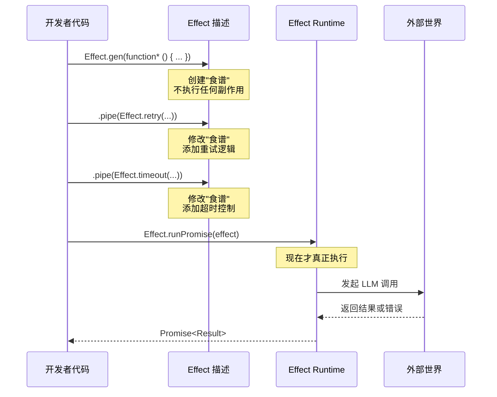

# 第 1 章：为什么选择 Effect-TS 构建 AI 编程工具

> **本章目标**：理解 AI 编程工具面临的技术挑战，认识 Promise 的局限性，掌握 Effect-TS 的核心设计思想——三维类型模型与惰性求值。
> **涉及文件**：`packages/opencode/src/session/processor.ts`
> **必备知识**：TypeScript 基础（async/await、Promise、泛型）

---

## 1.1 AI 编程工具的技术挑战

如果你正在开发一个 AI 编程助手——比如 OpenCode 这样的工具——你很快就会发现自己面对的不是普通的 Web 应用。AI 编程工具面临五个普通 CRUD 应用很少遇到的挑战：

**挑战一：LLM 调用的不确定性。** 大语言模型不是数据库。你发一个请求过去，可能得到正常的回复，可能得到"API Key 过期"的错误，可能因为模型限流被拒绝，也可能请求发出去了但响应流在中途断开。更麻烦的是，这些失败的处理方式各不相同——有些需要重试，有些需要提示用户，有些需要切换到备选模型。

**挑战二：多 Agent 协作的并发模型。** OpenCode 不是"一个用户对一个 AI"的简单对话。它有一个主 Agent 负责理解用户意图，有子 Agent 负责搜索代码、读取文件、执行命令。这些 Agent 同时运行，彼此之间需要通信、等待、取消。一个子 Agent 卡住了，主 Agent 不能也跟着卡住。

**挑战三：会话管理与上下文的持久化。** 一次编程对话可能持续几个小时，产生几百条消息。LLM 的上下文窗口是有限的（8K 到 200K token 不等），你需要决定哪些消息保留、哪些压缩、哪些丢弃。这些决策直接影响 AI 的回答质量。

**挑战四：Token 成本控制。** 每次 LLM 调用都在花钱。input token、output token、reasoning token、cache read、cache write——不同提供商的定价模型各不相同。你需要精确追踪每一笔消耗，在成本和质量之间找到平衡。

**挑战五：安全围栏。** AI 编程工具可以读写文件、执行 shell 命令、访问网络。你必须在"让 AI 足够强大以完成任务"和"防止 AI 造成破坏"之间建立精细的权限控制——不是简单的"允许"或"禁止"，而是根据操作类型、文件路径、命令内容动态判断。

这五个挑战有一个共同点：它们都要求你对**计算过程本身**进行精细的控制——控制它何时开始、何时取消、失败后如何处理、依赖哪些资源。而传统的 Promise + async/await 模型，恰恰在这些方面力不从心。

---

## 1.2 Promise 的四个不足

Promise 是 JavaScript 异步编程的基石。但它设计于 2015 年，目标场景是"发一个 HTTP 请求，拿到响应，渲染到页面"。当面对 AI 编程工具的复杂需求时，Promise 暴露出四个结构性不足。

### 不足一：无法优雅取消

一旦创建了一个 Promise，它就"发射"了——你无法从外部取消它。即使用 `AbortController`，也只能取消底层的 fetch 请求，Promise 本身仍然会走完它的生命周期。

想象一个场景：用户输入了一个问题，OpenCode 开始调用 LLM。LLM 的响应是流式的，可能需要 30 秒才能完成。但 5 秒后，用户意识到问题写错了，按下了 Escape 键。在 Promise 模型下，你能做的只是忽略最终结果——底层的 HTTP 连接可能还在传输数据，token 还在消耗，但你什么都做不了。

### 不足二：错误类型丢失

`catch (e: unknown)`——这是 TypeScript 中 Promise 错误处理的标配写法。`unknown` 意味着编译器不知道错误是什么类型。是 API Key 过期？是网络超时？是模型限流？编译器帮不了你，你只能手工解析错误消息字符串。

```typescript
// 普通 TypeScript：错误类型完全丢失
try {
  const reply = await callLLM(prompt)
} catch (e: unknown) {
  // e 是什么？不知道。只能猜。
  if (e instanceof Error && e.message.includes("429")) {
    // 可能是限流...
  }
}
```

### 不足三：缺乏结构化并发

`Promise.all` 可以并行执行多个 Promise，但它的语义是"全部成功或全部失败"——一个 Promise 失败，其他 Promise 不会被自动清理，它们继续在后台运行，消耗资源。更麻烦的是，你无法表达"这组 Promise 的生命周期应该绑定在一起"——没有父子关系，没有级联取消。

### 不足四：隐式副作用

看这个函数签名：

```typescript
async function generateReply(prompt: string): Promise<string>
```

你能从这个签名看出什么？它需要调用 LLM API 吗？它需要读取配置文件吗？它需要访问数据库吗？你完全看不出来。`Promise<string>` 只告诉你"最终会返回一个 string 或出错"，但出什么错、依赖什么资源——这些信息全部丢失在实现细节里。

---

## 1.3 Effect-TS 的核心思想

Effect-TS 解决上述问题的方式，可以用一句话概括：**把"执行计算"和"描述计算"分开**。

### 三维类型模型：`Effect<A, E, R>`

Effect 的核心数据类型是 `Effect<A, E, R>`，三个类型参数分别代表：

| 参数 | 含义 | 类比 |
|------|------|------|
| `A` (Success) | 成功时返回的值 | Promise 的 `<T>` |
| `E` (Error) | 可能失败的错误类型 | Promise 丢失了这部分信息 |
| `R` (Requirements) | 需要的依赖 | Promise 完全缺失这部分 |

一个具体的例子：

```typescript
// 普通 TypeScript
async function generateReply(prompt: string): Promise<string>
// 你能知道的：返回 string 或出错（什么错？不知道）

// Effect-TS
function generateReply(prompt: string): Effect.Effect<string, APIError | RateLimitError, LLMService>
// 你能知道的：
//   - 成功时返回 string
//   - 可能因 APIError 或 RateLimitError 失败
//   - 需要 LLMService 这个依赖
```

这个三维模型不是语法糖——它改变了你编写代码的方式。错误类型成为编译期检查的一部分，依赖成为函数签名的一部分。你不再需要"猜"一个函数可能出什么错、需要什么资源——类型系统替你记住了这些信息。

### 惰性求值：Effect 是"食谱"，Promise 是"端上桌的菜"

这是理解 Effect-TS 最关键的一点。

当你写 `new Promise((resolve) => resolve(42))` 时，Promise 立即开始执行。当你写 `Effect.succeed(42)` 时，你只是创建了一个**描述**——"一个会成功返回 42 的计算"。这个计算还没有执行，它只是一段蓝图。

```typescript
// Promise：创建即执行
const promise = new Promise((resolve) => {
  console.log("我立即执行了！")
  resolve(42)
})

// Effect：创建只是描述
const effect = Effect.succeed(42)
// 什么都没发生。effect 只是一个"食谱"。

// 只有当你调用 runPromise 时，它才真正执行
Effect.runPromise(effect) // 现在才执行
```

这种惰性带来了巨大的灵活性。因为 Effect 只是描述，你可以在执行之前对它进行任意组合和变换——添加重试逻辑、添加超时控制、替换依赖、捕获特定错误——所有这些操作都只是修改"食谱"，不产生任何副作用。

---

## 1.4 Effect-TS 函数详解

本章涉及五个入门级核心函数。理解它们是阅读后续所有 opencode 源码的基础。

### `Effect<A, E, R>` — 核心类型

```
类型签名（简化）: Effect<Success, Error, Requirements>
```

**用途**：描述一个可能成功（返回 A）、可能失败（抛出 E）、需要依赖（R）的计算。

**与普通 TypeScript 的对比**：

| 场景 | 普通 TypeScript | Effect-TS |
|------|----------------|-----------|
| 成功返回字符串 | `Promise<string>` | `Effect<string, never, never>` |
| 可能失败 | `Promise<string>`（错误类型丢失） | `Effect<string, MyError, never>` |
| 需要数据库 | 签名看不出来 | `Effect<string, MyError, DatabaseService>` |

**在 opencode 中的使用**：几乎每个函数都返回 `Effect`。例如 `Session.create()` 返回 `Effect<Session, SessionError, SessionDependencies>`。

### `Effect.gen` — Generator do-notation

```
类型签名（简化）: Effect.gen(function* (_) { ... }): Effect<A, E, R>
```

**用途**：用类似 `async/await` 的同步风格编写 Effect 代码。`function*` 是 Generator 函数，`yield*` 展平嵌套的 Effect。

**与普通 TypeScript 的对比**：

```typescript
// 普通 TypeScript: async/await
async function process(prompt: string) {
  const config = await loadConfig()        // await 展平 Promise
  const reply = await callLLM(prompt, config)
  return reply
}

// Effect-TS: Effect.gen + yield*
const process = Effect.gen(function* (_) {
  const config = yield* _(loadConfig())    // yield* 展平 Effect
  const reply = yield* _(callLLM(prompt, config))
  return reply
})
```

关键区别：`await` 丢失错误类型，`yield*` 保留错误类型。`await` 无法取消，`yield*` 所在的 Fiber 可以被中断。

**在 opencode 中的使用**：`SessionProcessor.handle()` 整个方法就是一个巨大的 `Effect.gen` 块（`processor.ts:721-789`），编排了 16 种 LLM 事件的处理逻辑。

### `yield*` — 展平操作符

```
语法: yield* _(effect)
```

**用途**：从 Generator 中"提取"Effect 的结果。如果 Effect 失败，`yield*` 会传播错误（类似 `await` 传播 Promise 拒绝）。如果 Effect 需要依赖，`yield*` 会从当前 Context 中查找。

**与普通 TypeScript 的对比**：

```typescript
// await: 展平 Promise，但错误类型变成 unknown
const result = await somePromise

// yield*: 展平 Effect，错误类型完整保留
const result = yield* _(someEffect)
```

**在 opencode 中的使用**：`processor.ts:91-104` 连续 12 个 `yield*` 注入所有依赖服务。

### `Effect.runPromise` — 执行按钮

```
类型签名（简化）: Effect.runPromise(effect: Effect<A, E, R>): Promise<A>
```

**用途**：将惰性的 Effect 描述"激活"为实际执行的 Promise。这是 Effect 世界和 Promise 世界的边界。

**与普通 TypeScript 的对比**：

```typescript
// 普通 TS: new Promise 立即执行
const p = new Promise((resolve) => { /* 立即执行 */ })

// Effect: 先描述，后执行
const e = Effect.succeed(42)     // 只是描述，什么都没发生
const result = await Effect.runPromise(e)  // 现在才执行
```

**在 opencode 中的使用**：`makeRuntime().runPromise()` 是所有 Effect 应用的入口点。

### `Effect.succeed` / `Effect.fail` — 创建 Effect

```
类型签名（简化）:
  Effect.succeed<A>(value: A): Effect<A, never, never>
  Effect.fail<E>(error: E): Effect<never, E, never>
```

**用途**：创建"立即成功"或"立即失败"的 Effect。这是最简单的 Effect 构造器。

**与普通 TypeScript 的对比**：

```typescript
// 普通 TS
const success = Promise.resolve(42)
const failure = Promise.reject(new Error("boom"))

// Effect-TS
const success = Effect.succeed(42)
const failure = Effect.fail(new APIError({ reason: "key_expired" }))
```

关键区别：`Effect.fail` 保留了错误类型（`APIError`），`Promise.reject` 丢失了类型。

---

## 1.5 实现剖析：SessionProcessor 的 12 层依赖注入

让我们打开 `packages/opencode/src/session/processor.ts`，看看 Effect-TS 在实际项目中是什么样子。

```typescript
// processor.ts:88-104 — SessionProcessor 的 Layer 定义
export const layer = Layer.effect(
  Service,
  Effect.gen(function* () {
    const session = yield* Session.Service       // 依赖 1
    const config = yield* Config.Service         // 依赖 2
    const bus = yield* Bus.Service               // 依赖 3
    const snapshot = yield* Snapshot.Service     // 依赖 4
    const agents = yield* Agent.Service          // 依赖 5
    const llm = yield* LLM.Service               // 依赖 6
    const permission = yield* Permission.Service // 依赖 7
    const plugin = yield* Plugin.Service         // 依赖 8
    const summary = yield* SessionSummary.Service// 依赖 9
    const scope = yield* Scope.Scope             // 依赖 10
    const status = yield* SessionStatus.Service  // 依赖 11
    const image = yield* Image.Service           // 依赖 12
    const events = yield* EventV2Bridge.Service  // 依赖 13
    const flags = yield* RuntimeFlags.Service    // 依赖 14
    // ... 使用这些依赖构建 SessionProcessor 实例
  })
)
```

这段代码展示了 Effect-TS 依赖注入的核心模式：

1. **`Layer.effect(Service, Effect.gen(...))`** — 定义一个"层"，它描述了如何从其他服务构建 `SessionProcessor` 服务
2. **`yield* Session.Service`** — 从当前 Context 中提取 `Session` 服务。这不是 `new Session()`，不是 `import`，不是全局变量——它是类型安全的依赖声明
3. **14 个依赖** — 每个都是显式声明的。如果你忘记提供某个依赖，不是运行时崩溃，而是**编译期报错**

对比一下，如果用普通 TypeScript 写同样的东西：

```typescript
// 普通 TypeScript：依赖来源完全不可见
class SessionProcessor {
  process(input: Input) {
    // session 从哪来的？构造函数？全局变量？import？
    const result = session.create(...)
    // config 从哪来的？
    const model = config.getModel(...)
    // 如果 config 是 undefined，这里就崩了——编译期不会告诉你
  }
}
```

Effect-TS 的依赖注入让"这个类需要什么"成为类型签名的一部分，而不是隐藏在构造函数或全局状态里。

### 时序图：Effect 的惰性求值流程



---

## 1.6 开发人员必备知识与技能

要理解本章内容并在 opencode 项目中高效工作，你需要掌握：

1. **TypeScript 泛型基础** — `Effect<A, E, R>` 的三个类型参数是理解整个 Effect 生态的钥匙。如果你对 `<T>` 感到陌生，建议先复习 TypeScript 泛型。

2. **Generator 函数概念** — `function*` 和 `yield` 是 ES6 的特性。Effect.gen 基于 Generator 实现了类似 `async/await` 的语法。理解 Generator 的"暂停-恢复"模型有助于理解 Fiber 的中断机制。

3. **函数式编程基础** — 纯函数（给定相同输入，永远返回相同输出）、副作用（修改外部状态、网络请求、文件读写）、惰性求值（描述计算但不立即执行）。这些概念在 Effect-TS 中无处不在。

4. **依赖注入思想** — 如果你用过 Spring Boot 的 `@Autowired` 或 Angular 的 DI，Effect 的 Layer 系统是同样的思想但更类型安全。核心原则：**对象不创建自己的依赖，依赖从外部提供**。

---

## 1.7 本章小结

- AI 编程工具面临五大挑战：LLM 不确定性、多 Agent 并发、会话持久化、成本控制、安全围栏
- Promise 有四个结构性不足：无法取消、错误类型丢失、缺乏结构化并发、隐式副作用
- Effect-TS 的核心创新是**惰性求值**——Effect 是"食谱"不是"菜"，执行前可以任意组合变换
- `Effect<A, E, R>` 三维模型让成功值、错误类型、依赖需求全部成为编译期可见的类型信息
- `Effect.gen` + `yield*` 提供了类似 async/await 的书写体验，但保留了类型安全和可中断性
- opencode 的 `SessionProcessor` 通过 14 个 `yield*` 显式声明所有依赖——这是工业级 Effect 应用的典型模式
