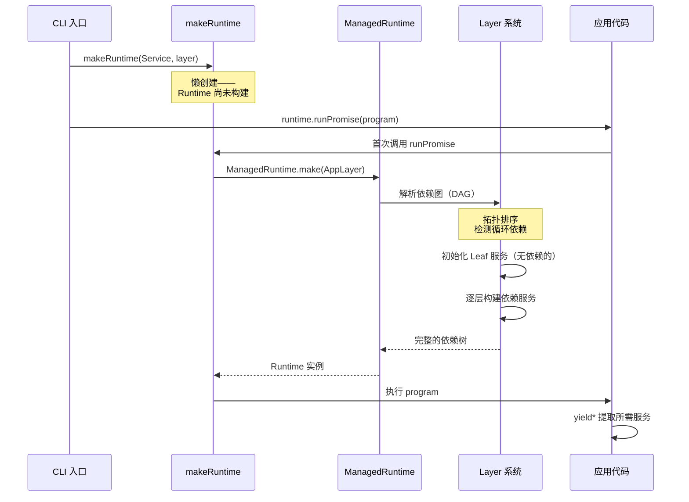

# 第 2 章：开发环境与项目结构

> **本章目标**：理解 opencode 的 monorepo 架构，掌握 Effect-TS 项目的标准结构——Layer 组装、Runtime 创建、服务定义模式。
> **涉及文件**：`packages/opencode/src/effect/app-runtime.ts`、`run-service.ts`、`instance-state.ts`
> **必备知识**：npm/pnpm 包管理基础、TypeScript 项目结构

---

## 2.1 项目架构全景

opencode 是一个典型的 **monorepo**（单一仓库多包）项目。打开 `packages/` 目录，你会看到 20+ 个子包：

```
packages/
├── core/          # 基础设施：EventV2、AI SDK 桥接、文件系统、Schema 工具
├── opencode/      # 业务逻辑：Session、Agent、Tool、Permission、CLI
├── llm/           # AI SDK 集成层：多提供商适配
├── app/           # 前端 UI（SolidJS）
├── ui/            # UI 组件库
├── desktop/       # Electron 桌面应用
├── web/           # Web 前端
├── sdk/           # 对外 SDK
├── plugin/        # 插件系统
├── enterprise/    # 企业版功能
├── identity/      # 身份认证
├── function/      # 函数式工具
├── slack/         # Slack 集成
├── storybook/     # UI 组件文档
├── script/        # 构建脚本
├── console/       # 控制台
├── containers/    # Docker 容器
├── extensions/    # 编辑器扩展
├── http-recorder/ # HTTP 录制
├── summary/       # 文档摘要
└── generated/     # 自动生成文件
```

但作为开发者，你只需要重点关注三个核心包：

| 包 | npm 名 | 职责 |
|----|--------|------|
| `core` | `@opencode-ai/core` | 基础设施层：EventV2 事件总线、AI SDK 桥接、文件系统抽象、Schema 工具、npm 工具 |
| `opencode` | `opencode` | 业务逻辑层：Session 管理、Agent 系统、Tool 注册、Permission 控制、CLI 入口 |
| `llm` | `@opencode-ai/llm` | AI SDK 集成层：多提供商适配（Anthropic、OpenAI、Google、Groq 等 20+） |

依赖方向是单向的：`opencode` → `core`，`opencode` → `llm`。`core` 不依赖 `opencode`，`llm` 不依赖 `opencode`。这种分层保证了基础设施的独立性和可测试性。

构建工具链是 **Turbo + Bun**。Turbo 负责 monorepo 的编排（缓存、并行构建），Bun 是 JavaScript 运行时（替代 Node.js），提供更快的启动速度和原生 TypeScript 支持。

---

## 2.2 Effect-TS 版本与关键依赖

opencode 使用 **Effect v4 (4.0.0-beta.65)**。虽然版本号带 "beta"，但核心概念（Effect、Layer、Schema、Stream、Fiber）已经稳定。本书关注的是这些核心概念，而非某个具体版本的 API 细节。

### Effect.gen vs pipe：两种编写风格

Effect-TS 提供了两种编写 Effect 代码的方式：

**方式一：`pipe` 链式调用**

```typescript
// pipe 风格：数据从左到右流经一系列函数
const program = pipe(
  Effect.succeed(42),
  Effect.map((n) => n * 2),
  Effect.flatMap((n) => Effect.succeed(n + 1)),
)
```

**方式二：`Effect.gen` Generator 语法**

```typescript
// Effect.gen 风格：类似 async/await 的同步写法
const program = Effect.gen(function* (_) {
  const n = yield* _(Effect.succeed(42))
  const doubled = n * 2
  return doubled + 1
})
```

opencode 项目中**两种风格都在使用**，但各有侧重：

- **`Effect.gen`** 用于服务实现（Layer 构建、业务逻辑）——因为逻辑复杂，Generator 语法更易读
- **`pipe`** 用于简单组合（添加重试、超时、错误处理）——因为链式调用更简洁

一个经验法则：如果逻辑超过 5 行，用 `Effect.gen`；如果只是给现有 Effect 添加一个修饰（如 `.pipe(Effect.timeout(...))`），用 `pipe`。

---

## 2.3 `/effect` 目录：opencode 的 Effect 基础设施

`packages/opencode/src/effect/` 目录包含 12 个文件，它们是整个 opencode 应用的 Effect 基础设施。理解它们的作用是阅读源码的前提：

| 文件 | 作用 | 关键导出 |
|------|------|----------|
| `app-runtime.ts` | 组装所有服务的 `AppLayer`（40+ 服务合并） | `AppLayer` |
| `bootstrap-runtime.ts` | 启动阶段的轻量 Runtime（仅加载必需服务） | `BootstrapLayer` |
| `run-service.ts` | 从 Layer 创建 `makeRuntime`（runSync/runPromise/runFork） | `makeRuntime`, `attach` |
| `instance-state.ts` | 按目录隔离的缓存状态（基于 `ScopedCache`） | `InstanceState.make` |
| `instance-ref.ts` | Fiber 本地上下文引用（`InstanceRef`、`WorkspaceRef`） | `InstanceRef`, `WorkspaceRef` |
| `instance-registry.ts` | 全局实例注册表（追踪所有活跃项目目录） | `InstanceRegistry` |
| `bridge.ts` | Effect ↔ Promise 双向桥接（保留上下文） | `EffectBridge.make` |
| `runner.ts` | 基于 `SynchronizedRef` 的状态机（Idle/Running/Shell） | `Runner` |
| `config-service.ts` | 从 `Config.*` 定义自动生成 `Context.Service` | `ConfigService.Service` |
| `service-use.ts` | Proxy 模式的服务访问器 | `serviceUse` |
| `runtime-flags.ts` | 运行时特性开关（20+ 配置项） | `RuntimeFlags.Service` |
| `promise.ts` | Promise 工具函数 | — |

其中最重要的三个文件是 `app-runtime.ts`、`run-service.ts` 和 `instance-state.ts`——它们构成了 opencode 的"心脏"：如何启动、如何执行、如何隔离。

---

## 2.4 Effect-TS 函数详解

### `Context.Service` — 定义带 Tag 的服务

```
类型签名（简化）:
  class Service extends Context.Service<Service, Interface>()("@scope/ServiceName") {}
```

**用途**：创建一个"服务类"，它同时是一个 `Context.Tag`（用于依赖注入）和一个 TypeScript 接口（用于类型检查）。

**与普通 TypeScript 的对比**：

```typescript
// 普通 TS：定义一个类，依赖来源不明
class SessionProcessor {
  private session: Session  // 从哪来的？构造函数？import？
  process(input: Input) { this.session.create(...) }
}

// Effect-TS：先定义接口，再定义 Service Tag
interface SessionProcessorInterface {
  readonly process: (input: Input) => Effect.Effect<Output, Error, Dependencies>
}
class SessionProcessorService extends Context.Service<SessionProcessorService, SessionProcessorInterface>()(
  "@opencode/SessionProcessor"
) {}
// SessionProcessorService 现在是一个 Tag——可以用 yield* 提取
```

关键区别：普通 TS 的类是一个"值"（需要 `new`），Effect 的 Service 是一个"Tag"（通过 `yield*` 从 Context 中提取，由 Layer 负责提供）。

**在 opencode 中的使用**：每个服务模块都定义了一个 `Context.Service`。例如 `SessionProcessor.Service`、`LLM.Service`、`Permission.Service` 等。

### `Layer.effect` / `Layer.provide` / `Layer.mergeAll` — 依赖注入层

```
类型签名（简化）:
  Layer.effect(Service, Effect.gen(function* () { ... })): Layer<Service, E, Dependencies>
  Layer.provide(layer, dependencyLayer): Layer<Service, E, RemainingDependencies>
  Layer.mergeAll(layer1, layer2, ...): Layer<MergedServices, MergedErrors, MergedDependencies>
```

**用途**：`Layer.effect` 创建一个"层"（描述如何从其他服务构建目标服务），`Layer.provide` 满足一个层对某个依赖的需求，`Layer.mergeAll` 合并多个独立的层。

**与普通 TypeScript 的对比**：

```typescript
// 普通 TS：手动管理依赖
const config = new Config()
const session = new Session(config)
const llm = new LLM(config)
const processor = new SessionProcessor(session, config, llm)
// 问题：依赖顺序必须手动保证，循环依赖难以检测

// Effect-TS：声明式 Layer 组装
const SessionLayer = Layer.effect(Session.Service, Effect.gen(function* () {
  const config = yield* Config.Service
  return Session.Service.of({ /* ... */ })
}))
const AppLayer = Layer.mergeAll(SessionLayer, ConfigLayer, LLMLayer, ProcessorLayer)
// Layer 系统自动解析依赖图，循环依赖在编译期报错
```

**在 opencode 中的使用**：`app-runtime.ts` 的 `AppLayer` 用 `Layer.mergeAll` 合并了 40+ 个服务层，然后用 `Layer.provideMerge` 注入 `InstanceLayer` 和 `Observability.layer`。

### `ManagedRuntime.make` — 从 Layer 创建运行时

```
类型签名（简化）:
  ManagedRuntime.make(layer, options?): ManagedRuntime<Services, Errors>
```

**用途**：将一个 Layer（依赖图）"编译"为可执行的 Runtime。Runtime 是 Effect 世界的"执行引擎"。

**与普通 TypeScript 的对比**：

```typescript
// 普通 TS：没有 Runtime 概念，代码直接执行
const result = await process(input)  // 依赖从哪来？全局？import？

// Effect-TS：先构建 Runtime，再在 Runtime 中执行
const runtime = ManagedRuntime.make(AppLayer)
const result = await runtime.runPromise(program)
// Runtime 封装了所有依赖，program 通过 yield* 获取它们
```

**在 opencode 中的使用**：`run-service.ts:33-47` 的 `makeRuntime` 函数封装了 `ManagedRuntime.make`，并添加了 `InstanceRef`/`WorkspaceRef` 的自动传播。

### `pipe` — 链式组合

```
类型签名（简化）:
  pipe(value, fn1, fn2, ...): ResultOfLastFn
```

**用途**：将值从左到右依次传递给一系列函数。在 Effect-TS 中，`pipe` 用于将 Effect 传递给修饰函数（如 `Effect.retry`、`Effect.timeout`、`Effect.map`）。

**与普通 TypeScript 的对比**：

```typescript
// 普通 TS：嵌套调用或中间变量
const result = await withTimeout(withRetry(callLLM(prompt), 3), 30000)
// 或者
const withRetry = await withRetry(callLLM(prompt), 3)
const result = await withTimeout(withRetry, 30000)

// Effect-TS：pipe 链式组合，从左到右读
const result = yield* _(
  callLLM(prompt).pipe(
    Effect.retry(Schedule.exponential("2 seconds")),
    Effect.timeout("30 seconds"),
  )
)
```

**在 opencode 中的使用**：`pipe` 无处不在。几乎所有 Effect 在传给 `yield*` 之前都会经过 `.pipe(...)` 添加修饰。

---

## 2.5 实现剖析：从 makeRuntime 到 AppLayer

### makeRuntime：Effect 应用的"启动按钮"

`packages/opencode/src/effect/run-service.ts:33-47`：

```typescript
export function makeRuntime<I, S, E>(service: Context.Service<I, S>, layer: Layer.Layer<I, E>) {
  let rt: ManagedRuntime.ManagedRuntime<I, E> | undefined
  const getRuntime = () => (rt ??= ManagedRuntime.make(
    Layer.provideMerge(layer, Observability.layer), { memoMap }
  ))

  return {
    runSync: (fn) => getRuntime().runSync(attach(service.use(fn))),
    runPromise: (fn, options) => getRuntime().runPromise(attach(service.use(fn)), options),
    runFork: (fn) => getRuntime().runFork(attach(service.use(fn))),
    // ...
  }
}
```

这个函数做了三件事：

1. **懒创建 Runtime**：`rt ??= ManagedRuntime.make(...)` —— Runtime 只在第一次调用时创建，后续复用
2. **注入 Observability**：`Layer.provideMerge(layer, Observability.layer)` —— 所有服务自动获得 OpenTelemetry 追踪能力
3. **自动 attach**：`attach(service.use(fn))` —— 在执行前自动将当前 Fiber 的 `InstanceRef` 和 `WorkspaceRef` 传播到 Effect 中

`attach` 机制是 opencode 的一个关键设计。它解决了"多项目目录同时使用"的问题——每个项目目录有自己的 Git 仓库、LSP 服务器、MCP 连接。`InstanceRef` 携带当前目录的身份信息，`attach` 确保这个信息自动传播到所有 Effect 执行中，而不需要每个函数手动传递。

### AppLayer：40+ 服务的全景图

`packages/opencode/src/effect/app-runtime.ts` 的 `AppLayer` 是整个 opencode 应用的依赖图：

```typescript
export const AppLayer = Layer.mergeAll(
  Npm.defaultLayer, AppFileSystem.defaultLayer, Bus.defaultLayer, Auth.defaultLayer,
  Account.defaultLayer, Config.defaultLayer, Git.defaultLayer, Ripgrep.defaultLayer,
  File.defaultLayer, FileWatcher.defaultLayer, Storage.defaultLayer, Snapshot.defaultLayer,
  Plugin.defaultLayer, ModelsDev.defaultLayer, Provider.defaultLayer, ProviderAuth.defaultLayer,
  Agent.defaultLayer, Skill.defaultLayer, Discovery.defaultLayer, Question.defaultLayer,
  Permission.defaultLayer, Todo.defaultLayer, Session.defaultLayer, SessionStatus.defaultLayer,
  BackgroundJob.defaultLayer, RuntimeFlags.defaultLayer, SessionRunState.defaultLayer,
  SessionProcessor.defaultLayer, SessionCompaction.defaultLayer, SessionRevert.defaultLayer,
  SessionSummary.defaultLayer, SessionPrompt.defaultLayer, Instruction.defaultLayer,
  LLM.defaultLayer, LSP.defaultLayer, MCP.defaultLayer, McpAuth.defaultLayer,
  Command.defaultLayer, Truncate.defaultLayer, ToolRegistry.defaultLayer, Format.defaultLayer,
  Project.defaultLayer, Vcs.defaultLayer, Reference.defaultLayer, Workspace.defaultLayer,
  Worktree.appLayer, Pty.defaultLayer, PtyTicket.defaultLayer, Installation.defaultLayer,
  ShareNext.defaultLayer, SessionShare.defaultLayer, SyncEvent.defaultLayer,
  EventV2Bridge.defaultLayer, DataMigration.defaultLayer,
).pipe(Layer.provideMerge(InstanceLayer.layer), Layer.provideMerge(Observability.layer))
```

这看起来很长，但结构很简单：

- **`Layer.mergeAll(...)`** — 把 50+ 个独立的服务层合并成一个巨大的层
- **`.pipe(Layer.provideMerge(InstanceLayer.layer))`** — 注入实例级别的依赖（按项目目录隔离）
- **`.pipe(Layer.provideMerge(Observability.layer))`** — 注入 OpenTelemetry 追踪

每个 `xxx.defaultLayer` 内部又通过 `Layer.provide` 声明了自己的依赖。整个依赖图是一个有向无环图（DAG），Effect 在启动时自动解析——循环依赖会在编译期被检测出来。

### 时序图：Effect 应用的启动流程



---

## 2.6 开发人员必备知识与技能

1. **Monorepo 工具链** — 理解 Turbo 的缓存和并行构建机制，理解 Bun 与 Node.js 的差异（原生 TS 支持、更快的启动）。如果你只熟悉单包项目，建议先阅读 Turbo 的官方文档了解 "workspace" 概念。

2. **Effect 项目结构约定** — 每个服务模块遵循统一模式：`interface` → `Context.Service` → `Layer.effect` → `defaultLayer`。识别这个模式后，阅读任何 Effect 项目的源码都会快很多。

3. **Layer 依赖图思维** — 不要用"import 依赖"的思维理解 Effect 项目。改用"Layer 依赖图"：每个服务声明它需要什么，Layer 系统负责拓扑排序和注入。这类似于 Spring 的依赖注入容器，但类型安全且无反射。

4. **Generator 函数深入理解** — `function*` 不只是 `async/await` 的替代品。Generator 的"暂停-恢复"模型是 Fiber 中断机制的基础。理解 `yield*` 的展平语义（它不只是"等待"，而是"委托"）有助于后续理解 Stream 和 Fiber。

---

## 2.7 本章小结

- opencode 是 Turbo + Bun 驱动的 monorepo，核心包是 `core`（基础设施）、`opencode`（业务逻辑）、`llm`（AI SDK 集成）
- Effect v4 提供两种编写风格：`Effect.gen`（复杂逻辑）和 `pipe`（简单修饰）
- `/effect` 目录是 opencode 的 Effect 基础设施，其中 `app-runtime.ts`、`run-service.ts`、`instance-state.ts` 是最核心的三个文件
- `Context.Service` 将"类定义"和"依赖标识"合二为一，`Layer.effect` 描述如何构建服务，`Layer.mergeAll` 合并依赖图
- `makeRuntime` 懒创建 Runtime，`attach` 自动传播实例上下文——这是 opencode 多项目隔离的关键
- `AppLayer` 合并了 50+ 服务层，整个依赖图在启动时自动解析，循环依赖在编译期报错
