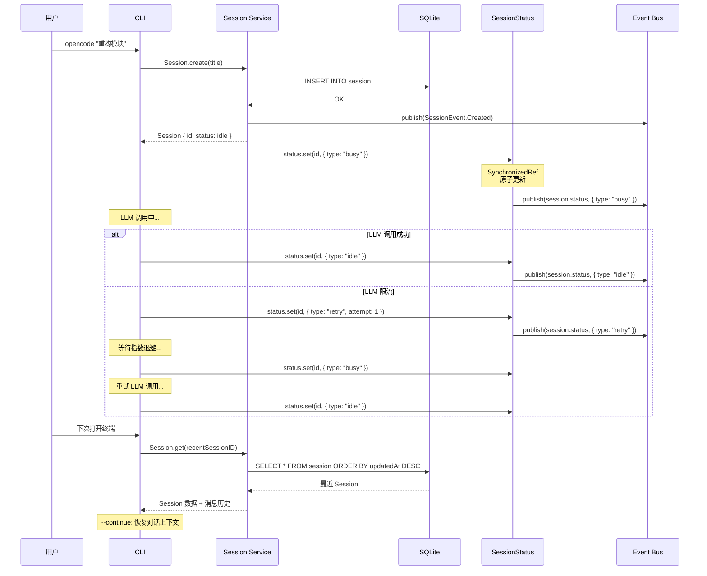

# 第 3 章：Session 生命周期管理

> **本章目标**：理解 opencode 的会话数据模型，掌握 `SynchronizedRef` 的原子状态管理，跟踪 Session 从创建到结束的完整生命周期。
> **涉及文件**：`packages/opencode/src/session/session.ts`、`status.ts`、`schema.ts`、`session.sql.ts`
> **必备知识**：SQL 基础、状态机概念、TypeScript 品牌类型（Branded Types）

---

## 3.1 场景引入：一次编程对话的一生

当你打开终端，输入 `opencode "帮我重构这个模块"`，背后发生了什么？

1. opencode 创建一个 **Session**（会话）——它有一个唯一的 ID，记录开始时间，关联到当前项目
2. Session 进入 **busy** 状态——LLM 开始生成回复
3. 如果 LLM 调用失败（比如限流），Session 进入 **retry** 状态——等待几秒后重试
4. 对话可能持续几小时，产生几百条消息。Session 需要持久化到 SQLite，这样你下次打开时可以 `--continue` 继续
5. 你可能会 `--fork` 一个会话——派生一个新会话，保留父会话的历史作为上下文

这整个过程——创建、状态转换、持久化、恢复、派生——就是 Session 的生命周期管理。在 opencode 中，这一切都通过 Effect-TS 实现。

---

## 3.2 核心概念

### 会话数据模型

opencode 的 Session 系统建立在三个核心类型之上：

```typescript
// packages/opencode/src/session/schema.ts
export const SessionID = Schema.brand(Schema.String, "SessionID")
export const MessageID = Schema.brand(Schema.String, "MessageID")
export const PartID = Schema.brand(Schema.String, "PartID")
```

这三个是**品牌类型**（Branded Types）。在运行时，它们就是普通的字符串。但在类型层面，`SessionID` 和 `MessageID` 是不同的类型——你不能把 `MessageID` 传给一个需要 `SessionID` 的函数，编译器会阻止你。

品牌类型的价值在于**防止混淆**。在一个有几十个 ID 类型的系统中（SessionID、MessageID、PartID、ProjectID、ProviderID、ModelID……），品牌类型让你不会意外地把消息 ID 当成会话 ID 传给函数。

### 持久化：Drizzle ORM + SQLite

opencode 使用 Drizzle ORM 操作 SQLite 数据库。Session 数据存储在两个表中：

- **`SessionTable`** — 会话元数据：ID、标题、创建时间、父会话 ID、项目 ID
- **`PartTable`** — 消息内容：每个 Part（文本片段、工具调用、工具结果）作为一行

Effect-TS 与 Drizzle 的集成方式是：Drizzle 的查询返回 `Promise`，通过 `Effect.try` 包装为 Effect：

```typescript
// 将 Drizzle 的 Promise 查询转为 Effect
const result = yield* _(Effect.try({
  try: () => db.select().from(SessionTable).where(eq(SessionTable.id, id)),
  catch: (cause) => new DatabaseError({ cause }),
}))
```

### Session 状态机

`packages/opencode/src/session/status.ts` 定义了 Session 的三种状态：

```typescript
export const Info = Schema.Union([
  Schema.Struct({ type: Schema.Literal("idle") }),           // 空闲，等待用户输入
  Schema.Struct({ type: Schema.Literal("busy") }),            // 忙碌，正在处理 LLM 响应
  Schema.Struct({ type: Schema.Literal("retry"), ... }),      // 重试中，包含 attempt 计数和 next 时间
])
```

状态转换路径：

```
idle → busy → idle（正常完成）
idle → busy → retry → busy → idle（失败后重试成功）
idle → busy → retry → idle（重试耗尽，放弃）
```

这个状态机通过 `SynchronizedRef` 实现——确保并发环境下的状态转换是原子的。

---

## 3.3 Effect-TS 函数详解

### `SynchronizedRef` — 原子可变状态

```
类型签名（简化）:
  SynchronizedRef.make<A>(initial: A): Effect<SynchronizedRef<A>, never, Scope>
  SynchronizedRef.modify(ref, fn): Effect<A, never, never>
  SynchronizedRef.modifyEffect(ref, fn): Effect<A, E, R>
```

**用途**：创建一个原子可变引用。`modify` 原子地读取、变换、写入——在并发环境中不会出现竞态条件。

**与普通 TypeScript 的对比**：

```typescript
// 普通 TS：let 变量在并发环境下不安全
let status: SessionStatus = { type: "idle" }
// 两个 Fiber 同时读取 status，同时修改，同时写入 → 其中一个修改丢失
status = { type: "busy" }

// Effect-TS：SynchronizedRef 保证原子性
const ref = yield* _(SynchronizedRef.make<SessionStatus>({ type: "idle" }))
// modify 是原子操作——读-改-写在一个事务中完成
yield* _(SynchronizedRef.modify(ref, (current) => [{ type: "busy" }, { type: "busy" }]))
```

关键区别：`let` 变量的"读-改-写"不是原子的——两个并发操作可能交错执行。`SynchronizedRef.modify` 保证整个操作是原子的。

**在 opencode 中的使用**：`SessionStatus.Service` 内部使用 `SynchronizedRef` 管理每个 Session 的状态。`Runner`（`effect/runner.ts`）用 `SynchronizedRef` 实现 Idle/Running/Shell 状态机。

### `Effect.fn` / `Effect.fnUntraced` — 命名 Effect 函数

```
类型签名（简化）:
  Effect.fn(name: string)(function* (_) { ... }): (...args) => Effect<A, E, R>
  Effect.fnUntraced(name: string)(function* (_) { ... }): (...args) => Effect<A, E, R>
```

**用途**：创建一个有名称的 Effect 函数。`Effect.fn` 会创建 OpenTelemetry span（用于追踪），`Effect.fnUntraced` 不创建 span（用于内部辅助函数）。

**与普通 TypeScript 的对比**：

```typescript
// 普通 TS：函数有名称，但没有追踪
async function createSession(title: string): Promise<Session> { ... }

// Effect-TS：Effect.fn 自动创建追踪 span
const createSession = Effect.fn("Session.create")(function* (_) {
  // 这个函数的所有 yield* 调用都会出现在 OpenTelemetry trace 中
  // 函数名 "Session.create" 是 span 的名称
})
```

**在 opencode 中的使用**：几乎所有公开的服务方法都用 `Effect.fn` 包装。例如 `Session.create`、`Session.get`、`Session.update` 等。

### `Schema.TaggedErrorClass` — 带标签的错误类型

```
类型签名（简化）:
  class MyError extends Schema.TaggedErrorClass<MyError>()("MyError", { field: Schema.String }) {}
```

**用途**：定义一个"带标签"的错误类。标签（如 `"MyError"`）可以在 `Effect.catchTag` 中用于精确匹配。

**与普通 TypeScript 的对比**：

```typescript
// 普通 TS：自定义错误，但 catch 时只能 instanceof 判断
class DatabaseError extends Error {
  constructor(public cause: unknown) { super("Database error") }
}
try { ... } catch (e) {
  if (e instanceof DatabaseError) { /* 处理数据库错误 */ }
}

// Effect-TS：TaggedError，可以用 catchTag 精确捕获
class DatabaseError extends Schema.TaggedErrorClass<DatabaseError>()("DatabaseError", {
  cause: Schema.Unknown,
}) {}
// 捕获时：
Effect.catchTag("DatabaseError", (e) => Effect.succeed(fallbackValue))
```

关键区别：`catchTag` 按标签字符串匹配，比 `instanceof` 更可靠（不受原型链影响），且标签是编译期检查的（打错标签名会报错）。

**在 opencode 中的使用**：`NotFoundError`、`BusyError`、`DeniedError`、`RejectedError`、`InitError` 等都是 `TaggedErrorClass`。

### `Context.Tag` / `Context.Service` — 依赖标识

```
类型签名（简化）:
  class MyService extends Context.Service<MyService, Interface>()("@scope/MyService") {}
```

**用途**：创建一个"服务 Tag"——它既是类型（描述服务的接口），又是标识（用于从 Context 中提取服务实例）。

**在 opencode 中的使用**：每个服务模块都定义了一个。`Session.Service`、`Config.Service`、`Bus.Service` 等。通过 `yield* Session.Service` 提取。

---

## 3.4 实现剖析

### Session.create() 的完整流程

`packages/opencode/src/session/session.ts` 中的 `Session.create` 是一个典型的 Effect 服务方法：

```typescript
const create = Effect.fn("Session.create")(function* (_) {
  // 1. 生成唯一 ID
  const id = SessionID.make()

  // 2. 插入数据库
  yield* _(Effect.try({
    try: () => db.insert(SessionTable).values({ id, title, projectID, ... }),
    catch: (cause) => new DatabaseError({ cause }),
  }))

  // 3. 发布事件（通知其他服务）
  yield* _(bus.publish(SessionEvent.Created, { sessionID: id }))

  // 4. 返回创建的 Session
  return { id, title, status: { type: "idle" }, ... }
})
```

这个流程展示了 Effect 编程的标准模式：

1. **纯数据操作**（生成 ID）——不需要 `yield*`
2. **副作用操作**（数据库写入）——用 `Effect.try` 包装，将 Promise 转为 Effect，同时捕获异常转为类型化错误
3. **事件发布**（通知其他服务）——通过 Bus 发布，解耦消费者
4. **返回结果**——`return` 在 `Effect.gen` 中等价于 `Effect.succeed`

### --continue 和 --fork 的实现

**`--continue`**：加载最近的会话继续对话。实现逻辑在 `packages/opencode/src/cli/cmd/run.ts:394-473`：

1. 查询最近修改的 Session（`db.select().orderBy(desc(SessionTable.updatedAt)).limit(1)`）
2. 如果存在且状态为 `idle`，加载该 Session 的消息历史
3. 将历史消息作为上下文传给 LLM

**`--fork`**：派生一个新会话。实现逻辑在 `session.ts` 的 Fork 相关方法中：

1. 创建新 Session，设置 `parentID` 为父会话的 ID
2. 将父会话的消息历史复制到新 Session（作为上下文）
3. 新 Session 有独立的 ID，后续消息不会影响父会话

### 时序图：Session 完整生命周期



---

## 3.5 开发人员必备知识与技能

1. **品牌类型（Branded Types）** — TypeScript 的结构类型系统下，两个 `string` 可以互相赋值。品牌类型通过交叉一个 phantom type（`& { readonly __brand: "SessionID" }`）创建名义类型，防止意外混淆。Effect 的 `Schema.brand` 提供了标准化的品牌类型创建方式。

2. **SQLite + Drizzle ORM** — opencode 选择 SQLite 而非 PostgreSQL/MySQL，因为它是嵌入式数据库——零配置、零依赖，适合 CLI 工具。Drizzle ORM 提供了类型安全的查询构建器，与 Effect 的集成通过 `Effect.try` 包装 Promise 实现。

3. **状态机设计** — Session 的 idle/busy/retry 三态是最简单的状态机模式。在实际系统中，状态机需要处理并发更新（两个操作同时修改状态），`SynchronizedRef` 的原子 modify 是解决方案。

4. **事件驱动解耦** — Session 创建后发布 `SessionEvent.Created`，而不是直接调用其他服务的更新方法。这允许未来添加新的消费者（如审计日志、用量统计）而不修改 Session 创建代码。

---

## 3.6 本章小结

- Session 数据模型建立在三个品牌类型之上：`SessionID`、`MessageID`、`PartID`——类型系统防止 ID 混淆
- Drizzle ORM + SQLite 提供类型安全的持久化，通过 `Effect.try` 将 Promise 查询转为 Effect
- Session 状态机有三种状态：`idle` → `busy` → `retry` → `idle`，通过 `SynchronizedRef` 保证原子转换
- `Session.create()` 展示了 Effect 编程的标准模式：数据操作 → 副作用包装 → 事件发布 → 返回结果
- `--continue` 加载最近会话，`--fork` 派生新会话保留父会话上下文
- `Effect.fn` 为每个方法创建追踪 span，`Schema.TaggedErrorClass` 让错误可精确匹配
