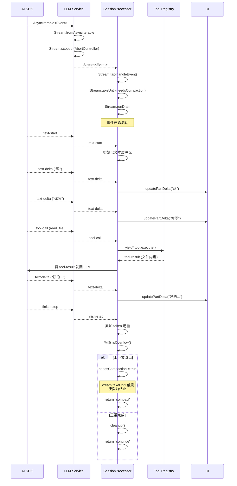

# 第 4 章：LLM 流处理 —— SessionProcessor 的核心

> **本章目标**：理解 opencode 最核心的流处理管道——从 AI SDK 的 SSE 事件流到 UI 更新的完整链路，掌握 `Stream.tap`、`Stream.takeUntil`、`Stream.runDrain` 的组合模式。
> **涉及文件**：`packages/opencode/src/session/processor.ts`、`llm.ts`、`packages/core/src/aisdk.ts`
> **必备知识**：SSE (Server-Sent Events) 基础、Node.js Stream 概念

---

## 4.1 场景引入：一个 LLM 请求的"内心独白"

当用户在 opencode 中输入"帮我写一个排序函数"，按下回车后，以下事情在几秒内发生：

1. opencode 构建一个请求，包含系统提示、对话历史、用户输入——总共可能几千行文本
2. 请求发送到 LLM 提供商（比如 Anthropic）。LLM 不是一次性返回完整结果——它通过 **SSE (Server-Sent Events)** 逐 token 流式返回
3. 每个 token 到达时，opencode 需要立即更新 UI（用户看到文字逐字出现）
4. LLM 可能在回复中插入**工具调用**——"我需要读取文件 X"、"我需要搜索代码 Y"。opencode 需要暂停流处理，执行工具，将结果发回 LLM，然后继续流处理
5. 如果 token 数量接近上下文窗口上限，opencode 需要**提前终止**流，触发压缩
6. 如果中途出错（限流、网络断开），需要根据错误类型决定重试还是放弃

这整个过程在 `SessionProcessor.handle()` 中实现——它是 opencode 最复杂、最核心的方法。

---

## 4.2 核心概念

### 流处理的三层结构

`SessionProcessor.handle()` 的流处理管道可以理解为三层：

```
第一层：Stream 管道（事件流处理）
  Stream.tap → 对每个事件执行副作用（更新 UI、记录日志）
  Stream.takeUntil → 条件终止（上下文溢出时提前结束）
  Stream.runDrain → 消费整个流

第二层：Effect 修饰器（错误处理与重试）
  Effect.onInterrupt → 用户取消时的清理
  Effect.catchCauseIf → 区分中断和真实错误
  Effect.retry → 按策略重试
  Effect.catch → 最终错误处理
  Effect.ensuring → 无论成败都执行的清理

第三层：业务逻辑（事件分发）
  handleEvent → 根据事件类型分发到不同处理函数
  text-delta → 更新消息文本
  tool-call → 执行工具
  tool-result → 处理工具结果
  finish-step → 累加 token 用量
```

这三层组合在一起，形成了一个既健壮又灵活的 LLM 调用管道。

### LLM.Service 的依赖注入

`packages/opencode/src/session/llm.ts:62-74` 展示了 `LLM.Service` 的 6 个依赖：

```typescript
const live = Layer.effect(Service, Effect.gen(function* () {
  const auth = yield* Auth.Service        // 提供商认证
  const config = yield* Config.Service    // 用户配置
  const provider = yield* Provider.Service // 提供商适配
  const plugin = yield* Plugin.Service    // 插件扩展
  const perm = yield* Permission.Service  // 权限检查
  const flags = yield* RuntimeFlags.Service // 特性开关
  // ...
}))
```

这 6 个依赖在 LLM 调用中各司其职：

- **Auth** — 提供 API Key
- **Config** — 用户选择的模型、温度参数
- **Provider** — 适配不同提供商的 API 差异（Anthropic/OpenAI/Google 等）
- **Plugin** — 允许插件修改请求（如添加自定义 header）
- **Permission** — 检查当前模型是否被允许使用
- **RuntimeFlags** — 实验性功能开关

在 LLM 流开始前，这 6 个依赖通过 `Effect.all({ concurrency: "unbounded" })` **并行获取**——因为它们是独立的，不需要等待彼此：

```typescript
yield* Effect.all([
  provider.getLanguage(...),   // 获取 LanguageModel 实例
  config.get(),                // 读取配置
  provider.getProvider(...),   // 获取提供商元数据
  auth.get(...),               // 获取认证凭据
], { concurrency: "unbounded" })
```

---

## 4.3 Effect-TS 函数详解

本章涉及 6 个 Stream 相关的核心函数——Stream 是 Effect-TS 中最强大也最容易被误解的模块。

### `Stream.fromAsyncIterable` — 将异步迭代器转为 Stream

```
类型签名（简化）:
  Stream.fromAsyncIterable<T>(iterable: AsyncIterable<T>, transform?: (e) => E): Stream<T, never, never>
```

**用途**：AI SDK 的 `streamText()` 返回一个 `AsyncIterable`（可以用 `for await` 消费）。`Stream.fromAsyncIterable` 将它转为 Effect Stream，从而可以使用 `Stream.tap`、`Stream.takeUntil` 等操作符。

**与普通 TypeScript 的对比**：

```typescript
// 普通 TS：for await 循环消费异步迭代器
for await (const event of aiSDK.fullStream) {
  if (event.type === "text-delta") updateUI(event.textDelta)
  if (needsCompaction) break  // 手动 break
}

// Effect-TS：Stream 操作符组合
Stream.fromAsyncIterable(aiSDK.fullStream).pipe(
  Stream.tap((event) => handleEvent(event)),  // 副作用
  Stream.takeUntil(() => needsCompaction),    // 条件终止
  Stream.runDrain,                             // 消费
)
```

关键区别：`for await` 循环中，副作用、终止条件、错误处理全部混在一起。Stream 将它们分离为独立的操作符，每个操作符只做一件事。

### `Stream.tap` — 对每个事件执行副作用

```
类型签名（简化）:
  Stream.tap<T>(stream, fn: (e: T) => Effect<void, never, never>): Stream<T>
```

**用途**：对流中的每个元素执行一个 Effect（副作用），但不改变元素本身。类似 `Array.forEach`，但用于异步流。

**与普通 TypeScript 的对比**：

```typescript
// 普通 TS：副作用混在循环逻辑中
for await (const event of stream) {
  console.log(event)        // 副作用 1：日志
  updateUI(event)           // 副作用 2：UI 更新
  if (event.type === "x") { // 业务逻辑
    // ...
  }
}

// Effect-TS：tap 分离副作用
stream.pipe(
  Stream.tap((event) => logEvent(event)),   // 副作用 1
  Stream.tap((event) => updateUI(event)),   // 副作用 2
  // 业务逻辑在后续操作符中处理
)
```

**在 opencode 中的使用**：`processor.ts:733` 的 `Stream.tap(handleEvent)` 是整个事件分发的入口——每个 LLM 事件都经过 `handleEvent` 处理。

### `Stream.takeUntil` — 条件终止流

```
类型签名（简化）:
  Stream.takeUntil<T>(stream, predicate: () => boolean): Stream<T>
```

**用途**：当条件满足时提前终止流。在 opencode 中，当 token 数量接近上下文窗口上限时，`needsCompaction` 变为 `true`，流被提前终止。

**与普通 TypeScript 的对比**：

```typescript
// 普通 TS：手动 break
for await (const event of stream) {
  if (needsCompaction) break  // 手动终止
  handleEvent(event)
}

// Effect-TS：takeUntil 声明式终止
stream.pipe(
  Stream.tap(handleEvent),
  Stream.takeUntil(() => needsCompaction),  // 条件满足时自动终止
  Stream.runDrain,
)
```

**在 opencode 中的使用**：`processor.ts:734` 的 `Stream.takeUntil(() => ctx.needsCompaction)` 在上下文溢出时提前结束 LLM 流。

### `Stream.runDrain` — 消费整个流

```
类型签名（简化）:
  Stream.runDrain<T>(stream): Effect<void, E, R>
```

**用途**：消费（执行）整个流，忽略元素值，只关心流的完成或失败。这是流的"执行按钮"。

**在 opencode 中的使用**：`processor.ts:735` 的 `Stream.runDrain` 是流管道的终点——它驱动整个流开始执行。

### `Effect.all({ concurrency })` — 结构化并行

```
类型签名（简化）:
  Effect.all([eff1, eff2, ...], { concurrency: "unbounded" | N }): Effect<[A1, A2, ...], E1 | E2 | ..., R1 | R2 | ...>
```

**用途**：并行执行多个 Effect，保留所有类型信息。与 `Promise.all` 不同，`Effect.all` 支持结构化并发——如果父 Fiber 被中断，所有子 Effect 也会被中断。

**与普通 TypeScript 的对比**：

```typescript
// Promise.all：一个失败全部失败，无法取消其他
const [a, b, c] = await Promise.all([fetchA(), fetchB(), fetchC()])

// Effect.all：结构化并发，可中断，类型安全
const [a, b, c] = yield* Effect.all([fetchA(), fetchB(), fetchC()], { concurrency: "unbounded" })
```

**在 opencode 中的使用**：`llm.ts` 中用 `Effect.all` 并行获取 provider、config、auth。

### `Stream.scoped` + `Effect.acquireRelease` — 资源安全的流

```
类型签名（简化）:
  Stream.scoped<T>(stream: Effect<Stream<T>, E, Scope>): Stream<T, E, never>
  Effect.acquireRelease(acquire, release): Effect<A, E, Scope>
```

**用途**：`acquireRelease` 获取资源并注册释放回调（类似 `try-with-resources`）。`Stream.scoped` 将"在 Scope 中创建流"的 Effect 转为"自动管理资源生命周期"的 Stream。

**在 opencode 中的使用**：`llm.ts` 用 `Stream.scoped` 包装 AI SDK 流，确保 `AbortController` 在流结束后被清理。

---

## 4.4 实现剖析：SessionProcessor.handle() 完整链路

`packages/opencode/src/session/processor.ts:721-789` 是全书最重要的代码片段之一。让我们逐层拆解：

### 第一层：Stream 管道

```typescript
const stream = llm.stream(streamInput)  // 获取 LLM 事件流

yield* stream.pipe(
  Stream.tap((event) => handleEvent(event)),  // 每个事件 → handleEvent 分发
  Stream.takeUntil(() => ctx.needsCompaction), // 溢出时提前终止
  Stream.runDrain,                             // 消费整个流
)
```

`handleEvent` 是一个巨大的事件分发函数，处理 16 种 LLM 事件类型：

| 事件类型 | 处理逻辑 |
|----------|----------|
| `text-start` | 初始化文本缓冲区 |
| `text-delta` | 追加文本增量，更新 UI |
| `text-end` | 完成文本块 |
| `tool-call` | 解析工具调用，执行工具 |
| `tool-result` | 处理工具执行结果 |
| `tool-error` | 处理工具执行失败 |
| `reasoning-start/delta/end` | 处理推理过程（如 Claude 的 thinking） |
| `finish-step` | 累加 token 用量，检查溢出 |
| `finish-reason` | 记录结束原因（stop/length/tool-calls） |
| `error` | 记录错误信息 |
| `start` | 初始化消息 |
| `file-start/delta/end` | 处理文件输出 |

### 第二层：Effect 修饰器

```typescript
}).pipe(
  Effect.onInterrupt(() => Effect.gen(function* () {
    aborted = true
    if (!ctx.assistantMessage.error) {
      yield* halt(new DOMException("Aborted", "AbortError"))
    }
  })),
  Effect.catchCauseIf(
    (cause) => !Cause.hasInterruptsOnly(cause),  // 只重试非中断错误
    (cause) => Effect.fail(Cause.squash(cause)),
  ),
  Effect.retry(SessionRetry.policy({ ... })),    // 按策略重试
  Effect.catch(halt),                            // 最终兜底
  Effect.ensuring(cleanup()),                    // 无论成败都清理
)
```

这五个修饰器从外到内形成了错误处理的"洋葱模型"：

1. **`Effect.onInterrupt`**（最外层）— 如果用户取消，标记 `aborted = true`，设置错误信息
2. **`Effect.catchCauseIf`** — 区分中断和真实错误。中断（用户取消）不重试，真实错误（限流、网络）才重试
3. **`Effect.retry`** — 按 `SessionRetry.policy` 重试（指数退避、提供商自适应）
4. **`Effect.catch`** — 如果重试耗尽，调用 `halt` 做最终错误处理
5. **`Effect.ensuring`**（最内层）— 无论成功、失败、中断，都执行 `cleanup()`（清理 toolcall Deferred、更新状态等）

### 第三层：返回决策

```typescript
if (ctx.needsCompaction) return "compact"   // 需要压缩
if (ctx.blocked || ctx.assistantMessage.error) return "stop"  // 被阻塞或出错
return "continue"                            // 继续下一轮
```

`handle()` 的返回值不是"成功/失败"，而是"下一步做什么"——这是一个**决策函数**，驱动着 Agent Loop 的下一轮行为。

### 时序图：LLM 流事件完整处理链路



---

## 4.5 开发人员必备知识与技能

1. **SSE (Server-Sent Events) 协议** — LLM 提供商通过 SSE 逐 token 返回结果。理解 SSE 的格式（`data: {...}\n\n`）和流式处理模式（chunk-by-chunk vs line-by-line）是理解 LLM 集成的基础。

2. **Stream 编程思维** — 与 `for await` 循环不同，Stream 编程是声明式的：你描述"对每个元素做什么"（tap）、"何时停止"（takeUntil）、"如何消费"（runDrain），而不是写循环体。这种思维来自 ReactiveX（RxJS）传统，Effect Stream 是其类型安全的进化版。

3. **错误处理分层** — `onInterrupt` → `catchCauseIf` → `retry` → `catch` → `ensuring` 的五层洋葱模型是 Effect 错误处理的标准模式。每一层有明确的职责，不越界。

4. **结构化并发** — `Effect.all` 不只是 `Promise.all` 的替代品。它的关键特性是：如果父 Fiber 被中断，所有子 Effect 自动中断。这消除了"Promise 在后台继续运行"的资源泄漏问题。

---

## 4.6 本章小结

- `SessionProcessor.handle()` 是 opencode 最核心的方法，用三层结构组织：Stream 管道 → Effect 修饰器 → 业务决策
- Stream 管道用 `tap` + `takeUntil` + `runDrain` 三个操作符组合，将副作用、终止条件、消费逻辑分离
- Effect 修饰器形成五层洋葱：中断处理 → 错误分类 → 重试 → 兜底 → 清理
- `LLM.Service` 的 6 个依赖通过 `Effect.all({ concurrency: "unbounded" })` 并行获取
- `Stream.scoped` + `Effect.acquireRelease` 确保 AbortController 等资源无论成败都被释放
- `handle()` 返回的不是"成功/失败"而是"下一步决策"——compact / stop / continue
