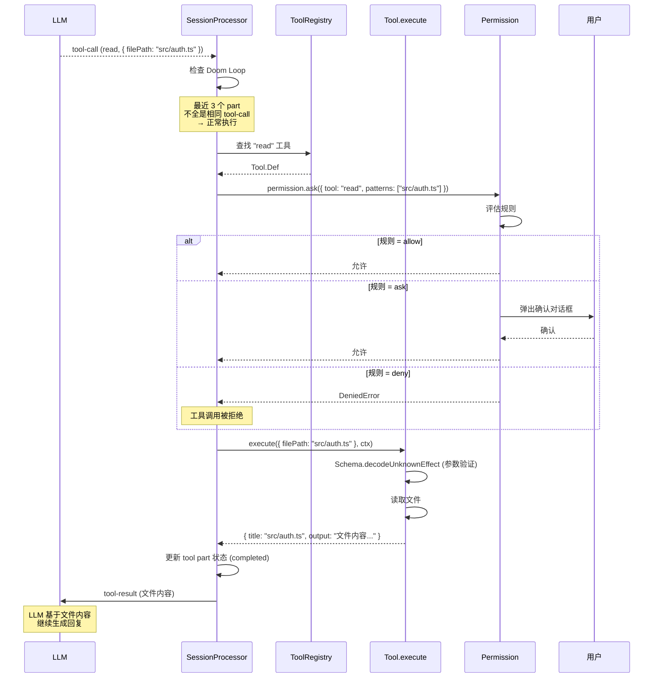

# 第 5 章：工具调用系统（Tool System）

> **本章目标**：理解 opencode 的工具注册与执行机制，掌握 LLM 工具调用的完整流程——从 tool-call 事件到权限检查到执行结果返回。
> **涉及文件**：`packages/opencode/src/tool/tool.ts`、`registry.ts`、`packages/opencode/src/session/processor.ts`
> **必备知识**：LLM Function Calling 概念、JSON Schema 基础

---

## 5.1 场景引入：当 LLM 说"我需要读文件"

LLM 不是全知全能的。当用户问"这个项目的认证逻辑是怎么实现的？"，LLM 不知道你的代码——它需要**调用工具**来获取信息。

在 opencode 中，这个过程是这样的：

1. LLM 在回复中插入一个 **tool-call**："调用 `read` 工具，参数 `{ filePath: 'src/auth/index.ts' }`"
2. opencode 收到 tool-call 事件，解析参数，找到 `read` 工具
3. **权限检查**：用户是否允许读取这个文件？如果规则是 `ask`，弹出确认对话框
4. 权限通过后，**执行工具**：读取文件内容
5. 将工具结果（文件内容）作为 **tool-result** 发回 LLM
6. LLM 基于文件内容继续生成回复

这个流程可能在一轮对话中重复多次——LLM 可能先读文件 A，发现需要文件 B，再读文件 B，然后搜索代码，最后执行 shell 命令。每次工具调用都经过同样的注册→检查→执行→返回流程。

---

## 5.2 核心概念

### 工具定义

`packages/opencode/src/tool/tool.ts` 定义了工具的抽象：

```typescript
export interface Def<Parameters, M> {
  id: string                    // 工具标识（如 "read", "grep", "bash"）
  description: string           // 工具描述（发给 LLM 的提示）
  parameters: Parameters        // 参数 Schema（Effect Schema 解码器）
  jsonSchema?: JSONSchema7      // JSON Schema 版本（发给 LLM）
  execute(args, ctx): Effect.Effect<ExecuteResult<M>>  // 执行函数
  formatValidationError?(error): string  // 参数校验失败时的错误格式化
}
```

每个工具是一个实现了这个接口的对象。例如 `read` 工具：

- `id`: `"read"`
- `description`: `"Reads a file from the local filesystem..."`
- `parameters`: `Schema.Struct({ file_path: Schema.String, offset: Schema.optional(Schema.Int), limit: Schema.optional(Schema.Int) })`
- `execute`: 读取文件内容，返回 `{ title, output, metadata }`

### 工具注册表

`packages/opencode/src/tool/registry.ts` 的 `ToolRegistry` 管理所有可用工具。它分为两类：

| 类别 | 来源 | 示例 |
|------|------|------|
| **内置工具** | opencode 自带 | read、write、edit、grep、glob、bash、task、todo、websearch、webfetch、skill、lsp、plan、question |
| **自定义工具** | 插件目录 | 用户或插件定义的额外工具 |

`ToolRegistry.tools()` 方法在每次 LLM 调用前动态生成可用工具列表——它会根据当前提供商的能力过滤（不是所有提供商都支持所有工具类型），并根据当前 Agent 动态调整描述（如 task 工具的描述包含可用子 Agent 列表）。

### 工具执行的 Effect 封装

`tool.ts` 的 `define()` 函数将原始工具定义包装为完整的 Effect 执行管道：

```typescript
// 简化的 define() 逻辑
export function define(info: Info) {
  return {
    ...info,
    init: () => Effect.gen(function* () {
      const def = yield* info.init()
      return {
        ...def,
        execute: (args, ctx) => Effect.gen(function* () {
          // 1. Schema 验证参数
          const validated = yield* Schema.decodeUnknownEffect(def.parameters)(args)
          // 2. 执行工具
          const result = yield* def.execute(validated, ctx)
          // 3. 截断过长输出
          const truncated = yield* Truncate.Service.truncate(result)
          return truncated
        }).pipe(Effect.withSpan("Tool.execute", { attributes: { "tool.name": def.id } }))
      }
    })
  }
}
```

每个工具执行自动获得：
- **参数验证**（Schema.decodeUnknownEffect）
- **输出截断**（Truncate.Service）
- **OpenTelemetry 追踪**（Effect.withSpan）

---

## 5.3 Effect-TS 函数详解

### `Schema.decodeUnknownEffect` — Schema 验证 + Effect 集成

```
类型签名（简化）:
  Schema.decodeUnknownEffect<A>(schema: Schema<A>)(value: unknown): Effect<A, ParseError>
```

**用途**：在 Effect 上下文中验证和解析数据。如果验证失败，返回 `ParseError`（而不是抛异常）。

**与普通 TypeScript 的对比**：

```typescript
// 普通 TS：JSON.parse + 手动校验
function execute(args: string) {
  const parsed = JSON.parse(args)  // 可能抛异常
  if (typeof parsed.filePath !== "string") throw new Error("Invalid args")
  // ... 使用 parsed.filePath
}

// Effect-TS：Schema.decodeUnknownEffect
function execute(args: unknown) {
  return Effect.gen(function* (_) {
    const validated = yield* _(Schema.decodeUnknownEffect(Parameters)(args))
    // validated 的类型是精确的——编译器知道它有哪些字段
    // 如果验证失败，Effect 自动传播 ParseError
  })
}
```

**在 opencode 中的使用**：每个工具的 `execute` 在执行前都通过 `Schema.decodeUnknownEffect` 验证 LLM 传来的参数。

### `Effect.withSpan` — OpenTelemetry 追踪

```
类型签名（简化）:
  Effect.withSpan(name: string, options?: { attributes?: Record<string, unknown> })(effect): Effect<A, E, R>
```

**用途**：为 Effect 创建一个 OpenTelemetry span。在分布式追踪系统中，你可以看到每个工具调用的耗时、参数和结果。

**在 opencode 中的使用**：每个工具执行都包裹在 `Effect.withSpan("Tool.execute", { attributes: { "tool.name": id } })` 中。

### `Effect.forEach({ concurrency })` — 并行遍历

```
类型签名（简化）:
  Effect.forEach(items, (item) => Effect<B, E, R>, { concurrency: N | "unbounded" }): Effect<B[], E, R>
```

**用途**：对数组的每个元素执行 Effect，支持并发控制。

**与普通 TypeScript 的对比**：

```typescript
// 普通 TS：顺序执行
for (const tool of tools) {
  const def = await tool.init()  // 一个接一个
}

// Effect-TS：并行执行
const defs = yield* Effect.forEach(tools, (tool) => tool.init(), { concurrency: "unbounded" })
// 所有工具的 init() 同时执行
```

**在 opencode 中的使用**：`ToolRegistry.tools()` 用 `Effect.forEach` 并行初始化所有工具定义。

### `Effect.timeout` — 超时控制

```
类型签名（简化）:
  Effect.timeout(duration: DurationInput)(effect): Effect<A, E | TimeoutException, R>
```

**用途**：为 Effect 设置超时。如果超时，抛出 `TimeoutException`。

**与普通 TypeScript 的对比**：

```typescript
// 普通 TS：AbortController + setTimeout
const controller = new AbortController()
const timer = setTimeout(() => controller.abort(), 5000)
try {
  const result = await fetch(url, { signal: controller.signal })
} finally {
  clearTimeout(timer)
}

// Effect-TS：声明式超时
const result = yield* _(fetchEffect(url).pipe(Effect.timeout("5 seconds")))
```

**在 opencode 中的使用**：`processor.ts` 的清理阶段用 `Effect.timeout("250 millis")` 等待 toolcall 完成——不无限等待。

### `Effect.ignore` — 忽略错误

```
类型签名（简化）:
  Effect.ignore(effect): Effect<void, never, R>
```

**用途**：将 Effect 的成功值和错误类型都"吞掉"，返回 `void`。用于"尽力而为"的清理操作。

**在 opencode 中的使用**：`processor.ts` 清理阶段等待 toolcall 完成时，用 `Effect.ignore` 忽略超时错误——"等不到就算了，不阻塞清理"。

---

## 5.4 实现剖析

### tool-call 事件处理 + Doom Loop 检测

`packages/opencode/src/session/processor.ts:321-379` 是 tool-call 事件的处理逻辑。除了正常的工具执行流程，它还包含一个关键的**安全机制**：Doom Loop 检测。

Doom Loop（死循环）是指 LLM 陷入重复调用同一个工具的循环——每次调用相同的工具、相同的参数，但期待不同的结果。检测逻辑在 `processor.ts:357-368`：

```typescript
const recentParts = parts.slice(-DOOM_LOOP_THRESHOLD)  // 取最近 3 个 part

if (
  recentParts.length !== DOOM_LOOP_THRESHOLD ||          // 不足 3 个，不检测
  !recentParts.every(                                    // 检查是否全部相同
    (part) =>
      part.type === "tool" &&
      part.tool === value.toolName &&
      part.state.status !== "pending" &&
      JSON.stringify(part.state.input) === JSON.stringify(value.input),
  )
) {
  return  // 不全是相同的 tool-call，正常执行
}

// 连续 3 次相同的 tool-call → 触发 doom loop 警告
yield* permission.ask({
  permission: "doom_loop",
  patterns: [value.toolName],
  // ...
})
```

检测逻辑很简单：看最近 3 个消息 part 是否都是同一个工具、同一个参数。如果是，暂停执行，询问用户："AI 似乎在重复调用同一个工具，要继续吗？"

### tool-result 事件处理

`processor.ts:382-439` 处理工具执行结果。关键步骤：

1. **图片附件规范化**：如果工具返回了图片（如截图），通过 `Image.Service` 规范化格式
2. **更新 tool part 状态**：将状态从 `running` 改为 `completed`，记录结束时间和输出
3. **错误处理**：如果工具执行失败，记录错误信息而不是崩溃整个会话

### 时序图：工具调用的完整流程



---

## 5.5 开发人员必备知识与技能

1. **LLM Function Calling 机制** — 理解 LLM 如何"调用工具"：不是 LLM 真的执行代码，而是 LLM 在回复中插入一个结构化的 JSON 对象（`{ name: "read", arguments: { filePath: "..." } }`），由客户端解析并执行。理解这个机制是理解整个 Agent 系统的基础。

2. **Schema 验证模式** — `Schema.decodeUnknownEffect` 是 Effect 生态中"边界验证"的标准方式。任何来自外部世界的数据（LLM 参数、用户输入、API 响应）在进入 Effect 世界之前，都应该经过 Schema 验证。

3. **安全围栏设计** — Doom Loop 检测是安全围栏的一个例子。设计 AI 工具系统时，你需要考虑：重复调用检测、危险操作白名单、权限粒度（文件级别 vs 目录级别）、用户确认的缓存策略。

4. **工具描述工程** — 工具的 `description` 字段直接发给 LLM，影响 LLM 何时调用、如何调用。描述需要精确、简洁、包含参数说明和返回值格式。这本质上是一种"面向 AI 的 API 文档"。

---

## 5.6 本章小结

- opencode 有 15+ 内置工具（read、write、edit、grep、glob、bash、task 等），通过 `ToolRegistry` 统一管理
- 每个工具定义包含 `id`、`description`、`parameters`（Effect Schema）、`execute`（Effect 函数）
- `define()` 自动为每个工具添加参数验证、输出截断、OpenTelemetry 追踪
- tool-call 事件处理包含 Doom Loop 检测——连续 3 次相同调用触发用户确认
- 权限检查在工具执行前进行，`allow`/`deny`/`ask` 三值逻辑决定工具是否执行
- `Schema.decodeUnknownEffect` 是外部数据进入 Effect 世界的"安检门"
