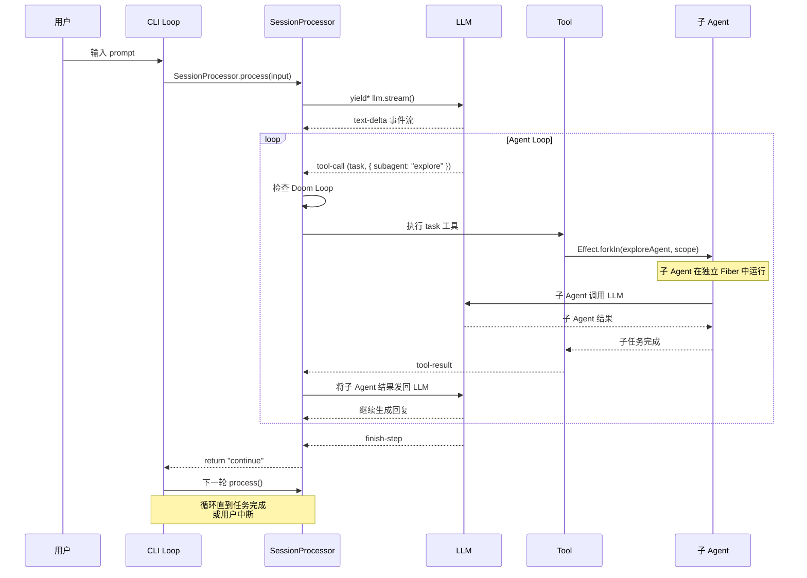

# 第 6 章：Agent 定义与执行循环

> **本章目标**：理解 opencode 的 Agent 模型——从 Agent 定义、系统提示模板到主循环的事件驱动架构，掌握子 Agent 的 Fork 隔离和 Doom Loop 安全机制。
> **涉及文件**：`packages/opencode/src/agent/agent.ts`、`packages/opencode/src/cli/cmd/run.ts`
> **必备知识**：Agent 架构基础、事件驱动编程

---

## 6.1 场景引入：一个 Agent 的"一天"

在 opencode 中，Agent 是实际"干活"的角色。当你输入"帮我重构这个模块"，不是 opencode 直接处理——它创建一个 Agent，Agent 调用 LLM，LLM 调用工具，工具返回结果，Agent 再调用 LLM……如此循环，直到任务完成。

这个循环看起来简单，但有很多细节：

- Agent 有不同的**模式**：`primary`（主 Agent，拥有全部工具）、`subagent`（子 Agent，权限受限）、`all`（两种模式都可用）
- Agent 有不同的**角色**：`build`（编写代码）、`plan`（制定计划，无编辑权限）、`explore`（搜索代码，只读）、`general`（通用子 Agent）
- 每个 Agent 有自己的**系统提示**——一段发给 LLM 的"角色说明"，定义它的行为边界
- Agent 可能陷入**死循环**（Doom Loop）——连续调用同一个工具、同样的参数，期待不同结果

理解 Agent 系统，就是理解 opencode 如何"驾驭"LLM 完成复杂任务。

---

## 6.2 核心概念

### Agent 数据模型

`packages/opencode/src/agent/agent.ts:28-49` 定义了 Agent 的 Schema：

```typescript
export const Info = Schema.Struct({
  name: Schema.String,                                    // Agent 名称
  description: Schema.optional(Schema.String),            // 描述
  mode: Schema.Literals(["subagent", "primary", "all"]),  // 运行模式
  native: Schema.optional(Schema.Boolean),               // 是否内置
  hidden: Schema.optional(Schema.Boolean),                // 是否隐藏
  topP: Schema.optional(Schema.Finite),                  // LLM 参数
  temperature: Schema.optional(Schema.Finite),            // LLM 参数
  permission: Permission.Ruleset,                        // 权限规则
  model: Schema.optional(Schema.Struct({                 // 指定模型
    modelID: ModelID,
    providerID: ProviderID,
  })),
  prompt: Schema.optional(Schema.String),                // 自定义系统提示
  options: Schema.Record(Schema.String, Schema.Unknown), // 额外选项
  steps: Schema.optional(Schema.Finite),                 // 最大步数限制
})
```

`mode` 字段决定了 Agent 的能力边界：

| mode | 含义 | 典型用途 |
|------|------|----------|
| `subagent` | 子 Agent，权限受限 | 执行具体子任务（搜索代码、读取文件） |
| `primary` | 主 Agent，拥有全部工具 | 理解用户意图，协调子 Agent |
| `all` | 两种模式都可用 | 通用 Agent，既可做主也可做子 |

### 内置 Agent 角色

opencode 预定义了 8 个 Agent：

| Agent | mode | 特点 |
|-------|------|------|
| `build` | primary | 主构建 Agent，拥有全部工具 |
| `plan` | primary | 规划 Agent，无编辑权限（只读+搜索） |
| `general` | subagent | 通用子 Agent |
| `explore` | subagent | 探索 Agent，只读权限 |
| `scout` | subagent | 侦察 Agent（功能开关控制） |
| `compaction` | hidden | 压缩 Agent（内部使用，不暴露给用户） |
| `title` | hidden | 标题生成 Agent（内部使用） |
| `summary` | hidden | 摘要生成 Agent（内部使用） |

### 系统提示模板

每个 Agent 的行为由**系统提示**（System Prompt）定义。opencode 使用模板文件管理这些提示：

| 模板文件 | 用途 |
|----------|------|
| `generate.txt` | 代码生成 Agent 的系统提示 |
| `compaction.txt` | 压缩 Agent 的系统提示 |
| `explore.txt` | 探索 Agent 的系统提示 |
| `scout.txt` | 侦察 Agent 的系统提示 |
| `summary.txt` | 摘要 Agent 的系统提示 |
| `title.txt` | 标题生成 Agent 的系统提示 |

这些模板不是简单的文本——它们包含变量替换（如 `{{agent.name}}`、`{{tools}}`），在每次 LLM 调用前动态渲染。

---

## 6.3 Effect-TS 函数详解

### `Effect.fork` / `Effect.forkIn` / `Effect.forkScoped` — 三种 Fork 方式

```
类型签名（简化）:
  Effect.fork(effect): Effect<Fiber<A, E>, never, R>
  Effect.forkIn(effect, scope): Effect<Fiber<A, E>, never, R>
  Effect.forkScoped(effect): Effect<Fiber<A, E>, never, R | Scope>
```

**用途**：在独立 Fiber 中执行 Effect。三种方式的生命周期管理不同：

| 方式 | 生命周期 | 使用场景 |
|------|----------|----------|
| `fork` | 独立运行，不受父 Fiber 影响 | 不推荐（容易泄漏） |
| `forkIn(scope)` | 绑定到指定 Scope，Scope 关闭时自动中断 | 后台任务（如摘要生成） |
| `forkScoped` | 绑定到当前 Scope | 临时子任务 |

**与普通 TypeScript 的对比**：

```typescript
// 普通 TS：没有轻量级并发原语
// 只能用 Worker（重量级）或 Promise（无法取消）

// Effect-TS：Fiber 是用户态绿色线程
const fiber = yield* _(Effect.forkIn(subAgentTask, scope))
// fiber 在 scope 中运行，scope 关闭时自动中断
// 父 Fiber 可以继续做其他事情
const result = yield* _(Fiber.join(fiber))  // 等待子 Fiber 完成
```

**在 opencode 中的使用**：子 Agent 通过 `Effect.forkIn` 在独立 Fiber 中运行，主 Agent 通过 `Fiber.join` 等待结果。

### `Fiber` — 轻量级绿色线程

```
类型签名（简化）:
  Fiber<A, E> — 一个正在执行的 Effect 的句柄
  Fiber.join(fiber): Effect<A, E>
  Fiber.interrupt(fiber): Effect<Exit<A, E>>
  Fiber.await(fiber): Effect<Exit<A, E>>
```

**用途**：Fiber 是 Effect 的并发原语——比 OS 线程轻量得多（用户态调度），比 Promise 强大得多（可中断、可等待、可检查状态）。

**与普通 TypeScript 的对比**：

```typescript
// Worker：OS 线程，重量级，通信靠 postMessage
const worker = new Worker("agent.js")
worker.postMessage({ task: "search" })
worker.onmessage = (e) => console.log(e.data)
worker.terminate()  // 强制终止

// Fiber：用户态绿色线程，轻量级，通信靠 Effect 类型系统
const fiber = yield* _(Effect.forkIn(agentTask, scope))
const result = yield* _(Fiber.join(fiber))     // 等待完成，获取类型安全的结果
yield* _(Fiber.interrupt(fiber))               // 优雅中断（触发 onInterrupt 清理）
```

**在 opencode 中的使用**：每个子 Agent 在独立 Fiber 中运行，主 Agent 通过 `Fiber.join` 等待子 Agent 完成，通过 `Fiber.interrupt` 取消超时的子 Agent。

### `Effect.ensuring` — 无论成败都执行的清理

```
类型签名（简化）:
  Effect.ensuring(effect, finalizer: Effect<void>): Effect<A, E, R>
```

**用途**：注册一个"无论成功、失败还是中断都会执行"的清理 Effect。类似 `try/finally` 的 `finally` 块。

**与普通 TypeScript 的对比**：

```typescript
// 普通 TS：try/finally
try {
  const result = await doWork()
} finally {
  await cleanup()  // 无论成败都执行
}

// Effect-TS：ensuring
const result = yield* _(doWork().pipe(Effect.ensuring(cleanup())))
// cleanup 在成功、失败、中断三种情况下都会执行
```

**在 opencode 中的使用**：`processor.ts:782` 的 `Effect.ensuring(cleanup())` 确保无论 LLM 调用成功、失败还是被用户取消，toolcall Deferred 都会被清理。

### `Effect.onInterrupt` — 中断处理钩子

```
类型签名（简化）:
  Effect.onInterrupt(effect, handler: () => Effect<void>): Effect<A, E, R>
```

**用途**：当 Fiber 被中断时执行清理逻辑。与 `ensuring` 不同，`onInterrupt` **只在中断时**触发。

**在 opencode 中的使用**：`processor.ts:738-745` 的 `Effect.onInterrupt` 在用户取消 LLM 调用时标记 `aborted = true` 并设置错误信息。

### `Cause.hasInterruptsOnly` — 区分中断和错误

```
类型签名（简化）:
  Cause.hasInterruptsOnly(cause: Cause<E>): boolean
```

**用途**：检查错误原因是否"仅由中断引起"（没有真实的错误）。这是区分"用户取消了"和"真的出错了"的关键函数。

**在 opencode 中的使用**：`processor.ts:747` 的 `Cause.hasInterruptsOnly(cause)` 决定是否重试——中断不重试，真实错误才重试。

---

## 6.4 实现剖析

### 主循环：事件驱动的 Agent Loop

`packages/opencode/src/cli/cmd/run.ts:611-759` 是 Agent 主循环的实现。核心结构：

```typescript
async function loop(client: OpencodeClient, events: Awaited<ReturnType<typeof sdk.event.subscribe>>) {
  for await (const event of events.stream) {
    // 事件类型 1: message.updated — 新消息到达
    if (event.type === "message.updated") { /* 显示 Agent 名称和模型 */ }

    // 事件类型 2: message.part.updated — 消息片段更新
    if (event.type === "message.part.updated") {
      const part = event.properties.part
      if (part.type === "tool" && part.state.status === "completed") { /* 显示工具结果 */ }
      if (part.type === "tool" && part.state.status === "error") { /* 显示工具错误 */ }
      if (part.type === "text" && part.time?.end) { /* 显示完整文本 */ }
      if (part.type === "reasoning" && part.time?.end) { /* 显示推理过程 */ }
    }

    // 事件类型 3: session.error — 会话错误
    if (event.type === "session.error") { /* 显示错误信息 */ }

    // 事件类型 4: session.status — 状态变化
    if (event.type === "session.status") { /* 显示重试/忙碌状态 */ }

    // 事件类型 5: permission.asked — 权限请求
    if (event.type === "permission.asked") { /* 弹出确认对话框 */ }
  }
}
```

这个循环是**纯事件驱动**的——它不主动调用任何 LLM 或工具，只是订阅事件流，对每个事件做出 UI 响应。实际的 LLM 调用和工具执行在 `SessionProcessor` 中完成，通过 Event Bus 通知 UI 层。

### 子 Agent 的 Fork 隔离

当主 Agent 调用 `task` 工具委派子任务时：

1. 主 Agent 在独立 Fiber 中 Fork 子 Agent 任务
2. 子 Agent 有自己的权限规则（`subagent-permissions.ts` 定义）
3. 子 Agent 的 Fiber 绑定到主 Agent 的 Scope——如果主 Agent 被取消，子 Agent 自动中断
4. 主 Agent 通过 `Fiber.join` 等待子 Agent 完成，收集结果

这种 Fork 隔离保证了：
- 子 Agent 的错误不会崩溃主 Agent
- 主 Agent 取消时子 Agent 自动清理
- 每个子 Agent 有独立的权限边界

### 时序图：Agent 执行循环



---

## 6.5 开发人员必备知识与技能

1. **Agent 架构设计** — Agent 不是"一个 AI"，而是"一个角色 + 一套工具 + 一个权限边界"。设计 Agent 系统时，关键是划分 Agent 的职责边界：什么 Agent 拥有什么工具、什么权限、什么系统提示。

2. **提示工程（Prompt Engineering）** — 系统提示模板是 Agent 行为的核心。好的提示不是"你是一个 AI 助手"，而是精确描述：你能做什么、不能做什么、如何格式化输出、如何处理错误。opencode 的模板文件是学习提示工程的好材料。

3. **事件驱动架构** — Agent Loop 不主动调用任何东西，只响应事件。这种设计让 UI 层和业务逻辑层完全解耦——`SessionProcessor` 不需要知道 UI 如何渲染，UI 不需要知道 LLM 如何调用。

4. **Fiber 并发模型** — 理解 Fiber 与 OS 线程的区别：Fiber 是用户态调度的，创建成本极低（微秒级），可以同时存在成千上万个。子 Agent 的 Fork 隔离依赖 Fiber 的中断传播机制。

---

## 6.6 本章小结

- Agent 由 `Info` Schema 定义，`mode` 字段决定它是 `primary`（主 Agent）、`subagent`（子 Agent）还是 `all`
- opencode 预定义 8 个 Agent 角色：build、plan、general、explore、scout、compaction、title、summary
- 系统提示模板在每次 LLM 调用前动态渲染，定义 Agent 的行为边界
- 主循环是纯事件驱动的：`for await (const event of events.stream)` 响应 5 种事件类型
- 子 Agent 通过 `Effect.forkIn` 在独立 Fiber 中运行，主 Agent 通过 `Fiber.join` 等待结果
- Doom Loop 检测在 `processor.ts:357-368`：连续 3 次相同 tool-call 触发用户确认
- `Effect.ensuring` 和 `Effect.onInterrupt` 保证无论成败或取消，资源都会被清理
