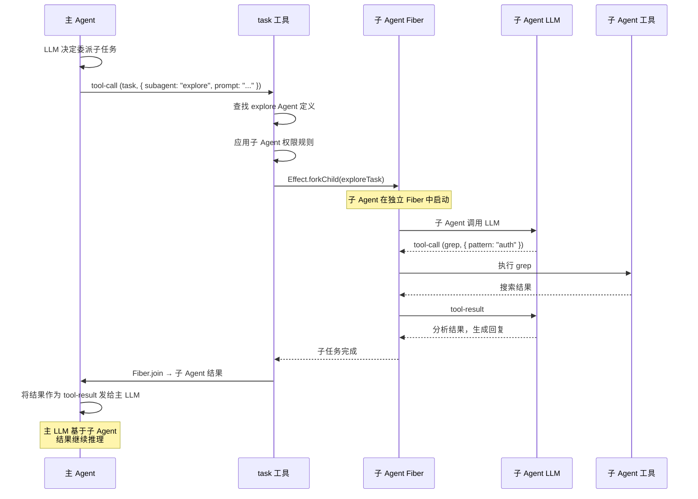

# 第 7 章：多 Agent 协作

> **本章目标**：理解 opencode 的多 Agent 协作机制——task 委派、Fiber 隔离、ACP 通信协议、Plan Mode 的逐步执行。
> **涉及文件**：`packages/opencode/src/tool/task.ts`、`packages/opencode/src/acp/`、`packages/opencode/src/agent/agent.ts`
> **必备知识**：第 6 章的 Agent 基础、Fiber 概念

---

## 7.1 场景引入：当一个 Agent 不够用

用户输入："帮我分析这个项目的认证逻辑，找出潜在的安全漏洞，并给出修复方案。"

这不是一个 Agent 能独立完成的任务。它需要：

1. **探索代码**：搜索所有认证相关的文件，理解整体架构
2. **安全审计**：检查密码存储、token 管理、权限检查
3. **生成修复**：编写修复代码

如果让一个 Agent 串行做这三件事，可能需要几十轮 LLM 调用，上下文窗口很快被占满。更好的方式是：主 Agent 制定计划，然后**委派子 Agent** 并行执行子任务。

这就是 opencode 多 Agent 协作的核心场景。

---

## 7.2 核心概念

### task 工具：Agent 委派的入口

`task` 工具是多 Agent 协作的枢纽。当主 Agent 调用 `task` 工具时：

```typescript
// task 工具的参数（简化）
{
  subagent_name: "explore",     // 委派给哪个 Agent
  description: "搜索所有认证相关文件",  // 任务描述
  prompt: "找到项目中所有与 authentication、login、token 相关的代码"  // 具体指令
}
```

`task` 工具的执行流程：

1. 根据 `subagent_name` 找到对应的 Agent 定义
2. 应用子 Agent 的权限规则（`subagent-permissions.ts`）
3. 在独立 Fiber 中 Fork 子 Agent 任务
4. 子 Agent 执行自己的 Agent Loop（调用 LLM → 使用工具 → 返回结果）
5. 主 Agent 通过 `Fiber.join` 等待子 Agent 完成
6. 将子 Agent 的结果作为 `tool-result` 返回给主 Agent 的 LLM

### ACP：Agent Communication Protocol

`packages/opencode/src/acp/` 目录实现了 **Agent Communication Protocol**——一个基于 `@agentclientprotocol/sdk` 的标准协议，用于 Agent 之间的通信。

ACP 的核心思想是：Agent 之间的通信不应该通过"调用函数"或"共享内存"，而应该通过**标准化的消息协议**。这带来几个好处：

- **语言无关**：理论上任何语言的 Agent 都可以通过 ACP 与 opencode 通信
- **可观测**：所有 Agent 间通信都是结构化消息，可以记录、审计、回放
- **解耦**：Agent A 不需要知道 Agent B 的内部实现，只需要知道 ACP 消息格式

在 Effect-TS 中，ACP 消息流通过 `Stream` 实现——每个 Agent 的输入和输出都是 `Stream<ACPMessage>`。

### Plan Mode：从"直接做"到"先计划再做"

opencode 的 Plan Mode 是一种特殊的 Agent 行为模式。当用户使用 `--plan` 标志或 plan Agent 时：

1. Agent 首先生成一个**执行计划**（步骤列表）
2. 计划展示给用户确认
3. 用户确认后，Agent 逐步执行每个步骤
4. 每步执行完，检查结果，决定是否调整后续步骤

`packages/opencode/src/agent/agent.ts:51-56` 的 `GeneratedAgent` Schema 用于 LLM 动态生成新的 Agent 配置——Plan Mode 中，LLM 可以创建临时子 Agent 来处理特定步骤。

---

## 7.3 Effect-TS 函数详解

### `Effect.forkChild` — 父等子的 Fork

```
类型签名（简化）:
  Effect.forkChild(effect): Effect<Fiber<A, E>, never, R>
```

**用途**：Fork 一个子 Fiber，父 Fiber 在退出前会自动等待子 Fiber 完成（或中断子 Fiber）。与 `fork` 的区别是：`fork` 的子 Fiber 独立运行，`forkChild` 的子 Fiber 生命周期绑定到父 Fiber。

**在 opencode 中的使用**：子 Agent 任务通过 `forkChild` 执行——主 Agent 退出时，子 Agent 自动被等待或中断。

### `Fiber.join` / `Fiber.interrupt` — 等待与中断

```
类型签名（简化）:
  Fiber.join(fiber): Effect<A, E>        // 等待 Fiber 完成，获取结果
  Fiber.interrupt(fiber): Effect<Exit<A, E>>  // 中断 Fiber
  Fiber.await(fiber): Effect<Exit<A, E>>      // 等待 Fiber 完成，获取 Exit（不抛异常）
```

**用途**：控制 Fiber 的生命周期。`join` 等待完成并获取结果（如果失败则传播错误），`interrupt` 发送中断信号，`await` 等待完成但以 `Exit` 形式返回（不传播错误）。

**在 opencode 中的使用**：主 Agent 用 `Fiber.join` 等待子 Agent 结果，用 `Fiber.interrupt` 取消超时的子 Agent。

### `Queue` — 并发安全的消息队列

```
类型签名（简化）:
  Queue.unbounded<A>(): Effect<Queue<A>>
  Queue.offer(queue, item): Effect<void>
  Queue.take(queue): Effect<A>
```

**用途**：并发安全的消息队列。多个生产者可以同时 `offer`，多个消费者可以同时 `take`。

**与普通 TypeScript 的对比**：

```typescript
// 普通 TS：数组不是并发安全的
const queue: Message[] = []
queue.push(msg)  // 多个 Fiber 同时 push → 竞态条件
const msg = queue.shift()  // 多个 Fiber 同时 shift → 数据丢失

// Effect-TS：Queue 是并发安全的
const queue = yield* _(Queue.unbounded<Message>())
yield* _(Queue.offer(queue, msg))  // 原子操作
const msg = yield* _(Queue.take(queue))  // 原子操作，队列空时阻塞
```

**在 opencode 中的使用**：Agent 间通信可以通过 Queue 传递消息（作为 ACP Stream 的底层实现之一）。

### `Effect.race` — 竞速执行

```
类型签名（简化）:
  Effect.race(effect1, effect2): Effect<A, E, R>
```

**用途**：同时执行两个 Effect，取最先完成者的结果，自动中断另一个。

**在 opencode 中的使用**：可以用于"多个子 Agent 解决同一个问题，取最快的结果"的场景。

### `Scope` — 资源生命周期作用域

```
类型签名（简化）:
  Scope.make(): Effect<Scope, never, never>
  Scope.addFinalizer(scope, finalizer): Effect<void>
  Scope.close(scope, exit): Effect<void>
```

**用途**：管理一组资源的生命周期。Scope 关闭时，所有注册的 finalizer 按 LIFO 顺序执行。Scope 是子 Agent 的"沙箱边界"——子 Agent 的所有资源（文件句柄、网络连接、Fiber）都在 Scope 中，Scope 关闭时自动清理。

**在 opencode 中的使用**：每个子 Agent 任务在独立的 Scope 中运行，确保子 Agent 退出时所有资源被释放。

---

## 7.4 实现剖析

### 子 Agent 的权限隔离

`packages/opencode/src/agent/subagent-permissions.ts` 定义了子 Agent 的权限规则。核心原则是：**子 Agent 的权限是主 Agent 权限的子集**。

例如，`explore` Agent 的权限规则只允许只读工具（read、grep、glob、lsp），不允许编辑工具（write、edit、bash）。这通过 `Permission.Ruleset` 实现：

```typescript
// 简化的 explore Agent 权限
const exploreRuleset = Permission.Ruleset.make([
  { pattern: "read", action: "allow" },
  { pattern: "grep", action: "allow" },
  { pattern: "glob", action: "allow" },
  { pattern: "lsp", action: "allow" },
  { pattern: "*", action: "deny" },  // 其他全部拒绝
])
```

### Plan Mode 的 Effect 实现

Plan Mode 的核心是**分步执行 + 结果验证**：

1. Agent 调用 LLM 生成计划（`generatePlan()`）
2. 计划是一系列步骤，每个步骤有描述和预期结果
3. 使用 `Effect.forEach` 逐步执行（或 `Effect.Schedule` 控制节奏）
4. 每步执行后检查结果，如果与预期不符，调整后续步骤
5. 所有步骤完成后，生成最终报告

### 时序图：主 Agent 委派子任务



---

## 7.5 开发人员必备知识与技能

1. **多 Agent 协作模式** — 常见的多 Agent 模式有：委派（主 Agent 分配任务给子 Agent）、辩论（多个 Agent 讨论达成共识）、分层（上层 Agent 规划，下层 Agent 执行）。opencode 主要使用委派模式。

2. **ACP 协议基础** — Agent Communication Protocol 是 Agent 间通信的标准化尝试。理解 ACP 的消息格式（请求/响应/事件）有助于理解 Agent 系统的可扩展性设计。

3. **Fiber 隔离原理** — 每个子 Agent 在独立 Fiber 中运行，这意味着：独立的错误处理、独立的中断信号、独立的 Context。Fiber 隔离是 Effect 结构化并发的核心优势。

4. **权限边界设计** — 子 Agent 的权限应该是主 Agent 权限的子集。设计权限边界时，遵循"最小权限原则"：子 Agent 只拥有完成任务所需的最少权限。

---

## 7.6 本章小结

- `task` 工具是多 Agent 协作的入口——主 Agent 委派子任务给子 Agent
- 子 Agent 通过 `Effect.forkChild` 在独立 Fiber 中运行，生命周期绑定到父 Fiber
- ACP（Agent Communication Protocol）提供标准化的 Agent 间通信，基于 Effect Stream 实现
- Plan Mode 让 Agent 先制定计划再逐步执行，每步验证结果
- 子 Agent 权限通过 `Permission.Ruleset` 隔离，遵循最小权限原则
- `Fiber.join` 等待子 Agent 结果，`Fiber.interrupt` 取消超时子 Agent，`Scope` 管理子 Agent 的资源生命周期
