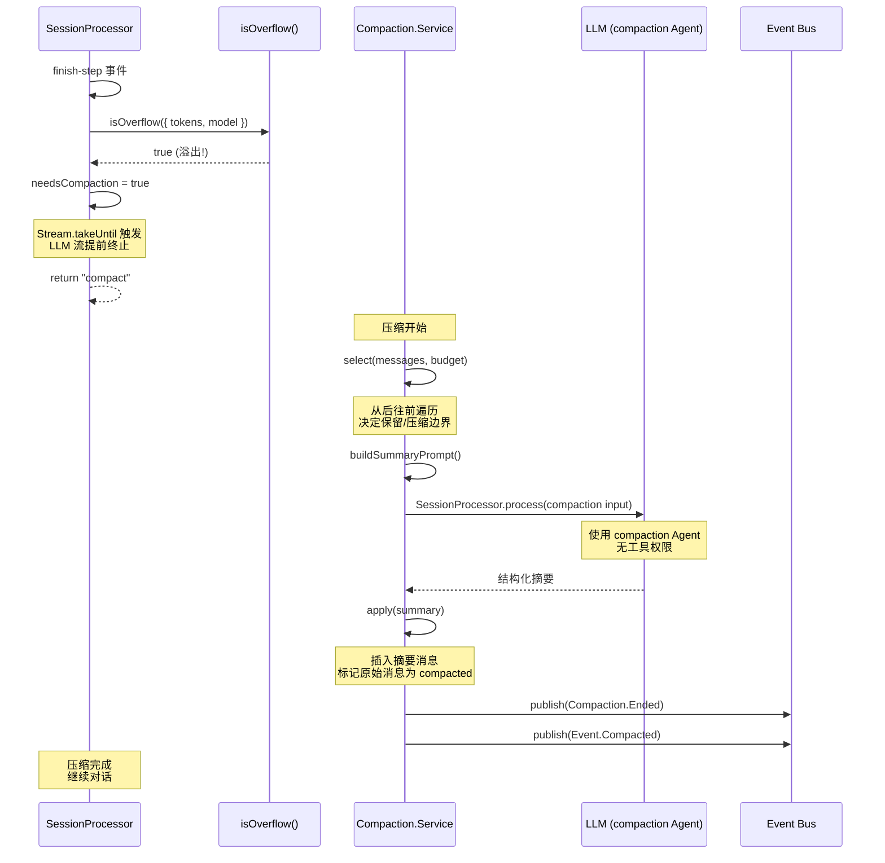

# 第 9 章：会话压缩（Compaction）

> **本章目标**：理解 opencode 的会话压缩机制——从溢出检测到 LLM 摘要生成到消息替换的完整流程，掌握 Effect Scope 在资源管理中的作用。
> **涉及文件**：`packages/opencode/src/session/compaction.ts`、`overflow.ts`
> **必备知识**：第 8 章的上下文管理、LLM 调用基础

---

## 9.1 场景引入：当对话"太长了"

你正在用 opencode 开发一个功能，对话已经持续了三小时。每次你让 AI 修改代码，opencode 都需要把整个三小时的对话历史发送给 LLM——包括你最初的需求描述、AI 的每次回复、每次工具调用的完整输出。

问题来了：Claude 的上下文窗口是 200K token。三小时的对话可能已经积累了 180K token。下一次 LLM 调用很可能触发上下文溢出——LLM 直接拒绝请求，或者更糟，悄悄忽略最早的消息（不同提供商行为不同）。

opencode 的解决方案是**会话压缩（Compaction）**：当 token 数量接近上限时，用 LLM 生成一段对话摘要，然后用摘要替换原始消息。这样，后续 LLM 调用看到的是"摘要 + 最近消息"，而不是"全部历史"。

---

## 9.2 核心概念

### 压缩策略的三个常数

`packages/opencode/src/session/compaction.ts` 定义了三个关键常数：

| 常数 | 值 | 含义 |
|------|-----|------|
| `PRUNE_MINIMUM` | 20,000 | 至少保留 20K token 不被裁剪 |
| `PRUNE_PROTECT` | 40,000 | 保护 40K token 范围内的消息不被裁剪 |
| `TOOL_OUTPUT_MAX_CHARS` | 2,000 | 工具输出超过 2000 字符时截断 |

这些常数定义了一个"保护区域"：最近 40K token 的消息不会被裁剪，20K token 是裁剪后必须保留的最小值。这保证了压缩不会丢失最近的对话上下文。

### 受保护工具

```typescript
const PRUNE_PROTECTED_TOOLS = ["skill"]
```

`skill` 工具的调用记录不会被裁剪。为什么？因为 skill 工具的输出通常包含重要的结构化信息（如技能定义、配置），这些信息在后续对话中可能被反复引用。裁剪它们会导致 AI "忘记"可用的技能。

### 压缩流程

压缩由 `Compaction.Service` 管理，核心流程分四步：

1. **溢出检测** → `isOverflow()` 判断 token 是否超过阈值
2. **消息选择** → `select()` 决定哪些消息保留、哪些压缩
3. **摘要生成** → `generateSummary()` 调用 LLM 生成摘要
4. **消息替换** → `apply()` 用摘要替换原始消息

---

## 9.3 Effect-TS 函数详解

### `Effect.acquireRelease` — 资源安全获取与释放

```
类型签名（简化）:
  Effect.acquireRelease<A>(acquire: Effect<A>, release: (a: A) => Effect<void>): Effect<A, never, Scope>
```

**用途**：获取资源并自动注册释放回调。无论成功、失败还是中断，`release` 都会执行。这是 Effect 的 `try-with-resources`。

**与普通 TypeScript 的对比**：

```typescript
// 普通 TS：手动管理资源
const file = await openFile("data.txt")
try {
  const content = await file.read()
} finally {
  await file.close()  // 容易忘记
}

// Effect-TS：acquireRelease 自动管理
const file = yield* _(Effect.acquireRelease(
  openFile("data.txt"),
  (file) => file.close()  // 无论成败、中断，必定执行
))
const content = yield* _(file.read())
```

**在 opencode 中的使用**：`llm.ts` 用 `acquireRelease` 管理 `AbortController` 的生命周期。

### `Scope` — 资源作用域

```
类型签名（简化）:
  Scope.make(): Effect<Scope>
  Scope.addFinalizer(scope, finalizer): Effect<void>
  Scope.close(scope, exit): Effect<void>
```

**用途**：管理一组资源的生命周期。Scope 关闭时，所有注册的 finalizer 按 LIFO（后进先出）顺序执行。

**在 opencode 中的使用**：压缩过程中，摘要生成的 LLM 调用在独立 Scope 中执行——Scope 关闭时自动释放 AbortController、清理临时状态。

### `Effect.addFinalizer` — 注册清理回调

```
类型签名（简化）:
  Effect.addFinalizer(finalizer: Effect<void>): Effect<void, never, Scope>
```

**用途**：在当前 Scope 中注册一个清理回调。Scope 关闭时执行。

**在 opencode 中的使用**：`InstanceState` 用 `addFinalizer` 注册实例销毁时的清理逻辑。

### `Effect.forkIn(scope)` — 在指定 Scope 中 Fork

```
类型签名（简化）:
  Effect.forkIn(effect, scope): Effect<Fiber<A, E>, never, R>
```

**用途**：在指定 Scope 中 Fork 一个后台任务。Scope 关闭时，Fork 的 Fiber 自动中断。

**在 opencode 中的使用**：后台摘要生成通过 `Effect.forkIn(scope)` 执行——如果主任务完成或取消，后台摘要自动中断。

### `Stream.runCollect` — 收集流元素

```
类型签名（简化）:
  Stream.runCollect<T>(stream): Effect<Chunk<T>, E, R>
```

**用途**：消费整个流，将所有元素收集到一个 `Chunk`（Effect 的不可变数组）中。

**在 opencode 中的使用**：压缩时可能需要收集 LLM 流的完整输出用于摘要生成。

---

## 9.4 实现剖析

### 消息选择：select() 算法

`compaction.ts` 的 `select()` 函数决定哪些消息保留、哪些压缩。算法如下：

1. **从后往前遍历消息**，累计 token 数
2. 当累计 token 数达到 `preserveRecentBudget`（最近消息保留预算）时停止
3. 停止位置之前的消息 → 压缩（生成摘要替换）
4. 停止位置之后的消息 → 保留（原样发送给 LLM）
5. 如果之前已有摘要，将旧摘要也纳入新摘要的生成

这个算法的核心思想是：**最近的消息最重要，越早的消息越可以被压缩**。

### 摘要生成：generateSummary()

摘要生成本身也是一次 LLM 调用——使用 `compaction` Agent（hidden 模式，无工具权限）：

```typescript
// 简化的 generateSummary 逻辑
generateSummary(sessionID, messages) {
  return Effect.gen(function* (_) {
    // 1. 构建摘要提示（包含旧摘要 + 待压缩消息）
    const prompt = buildSummaryPrompt(previousSummary, messagesToCompress)

    // 2. 创建 compaction Agent 的输入
    const input = createCompactionInput(sessionID, prompt)

    // 3. 调用 SessionProcessor（使用 compaction Agent，无工具）
    yield* _(SessionProcessor.process(input))

    // 4. 从结果中提取摘要文本
    const summary = extractSummary(result)
    return summary
  })
}
```

摘要的格式是结构化的 Markdown：

```markdown
## Goal
- [任务目标]

## Constraints & Preferences
- [用户约束和偏好]

## Key Decisions
- [关键决策]

## Current State
- [当前状态：已完成的文件、待处理的任务]
```

### 消息替换：apply()

摘要生成后，`apply()` 执行替换：

1. 在消息列表中插入一条用户消息，包含 `compaction` Part（摘要内容）
2. 创建一条 AI 消息，标记 `summary: true` 和 `mode: "compaction"`
3. 原始消息被标记为 `compacted`，后续 LLM 调用不再发送它们
4. 发布 `SessionEvent.Compaction.Ended` 和 `Event.Compacted` 事件

替换后，LLM 看到的对话历史变为：

```
[摘要消息] → [最近 2-3 轮对话]
```

而不是：

```
[100 条历史消息] → [最近 2-3 轮对话]
```

### 时序图：压缩完整流程



---

## 9.5 开发人员必备知识与技能

1. **摘要生成策略** — 好的摘要不是"把对话缩短"，而是"提取关键信息"。opencode 的结构化摘要模板（Goal / Constraints / Key Decisions / Current State）是一个很好的参考——它强制 LLM 按维度提取信息，而非自由发挥。

2. **Token 估算** — 压缩决策依赖准确的 token 计数。不同模型的 tokenizer 不同，opencode 使用 AI SDK 提供的 token 计数（`usage.inputTokens`、`usage.outputTokens`）。在开发自己的 AI 应用时，注意 token 计数是估算值，不是精确值。

3. **Scope 资源管理** — 压缩过程中的 LLM 调用、临时状态、AbortController 都在独立 Scope 中管理。Scope 确保压缩失败时不会泄漏资源，压缩被取消时所有子任务自动中断。

4. **压缩触发时机** — 压缩不是在溢出那一刻才触发，而是通过 `COMPACTION_BUFFER`（20K token）提前预留空间。这保证了压缩本身有足够的 token 预算执行。

---

## 9.6 本章小结

- 压缩是 opencode 处理长对话的核心机制——用 LLM 摘要替换历史消息
- 三个关键常数定义保护区域：`PRUNE_MINIMUM = 20K`、`PRUNE_PROTECT = 40K`
- `skill` 工具受保护不被裁剪，因为其输出包含重要的结构化信息
- `select()` 从后往前遍历消息，最近的消息保留，较早的消息压缩
- 摘要使用结构化 Markdown 模板（Goal / Constraints / Key Decisions / Current State）
- `Effect.acquireRelease` 和 `Scope` 确保压缩过程中的资源无论成败都被释放
- 压缩通过 `COMPACTION_BUFFER` 提前触发，保证压缩本身有足够的 token 预算
