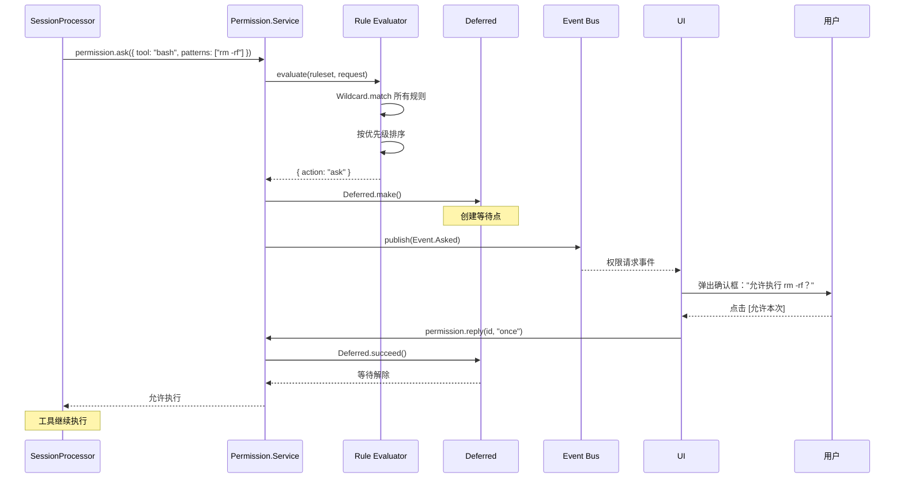

# 第 12 章：权限系统（Permission Guard）

> **本章目标**：理解 opencode 的权限模型——三值逻辑、通配符匹配、`Deferred` 请求-回复模式，掌握 AI 编程工具的安全围栏设计。
> **涉及文件**：`packages/opencode/src/permission/index.ts`、`evaluate.ts`、`arity.ts`
> **必备知识**：安全模型基础（ACL、RBAC）、通配符匹配概念

---

## 12.1 场景引入：AI 说"让我删掉这个文件"

AI 编程工具拥有强大的能力——读写文件、执行 shell 命令、访问网络。但能力越大，风险越大。

想象这个场景：AI 在修复一个 bug，它决定"删除 `node_modules` 重新安装"。这个操作可能是合理的（确实需要清理），也可能是灾难性的（删错了目录）。opencode 不能替用户做这个决定——但它可以**拦截这个操作，询问用户**。

这就是权限系统的作用：**在 AI 的"想做"和"能做"之间建立一道可控的围栏**。

---

## 12.2 核心概念

### 三值逻辑：allow / deny / ask

`packages/opencode/src/permission/index.ts:19` 定义了权限的三种操作：

```typescript
export const Action = Schema.Literals(["allow", "deny", "ask"])
```

| 操作 | 含义 | 用户体验 |
|------|------|----------|
| `allow` | 允许执行 | 无感知，操作直接执行 |
| `deny` | 拒绝执行 | 操作被阻止，AI 收到拒绝通知 |
| `ask` | 询问用户 | 弹出确认对话框，用户决定 |

这不是简单的"允许/禁止"二元模型。`ask` 是关键的第三种状态——它让用户可以在运行时动态决定，而不是预先配置所有规则。

### 规则模型

```typescript
export const Rule = Schema.Struct({
  permission: Schema.String,   // 权限类别（如 "tool"、"file_write"）
  pattern: Schema.String,      // 匹配模式（如 "bash"、"src/**"）
  action: Action,              // allow / deny / ask
})
```

一条规则说："对于 `permission` 类别中匹配 `pattern` 的操作，执行 `action`。"

例如：
- `{ permission: "tool", pattern: "read", action: "allow" }` — 读取文件总是允许
- `{ permission: "tool", pattern: "bash", action: "ask" }` — 执行 shell 命令需要询问
- `{ permission: "file_write", pattern: ".env", action: "deny" }` — 禁止修改 `.env` 文件

### 通配符匹配

`Wildcard.match()` 支持 `*`（匹配单层）和 `?`（匹配单字符）通配符：

```typescript
Wildcard.match("src/**", "src/components/Button.tsx")  // true
Wildcard.match("src/*.ts", "src/index.ts")              // true
Wildcard.match("src/*.ts", "src/lib/utils.ts")          // false（* 不跨目录）
Wildcard.match("*.env", ".env")                         // true
```

### 规则优先级

`packages/opencode/src/permission/arity.ts` 定义了规则的优先级排序。核心原则：**越具体的规则优先级越高**。`findLast` 语义——多条规则匹配时，最后一条匹配的规则生效。

---

## 12.3 Effect-TS 函数详解

### `Deferred` — 一次性异步协调原语

```
类型签名（简化）:
  Deferred.make<A, E>(): Effect<Deferred<A, E>>
  Deferred.succeed(deferred, value: A): Effect<void>
  Deferred.fail(deferred, error: E): Effect<void>
  Deferred.await(deferred): Effect<A, E>
```

**用途**：创建一个"一次性 Promise"。与 `Promise` 不同，`Deferred` 可中断、类型安全（错误类型不丢失）。

**与普通 TypeScript 的对比**：

```typescript
// 普通 TS：Promise 的 resolve/reject 模式
const { promise, resolve, reject } = Promise.withResolvers()
// promise: Promise<T>（错误类型丢失）
// 无法从外部中断

// Effect-TS：Deferred
const deferred = yield* _(Deferred.make<string, PermissionError>())
// Deferred.await 返回 Effect<string, PermissionError>（错误类型保留）
// Fiber 中断时 Deferred.await 自动中断
```

**在 opencode 中的使用**：`Permission.ask()` 创建一个 `Deferred`，发布 `Event.Asked`，然后 `Deferred.await` 等待用户回复。用户回复通过 `Permission.reply()` 调用 `Deferred.succeed` 或 `Deferred.fail`。

### `Effect.ensuring(cleanup, effect)` — 保证清理

```
类型签名（简化）:
  Effect.ensuring(effect, finalizer: Effect<void>): Effect<A, E, R>
```

**用途**：无论 `effect` 成功、失败还是被中断，`finalizer` 都会执行。

**在 opencode 中的使用**：`Permission.ask()` 用 `ensuring` 保证用户回复后清理 pending 请求：

```typescript
return yield* _(Effect.ensuring(
  Deferred.await(deferred),
  Effect.sync(() => pending.delete(id))  // 无论结果如何，清理 pending 记录
))
```

### `Effect.catchTag` — 按标签精确捕获错误

```
类型签名（简化）:
  Effect.catchTag(effect, "TagName", handler: (e: TaggedError) => Effect<A2, E2, R2>)
```

**用途**：按 `TaggedError` 的标签名精确捕获特定错误类型。比 `catchIf` 更简洁（不需要写 predicate），比 `catchAll` 更精确。

**与普通 TypeScript 的对比**：

```typescript
// 普通 TS：instanceof 判断
try { ... }
catch (e) {
  if (e instanceof PermissionDeniedError) { /* 处理 */ }
  else if (e instanceof PermissionRejectedError) { /* 处理 */ }
  else { throw e }
}

// Effect-TS：catchTag 按标签匹配
effect.pipe(
  Effect.catchTag("PermissionDeniedError", (e) => handleDenied(e)),
  Effect.catchTag("PermissionRejectedError", (e) => handleRejected(e)),
)
```

**在 opencode 中的使用**：权限系统中用 `catchTag` 区分 `DeniedError`（规则拒绝）和 `RejectedError`（用户拒绝）。

### `PubSub` — 发布订阅

```
类型签名（简化）:
  PubSub.unbounded<T>(): Effect<PubSub<T>>
  PubSub.publish(pubsub, value: T): Effect<void>
  PubSub.subscribe(pubsub): Effect<Stream<T>>
```

**用途**：多播事件总线。多个订阅者可以同时接收同一个事件。

**与普通 TypeScript 的对比**：

```typescript
// Node EventEmitter：无类型安全
emitter.on("event", (data) => { /* data 是 unknown */ })
emitter.emit("event", someData)

// Effect PubSub：类型安全
const pubsub = yield* _(PubSub.unbounded<PermissionEvent>())
yield* _(PubSub.publish(pubsub, event))  // 类型检查
const stream = yield* _(PubSub.subscribe(pubsub))  // Stream<PermissionEvent>
```

**在 opencode 中的使用**：`Bus` 和 `EventV2` 的底层都是 `PubSub`。

---

## 12.4 实现剖析

### Permission.ask()：Deferred 请求-回复模式

`Permission.ask()` 是权限系统的核心方法。它的流程展示了 Effect 如何优雅地处理"需要外部输入"的异步操作：

```typescript
// 简化的 ask() 逻辑
ask(request: Permission.Request) {
  return Effect.gen(function* (_) {
    // 1. 评估规则
    const result = yield* _(evaluate(ruleset, request))
    if (result.action !== "ask") {
      if (result.action === "allow") return  // 允许 → 直接通过
      if (result.action === "deny") return yield* _(new DeniedError(...))  // 拒绝 → 报错
    }

    // 2. 需要询问用户 → 创建 Deferred
    const deferred = yield* _(Deferred.make<void, RejectedError | CorrectedError>())
    const id = PermissionID.make()
    pending.set(id, { request, deferred })

    // 3. 发布事件（通知 UI 弹出确认框）
    yield* _(bus.publish(Event.Asked, { id, ...request }))

    // 4. 等待用户回复（阻塞当前 Fiber）
    return yield* _(Effect.ensuring(
      Deferred.await(deferred),           // 等待用户确认/拒绝
      Effect.sync(() => pending.delete(id)) // 清理 pending 记录
    ))
  })
}
```

这个模式的关键是 `Deferred`——它让异步的"用户确认"操作变成了 Effect 世界中的"等待一个值"。`Permission.ask()` 的调用者不需要知道用户如何确认（CLI 对话框？Web UI？移动端推送？），只需要 `yield* _(permission.ask(...))`。

### Permission.reply()：用户回复处理

```typescript
// 简化的 reply() 逻辑
reply(id: PermissionID, reply: "once" | "always" | "reject") {
  return Effect.gen(function* (_) {
    const entry = pending.get(id)
    if (!entry) return

    if (reply === "once") {
      yield* _(Deferred.succeed(entry.deferred, undefined))  // 允许本次
    } else if (reply === "always") {
      // 将匹配的 pattern 加入 approved 规则
      yield* _(addApprovedRule(entry.request))
      yield* _(Deferred.succeed(entry.deferred, undefined))
      // 同时自动批准其他 pending 请求中匹配的
      yield* _(autoApproveMatching(entry.request))
    } else {
      yield* _(Deferred.fail(entry.deferred, new RejectedError(...)))  // 拒绝
    }
  })
}
```

`"always"` 选项的智能之处：它不仅批准当前请求，还自动批准其他 pending 请求中匹配相同 pattern 的——避免用户被重复询问。

### 时序图：权限检查完整流程



---

## 12.5 开发人员必备知识与技能

1. **权限模型设计** — 三值逻辑（allow/deny/ask）比二值逻辑（allow/deny）更适合 AI 工具——因为 AI 的行为不可完全预测，需要运行时的人类判断。设计权限系统时，考虑粒度：工具级别（bash vs read）、路径级别（src/** vs .env）、操作级别（read vs write vs delete）。

2. **通配符匹配算法** — `Wildcard.match` 是权限系统的核心算法。`*` 匹配单层（不跨目录分隔符），`**` 匹配任意深度。理解通配符语义是编写正确权限规则的前提。

3. **Deferred 请求-回复模式** — 当 Effect 需要等待外部输入（用户确认、网络回调、硬件事件）时，`Deferred` 是标准模式。它比 `Promise` 更适合 Effect 世界——可中断、类型安全、与 Fiber 生命周期集成。

4. **安全围栏策略** — AI 工具的安全围栏应该是多层防御：权限规则（第一层）、Doom Loop 检测（第二层）、上下文溢出保护（第三层）、文件快照回滚（第四层）。单层防御不够。

---

## 12.6 本章小结

- 权限模型使用三值逻辑：`allow`（允许）、`deny`（拒绝）、`ask`（询问用户）
- 规则由 `permission` 类别 + `pattern` 模式 + `action` 操作组成
- `Wildcard.match()` 支持 `*` 和 `**` 通配符，`findLast` 语义决定优先级
- `Permission.ask()` 通过 `Deferred` 实现异步请求-回复——创建 Deferred → 发布事件 → 等待回复
- `"always"` 回复自动批准其他 pending 请求中匹配相同 pattern 的
- `Effect.catchTag` 精确区分 `DeniedError`（规则拒绝）和 `RejectedError`（用户拒绝）
- 安全围栏应该是多层防御：权限规则 + Doom Loop 检测 + 溢出保护 + 快照回滚
