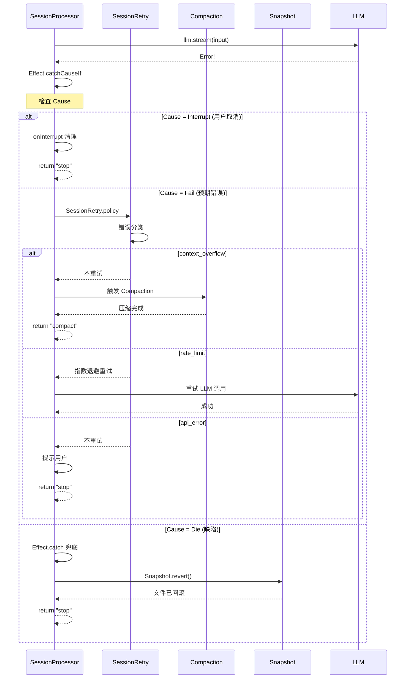

# 第 13 章：失败恢复与容错

> **本章目标**：理解 Effect 的三层错误模型（Error / Defect / Interrupt），掌握 opencode 的快照与回滚机制，学习优雅降级策略。
> **涉及文件**：`packages/opencode/src/snapshot/index.ts`、`packages/opencode/src/session/processor.ts`
> **必备知识**：Git 基础操作、错误处理策略

---

## 13.1 场景引入：当 AI 改坏了你的代码

你让 opencode 帮你重构一个模块。AI 修改了 5 个文件，删除了 2 个"不再需要的"函数。然后你发现——那两个函数其实还在别处被引用。AI 犯了一个错误。

现在你需要撤销这些修改。但你已经做了其他手动修改，不能简单地 `git reset --hard`。

opencode 的解决方案是**文件快照（Snapshot）**：在每次 LLM 调用前自动记录文件状态，如果 AI 的修改有问题，可以一键回滚到调用前的状态——不影响你在调用之间做的其他修改。

---

## 13.2 核心概念

### Effect 的三层错误模型

Effect-TS 将"出错"分为三个层次：

| 层次 | 类型 | 含义 | 处理方式 |
|------|------|------|----------|
| **预期错误（Error）** | `E` 类型参数 | 可预期的业务错误 | `catchTag`、`catchIf`、`retry` |
| **缺陷（Defect）** | `Cause.Die` | 未预期的程序错误（空指针、逻辑 bug） | `catchAll`、`orDie` |
| **中断（Interrupt）** | `Cause.Interrupt` | Fiber 被取消 | `onInterrupt`、`Cause.hasInterruptsOnly` |

这个三层模型的关键价值在于**区分"可以恢复的错误"和"不应该恢复的缺陷"**：

- API Key 过期 → 预期错误，提示用户更新 Key
- 网络超时 → 预期错误，重试
- 空指针异常 → 缺陷，不应该重试（重试也不会好）
- 用户按 Escape → 中断，清理资源但不报错

在普通 TypeScript 中，这三种情况全部混在 `catch (e: unknown)` 中。Effect 将它们分离到类型系统层面。

### 错误分类与恢复策略

opencode 将 LLM 调用中的错误分为三类：

| 错误类型 | 示例 | 恢复策略 |
|----------|------|----------|
| `context_overflow` | token 超过上下文窗口 | 触发 Compaction |
| `api_error` | API Key 过期、权限不足 | 提示用户，不重试 |
| `rate_limit` | HTTP 429 | 指数退避重试 |

### 快照系统

`packages/opencode/src/snapshot/index.ts` 实现了基于 Git 的文件快照：

- **`track()`** — `git add` + `git write-tree`，记录当前文件状态，返回 tree hash
- **`patch()`** — `git diff --cached --name-only`，生成差异文件列表
- **`restore()`** — `git read-tree` + `git checkout-index -a -f`，恢复到指定快照
- **`revert()`** — 按文件回滚：`git checkout <hash> -- <file>`
- **`diffFull()`** — `git diff --name-status --numstat` + `git cat-file --batch`，生成完整差异

快照存储在裸 Git 仓库中（`Global.Path.data/snapshot/<project>/<hash>`），不影响项目的工作 Git 仓库。

---

## 13.3 Effect-TS 函数详解

### `Cause` — 错误原因类型

```
类型签名（简化）:
  Cause<E> = Cause.Die | Cause.Fail<E> | Cause.Interrupt | Cause.Parallel<Cause<E>> | Cause.Sequential<Cause<E>>
```

**用途**：`Cause` 是 Effect 的"错误详情"类型。它不仅告诉你"出错了"，还告诉你"为什么出错"——是预期错误、缺陷、中断，还是多个错误的组合。

**在 opencode 中的使用**：`processor.ts:747` 用 `Cause.hasInterruptsOnly(cause)` 区分中断和真实错误。

### `Cause.hasInterruptsOnly` / `Cause.squash` — 中断检测与展平

```
类型签名（简化）:
  Cause.hasInterruptsOnly(cause: Cause<E>): boolean
  Cause.squash(cause: Cause<E>): unknown
```

**用途**：`hasInterruptsOnly` 检查 Cause 是否仅由中断引起（没有真实错误）。`squash` 将 Cause 展平为单个错误值（用于传播给 Promise 世界）。

**在 opencode 中的使用**：`processor.ts:747-748`：

```typescript
Effect.catchCauseIf(
  (cause) => !Cause.hasInterruptsOnly(cause),  // 只重试非中断错误
  (cause) => Effect.fail(Cause.squash(cause)),  // 展平后传播
)
```

### `Effect.catchCauseIf` — 按 Cause 条件捕获

```
类型签名（简化）:
  Effect.catchCauseIf(effect, predicate: (cause: Cause<E>) => boolean, handler: (cause: Cause<E>) => Effect<A2, E2, R2>)
```

**用途**：按 Cause 条件捕获错误。比 `catchIf` 更底层——可以访问完整的 Cause 信息（包括 Defect 和 Interrupt）。

**在 opencode 中的使用**：`processor.ts:746` 用 `catchCauseIf` 区分中断和真实错误。

### `Effect.orDie` — 将错误转为 Defect

```
类型签名（简化）:
  Effect.orDie(effect): Effect<A, never, R>
```

**用途**：将预期错误"升级"为 Defect（不可恢复的缺陷）。用于"这个错误不应该发生，如果发生了就是 bug"的场景。

**在 opencode 中的使用**：`provider.getModel(...).pipe(Effect.orDie)` —— 获取模型失败被视为不可恢复的缺陷。

### `Exit` — Effect 执行结果

```
类型签名（简化）:
  Exit<A, E> = Exit.Success<A, E> | Exit.Failure<A, E>
```

**用途**：`Exit` 是 Effect 执行完成后的"结果包装"。与 `try/catch` 不同，`Exit` 将成功和失败统一在一个类型中，不抛异常。

**与普通 TypeScript 的对比**：

```typescript
// 普通 TS：try/catch 分离成功和失败
try {
  const result = await effect
  // 处理成功
} catch (e) {
  // 处理失败
}

// Effect-TS：Exit 统一处理
const exit = yield* _(Effect.exit(effect))
Exit.match(exit, {
  onSuccess: (value) => handleSuccess(value),
  onFailure: (cause) => handleFailure(cause),
})
```

**在 opencode 中的使用**：`run-service.ts` 的 `runPromiseExit` 返回 `Exit` 而非抛异常。

### `Effect.acquireRelease` — 资源安全获取与释放

**在 opencode 中的使用**：快照系统使用 `acquireRelease` 管理 Git 进程——获取 Git 子进程，注册清理回调（进程退出时 kill）。

---

## 13.4 实现剖析

### 快照的 Effect 实现

快照系统使用 Git 裸仓库存储文件版本。所有 Git 操作通过 `Effect.fnUntraced` 包装：

```typescript
// 简化的 track() 逻辑
const track = Effect.fnUntraced("Snapshot.track")(function* () {
  // 1. git add 所有文件
  yield* _(git(["add", "."]))

  // 2. git write-tree 创建 tree 对象
  const result = yield* _(git(["write-tree"]))
  const hash = result.text.trim()

  // 3. 返回 hash（后续用于 patch/restore/revert）
  return hash
})
```

`Semaphore` 序列化对同一 Git 仓库的并发操作：

```typescript
const lock = (key: string) => {
  const hit = locks.get(key)
  if (hit) return hit
  const next = Semaphore.makeUnsafe(1)
  locks.set(key, next)
  return next
}
// 使用：lock(gitdir).withPermits(1)(gitOperation)
```

### 优雅降级策略

opencode 的优雅降级体现在多个层面：

1. **提供商降级**：主提供商不可用 → 自动切换到备选提供商（如果用户配置了多个提供商）
2. **模型降级**：大模型限流 → 降级到小模型（如 Claude Opus → Claude Sonnet）
3. **功能降级**：某些实验性功能出错 → 自动禁用该功能，不影响核心流程
4. **工具降级**：工具执行失败 → 将错误信息返回给 LLM，让 LLM 决定下一步（而非崩溃整个会话）

### 时序图：LLM 调用失败 → 恢复决策树



---

## 13.5 开发人员必备知识与技能

1. **错误分类策略** — 好的错误处理不是"捕获所有异常"，而是"分类处理"。至少区分三类：可重试的（网络、限流）、需用户介入的（认证、权限）、不可恢复的（数据损坏、逻辑 bug）。

2. **快照/回滚模式** — AI 工具的修改应该是可撤销的。Git 裸仓库是轻量级的快照方案——不影响用户的工作仓库，不产生额外的 branch/tag。关键设计：快照在 LLM 调用**前**创建，回滚只撤销 AI 的修改，不影响用户在调用之间做的修改。

3. **优雅降级设计** — 系统应该在部分功能失败时继续运行，而非全部崩溃。降级路径应该是预先设计的，而非临时判断。例如：主模型不可用 → 备选模型 → 缓存结果 → 提示用户稍后重试。

4. **Cause 分析** — `Cause` 类型是 Effect 错误处理的"显微镜"。学会使用 `Cause.hasInterruptsOnly`、`Cause.squash`、`Cause.failures`、`Cause.defects` 等工具函数，可以精确诊断错误的根因。

---

## 13.6 本章小结

- Effect 将错误分为三层：预期错误（E）、缺陷（Defect）、中断（Interrupt）
- `Cause.hasInterruptsOnly` 区分中断和真实错误——中断不重试，真实错误才重试
- opencode 将 LLM 错误分为三类：`context_overflow`（触发压缩）、`api_error`（提示用户）、`rate_limit`（指数退避重试）
- 快照系统基于 Git 裸仓库：`track()` → `patch()` → `revert()`，不影响用户的工作仓库
- `Semaphore` 序列化并发 Git 操作，`Effect.acquireRelease` 管理 Git 子进程生命周期
- 优雅降级在多个层面：提供商 → 模型 → 功能 → 工具
- `Exit` 统一成功和失败，`runPromiseExit` 返回 `Exit` 而非抛异常
