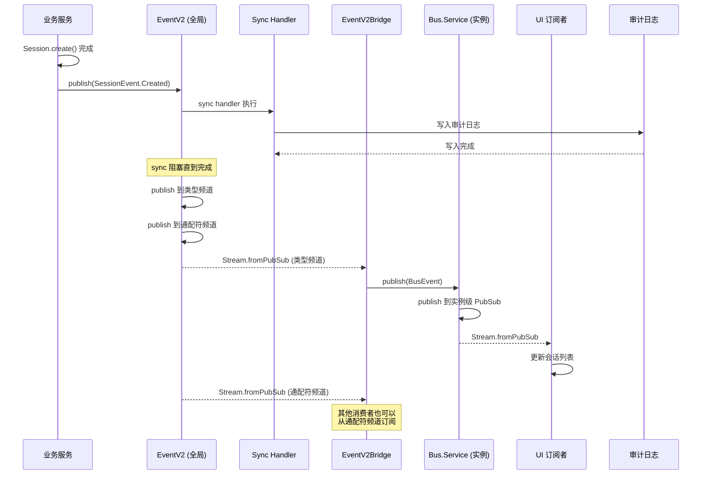

# 第 15 章：事件驱动架构

> **本章目标**：理解 opencode 的双层事件总线——全局 `EventV2` 和实例级 `Bus.Service`，掌握 `PubSub` 的三种订阅模式及其选择策略。
> **涉及文件**：`packages/core/src/event.ts`、`packages/opencode/src/bus/`、`packages/opencode/src/event-v2-bridge.ts`
> **必备知识**：发布订阅模式基础、Node.js EventEmitter 概念

---

## 15.1 场景引入：一个操作，多个响应

当 opencode 创建一个新 Session 时，以下事情需要发生：

1. **数据库写入**——必须在响应返回前完成（同步）
2. **UI 更新**——会话列表需要显示新会话（异步，可以晚几毫秒）
3. **审计日志**——法规要求记录所有会话创建（同步写入）
4. **用量统计更新**——更新用户的 token 消耗统计（异步）
5. **Slack 通知**——如果是团队版，通知 Slack 频道（异步）

如果把这些逻辑全部写在 `Session.create()` 方法里，它会变成一个几百行的"上帝方法"。事件驱动架构的解决方案是：

> `Session.create()` 只做一件事：创建会话。创建成功后，发布一个 `Session.Created` 事件。其他所有操作——写日志、更新 UI、发通知——都是这个事件的消费者。

---

## 15.2 核心概念

### 双层事件总线

opencode 有两层事件总线：

| 层级 | 实现 | 作用域 | 用途 |
|------|------|--------|------|
| **EventV2** | `packages/core/src/event.ts` | 全局 | 跨实例的事件定义和发布（Session 事件、审计日志） |
| **Bus.Service** | `packages/opencode/src/bus/` | 实例级 | 单个项目目录内的事件通信（权限请求、状态变化） |

`EventV2` 是全局的——所有项目目录共享同一个 EventV2 总线。`Bus.Service` 是实例级的——每个项目目录有自己的 Bus 实例，通过 `InstanceState` 隔离。

### EventV2 的事件定义

```typescript
// EventV2 的事件定义模式
const SessionEvent = {
  Created: EventV2.define({
    type: "session.created",
    version: "v2",
    aggregate: "session",
    schema: Schema.Struct({
      sessionID: SessionID,
      projectID: ProjectID,
      timestamp: DateTimeUtcFromMillis,
    }),
  }),
}
```

每个事件有：
- **`type`** — 唯一的事件类型标识
- **`version`** — 事件版本（支持事件格式演进）
- **`aggregate`** — 聚合根（用于事件溯源）
- **`schema`** — Effect Schema（编译期 + 运行时类型验证）

### 三种订阅模式

| 模式 | 方法 | 特点 | 使用场景 |
|------|------|------|----------|
| **sync handler** | `EventV2.sync()` | 同步执行，阻塞发布者 | 审计日志（必须写入后才返回） |
| **subscribe (Stream)** | `EventV2.subscribe()` | 异步流式，不阻塞 | UI 更新、后台处理 |
| **subscribeCallback** | `Bus.subscribeCallback()` | 命令式回调 | 与 Promise/回调代码互操作 |

选择策略：
- **必须成功且必须在返回前完成** → `sync`（如审计日志）
- **可以异步，最终一致即可** → `subscribe`（如 UI 更新）
- **需要与 Promise 代码集成** → `subscribeCallback`（如 CLI 输出）

### EventV2Bridge：连接两层总线

`packages/opencode/src/event-v2-bridge.ts` 连接全局 `EventV2` 和实例级 `Bus`：

- 全局事件（如 Session 创建）通过 Bridge 分发到当前实例的 Bus
- 实例级事件（如权限请求）通过 Bridge 发布到全局 EventV2（用于跨实例通信）

---

## 15.3 Effect-TS 函数详解

### `PubSub` — 发布订阅原语

```
类型签名（简化）:
  PubSub.unbounded<T>(): Effect<PubSub<T>>
  PubSub.publish(pubsub, value: T): Effect<void>
  PubSub.subscribe(pubsub): Effect<Stream<T>>
```

**用途**：多播事件总线。`unbounded` 表示队列无容量限制（背压由订阅者自行处理）。

**与 Node EventEmitter 的对比**：

| 特性 | EventEmitter | PubSub |
|------|-------------|--------|
| 类型安全 | ❌（`emit(event, ...args: any[])`） | ✅（`PubSub<T>`） |
| 背压支持 | ❌ | ✅（通过 `Stream`） |
| 资源管理 | ❌（手动 `removeListener`） | ✅（Scope 自动清理） |
| 中断支持 | ❌ | ✅（Fiber 中断时自动取消订阅） |

**在 opencode 中的使用**：`EventV2` 和 `Bus` 的底层都是 `PubSub.unbounded`。

### `Stream.fromPubSub` — PubSub 转 Stream

```
类型签名（简化）:
  Stream.fromPubSub<T>(pubsub: PubSub<T>): Stream<T>
```

**用途**：将 PubSub 订阅转为 Effect Stream，从而可以使用 `Stream.tap`、`Stream.runForEach` 等操作符。

**在 opencode 中的使用**：`EventV2.subscribe()` 返回 `Stream.fromPubSub(pubsub)`。

### `Stream.runForEach` — 对每个流事件执行 Effect

```
类型签名（简化）:
  Stream.runForEach<T>(stream, fn: (t: T) => Effect<void, E, R>): Effect<void, E, R>
```

**用途**：消费流，对每个元素执行一个 Effect。与 `Stream.tap` + `Stream.runDrain` 等价。

**在 opencode 中的使用**：`Bus.subscribeCallback` 内部使用 `Stream.runForEach` 将 Stream 事件转为回调调用。

### `Stream.fromSubscription` — 从 PubSub 订阅创建 Stream

```
类型签名（简化）:
  Stream.fromSubscription<T>(pubsub: PubSub<T>): Stream<T>
```

**用途**：与 `Stream.fromPubSub` 类似，但提供更细粒度的订阅控制。

### `Effect.forkScoped` — 在 Scope 中 Fork 后台订阅

```
类型签名（简化）:
  Effect.forkScoped(effect): Effect<Fiber<A, E>, never, R | Scope>
```

**用途**：在 Scope 中 Fork 一个后台任务。Scope 关闭时自动中断。

**在 opencode 中的使用**：`Bus.subscribeCallback` 用 `Effect.forkScoped` 将订阅处理器 Fork 到当前 Scope——当实例关闭时，所有订阅自动取消。

---

## 15.4 实现剖析

### EventV2 的 PubSub 架构

`packages/core/src/event.ts` 的 EventV2 使用双层 PubSub 结构：

```typescript
// 简化的 EventV2 架构
const all = yield* PubSub.unbounded<Payload>()        // 通配符频道（所有事件）
const typed = new Map<string, PubSub<Payload>>()      // 类型频道（每种事件类型一个）

// publish：同时发布到通配符频道和类型频道
publish(event) {
  // 1. 执行 sync handler（同步，阻塞）
  for (const handler of syncHandlers) {
    handler(event)
  }
  // 2. 发布到类型频道
  PubSub.publish(typed.get(event.type), event)
  // 3. 发布到通配符频道
  PubSub.publish(all, event)
}

// subscribe(type)：订阅特定类型
subscribe(type) {
  return Stream.fromPubSub(typed.get(type))
}

// subscribeAll()：订阅所有事件
subscribeAll() {
  return Stream.fromPubSub(all)
}
```

双层结构的好处：订阅特定类型的消费者不会收到不相关的事件，减少过滤开销。

### Bus.Service 的实例隔离

`Bus.Service` 通过 `InstanceState.make` 实现每个项目目录独立的 Bus：

```typescript
// 简化的 Bus 架构
const state = yield* InstanceState.make<BusState>(() =>
  Effect.gen(function* () {
    const all = yield* PubSub.unbounded<BusPayload>()
    const typed = new Map<string, PubSub<BusPayload>>()
    return { all, typed }
  })
)
```

当项目目录关闭时，`InstanceState` 的 finalizer 自动清理该目录的 PubSub——先发布 `InstanceDisposed` 事件（通知订阅者清理），然后关闭所有 PubSub。

### 时序图：事件从产生到消费的完整链路



---

## 15.5 开发人员必备知识与技能

1. **PubSub 模式** — 发布订阅是解耦生产者和消费者的标准模式。关键设计决策：通配符频道 vs 类型频道（opencode 两者都支持）、sync vs async（opencode 两者都支持）、有界队列 vs 无界队列（opencode 使用无界队列，背压由订阅者处理）。

2. **事件溯源基础** — EventV2 的 `version` 和 `aggregate` 字段支持事件溯源模式。事件溯源的核心思想是：不存储当前状态，而是存储所有状态变更事件，当前状态是事件流的折叠结果。opencode 目前未完全实现事件溯源，但 EventV2 的设计预留了这个能力。

3. **审计日志设计** — 审计日志使用 `sync` 模式——必须在操作返回前写入。这保证了"操作成功 = 日志已记录"的不变性。审计日志通常写入 SQLite（与业务数据同库），确保原子性。

4. **双层总线设计** — 全局总线（EventV2）用于跨实例通信，实例总线（Bus）用于实例内通信。这种分层避免了全局总线的污染（实例 A 的内部事件不会干扰实例 B）。

---

## 15.6 本章小结

- opencode 有两层事件总线：全局 `EventV2`（跨实例）和实例级 `Bus.Service`（单项目目录）
- `PubSub.unbounded` 是两层总线的底层原语——类型安全、Scope 管理、可中断
- 三种订阅模式：`sync`（阻塞，用于审计日志）、`subscribe`（Stream，用于 UI）、`subscribeCallback`（回调，用于 Promise 互操作）
- `EventV2Bridge` 连接两层总线，实现全局事件 ↔ 实例事件的转换
- 双层 PubSub 结构（通配符频道 + 类型频道）让订阅者只接收相关事件
- `Effect.forkScoped` 确保订阅处理器在实例关闭时自动取消
