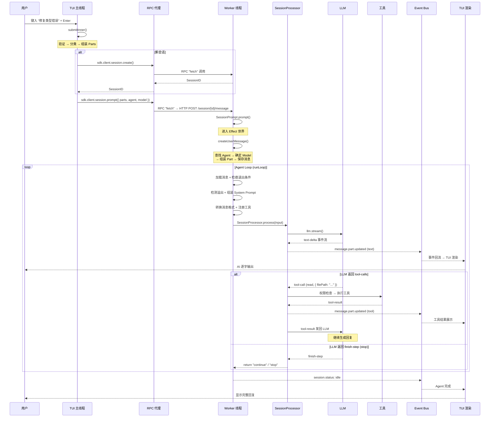

# 第 17 章：TUI 输入到 Agent 响应的完整调用链

> **本章目标**：串联前 16 章的所有知识点，追踪从用户在终端按下回车到 AI 流式响应逐字出现在屏幕上的完整链路——跨越主线程与 Worker 线程，涉及 RPC 通信、SDK 调用、Session 管理、Effect-TS 运行时、LLM 流式通信和 TUI 事件消费。
> **涉及文件**：15+ 个关键文件（详见 17.6 文件索引）
> **必备知识**：前 16 章的全部内容（Effect-TS 基础、Session 系统、Agent 循环、工具调用、事件驱动、并发控制）

---

## 17.1 场景概述

这是 opencode 中最完整的端到端流程。用户在终端界面（TUI）的 Prompt 输入框中键入"帮我修复 src/auth 下的类型错误"，按下回车。几秒后，AI 的回复开始逐字出现在屏幕上——它可能先读取几个文件，然后搜索相关代码，最后给出修复方案。

这短短几秒内发生了什么？整个流程跨越两个线程、经过 15+ 个关键文件、触发了本书前 16 章讨论的几乎所有 Effect-TS 机制。理解这个流程，等于把前 16 章的知识点串联成一张完整的"全景图"。

本章按时间顺序追踪五个阶段：键盘输入 → 跨线程 RPC → Worker 内部 Agent 循环 → 工具执行 → 事件回流渲染。

---

## 17.2 阶段一：用户在 TUI 中输入并按下回车

### 发生了什么

用户在 Prompt 输入框中键入指令，按下 Enter。TUI 的 Prompt 组件捕获这个事件，执行 `submit()` → `submitInner()`。

### 关键代码路径

**文件**：`cli/cmd/tui/component/prompt/index.tsx` — `submitInner()` 函数

这个函数是 TUI 输入的分发中枢，按顺序执行十个步骤：

1. **防重复提交**：`submitting` 标志位防止用户快速连按回车导致重复请求
2. **IME 输入同步**：处理韩文、中文等组合字符——`input.plainText` 可能滞后于屏幕显示，需要同步
3. **状态验证**：检查输入框是否被禁用、输入是否为空、Agent 是否已选定
4. **特殊命令识别**：`exit`、`quit`、`:q` 直接退出，不走 AI 流程
5. **Workspace 状态检查**：确保当前项目目录可用
6. **Session 确定**：有 `sessionID` → 复用已有会话；无 `sessionID` → 调用 `sdk.client.session.create()` 创建新会话
7. **模式分发**：
   - Shell 模式 → `sdk.client.session.shell()`（直接执行命令）
   - 斜杠命令（以 `/` 开头）→ `sdk.client.session.command()`（路由到 `/compact`、`/agent` 等命令处理器）
   - 普通文本 → `sdk.client.session.prompt()`（发送给 AI）
8. **组装 Parts**：将编辑器选中内容、用户输入文本、文件引用等组装为 `parts` 数组
9. **发送请求**：通过 SDK → RPC 代理 → Worker 线程
10. **清空输入框 + 导航**：清空 Prompt，路由跳转到 Session 页面

### 自然语言小结

`submitInner` 做的事情可以概括为：**验证 → 分类 → 发送**。它不执行任何 AI 逻辑——只是判断用户意图（是命令还是对话？是新会话还是继续？），然后通过 SDK 将请求转发给 Worker 线程。

---

## 17.3 阶段二：SDK → RPC → Worker 线程

### 发生了什么

主线程中的 `sdk.client.session.prompt()` 调用最终需要发起 HTTP 请求（`POST /session/{id}/message`）。但主线程不直接执行 HTTP 请求——opencode 使用了一种巧妙的**RPC 代理**机制。

### 关键代码路径

**文件**：`cli/cmd/tui/thread.ts` — `createWorkerFetch()`

```typescript
function createWorkerFetch(client: RpcClient): typeof fetch {
  return async (input, init) => {
    const request = new Request(input, init)
    const body = request.body ? await request.text() : undefined
    const result = await client.call("fetch", {
      url: request.url,
      method: request.method,
      headers: Object.fromEntries(request.headers.entries()),
      body,
    })
    return new Response(result.body, {
      status: result.status,
      headers: result.headers,
    })
  }
}
```

这段代码将全局 `fetch` 函数替换为 RPC 代理：每个 HTTP 请求被序列化为 JSON，通过 `client.call("fetch", {...})` 发送给 Worker 线程。Worker 线程中的 `Rpc.server` 收到调用后，执行实际的 HTTP 请求，将结果序列化返回。

### 为什么需要 RPC 代理？

TUI 主线程负责 UI 渲染（React/Ink 组件树），Worker 线程负责所有后端逻辑（HTTP 服务端 + Effect 运行时 + LLM 通信）。RPC 代理让主线程可以"像调用本地函数一样"调用 Worker 线程的能力，同时保持两个线程的职责分离。

### Worker 线程收到请求后

```
Worker 线程:
  Rpc.server 处理 "fetch" 调用
    → 执行实际 HTTP 请求 (http://localhost:4096 POST /session/{id}/message)
      → server/routes/.../session.ts (路由匹配)
        → session/prompt.ts::SessionPrompt.prompt()
          → 进入 Effect 世界!
```

从 `SessionPrompt.prompt()` 开始，整个流程进入 Effect-TS 的管辖范围——后续所有操作都在 Effect Runtime 中执行。

---

## 17.4 阶段三：Worker 内部的 Agent 运行循环

这是整个流程的核心——Worker 线程内部的完整 Effect 链。它分为两个子阶段：消息创建和 Agent 循环。

### 子阶段 3a：createUserMessage（消息创建）

**文件**：`session/prompt.ts` — `createUserMessage()`

```
Effect.gen(function* () {
  // ① 查找 Agent
  const agent = yield* Agent.Service.get(agentName)

  // ② 确定 Model
  const model = yield* Provider.Service.getModel(providerID, modelID)

  // ③ 组装 Part（逐条解析用户输入）
  for (const part of input.parts) {
    if (part.type === "text") → TextPart
    if (part.type === "file") → 读取文件内容 (Read tool)
    if (part.type === "agent") → AgentPart + 提示词注入
  }

  // ④ 保存消息到数据库
  yield* Session.updateMessage(messageID, parts)

  // ⑤ 发布事件
  yield* Bus.publish(AgentSwitched, { agent: agent.name })
  yield* Bus.publish(ModelSwitched, { model: model.id })
})
```

这个阶段将用户的原始输入转化为结构化的消息对象，持久化到 SQLite，并通知 UI "Agent 和 Model 已确定"。

### 子阶段 3b：runLoop（Agent 主循环）

**文件**：`session/prompt.ts` — `runLoop()`

这是全书最重要的代码——Agent 的主循环。它在一个 `while (true)` 中反复执行以下步骤：

```
╔═══════ 每一轮 Step ═══════════════════════════════════════╗
║                                                             ║
║  ① 加载消息 (filterCompactedEffect)                         ║
║     → 过滤已被压缩的消息，只保留活跃消息                      ║
║                                                             ║
║  ② 检查退出条件                                              ║
║     → lastAssistant.finish? → break (退出循环)               ║
║                                                             ║
║  ③ 检测上下文溢出                                            ║
║     → compaction.isOverflow(tokens, model)                  ║
║     → 溢出 → 触发 Compaction → 重新开始 Step                 ║
║                                                             ║
║  ④ 组装 System Prompt                                        ║
║     → Effect.all([environment, instructions, skills])       ║
║     → 并行获取环境信息、用户指令、技能列表                     ║
║                                                             ║
║  ⑤ 转换消息格式                                              ║
║     → toModelMessagesEffect()                               ║
║     → 将内部消息格式转为 LLM 提供商要求的格式                  ║
║                                                             ║
║  ⑥ 注册工具                                                  ║
║     → resolveTools(agent, provider)                         ║
║     → 根据 Agent 权限和提供商能力过滤可用工具                  ║
║                                                             ║
║  ⑦ 创建 Processor Handle                                     ║
║     → SessionProcessor.process(input)                       ║
║                                                             ║
║  ⑧ 调用 LLM ────→ 进入阶段四的流处理                         ║
║     → provider/transform.ts::message()                      ║
║     → session/llm.ts::stream()                              ║
║     → AI SDK streamText() → SSE 流                          ║
║     → protocols/anthropic-messages.ts (SSE 解析)            ║
║                                                             ║
║  ⑨ LLM 返回 text-delta → 实时发布 Part 更新事件               ║
║     → 这些事件通过 Bus → sync → Worker → RPC → 主线程        ║
║     → TUI 实时渲染 AI 逐字输出!                               ║
║                                                             ║
║  ⑩ finish_reason = "stop" → break (退出循环)                ║
║     finish_reason = "tool_calls" → 进入阶段五 → 回到 ①       ║
║                                                             ║
╚══════════════════════════════════════════════════════════════╝
```

循环退出后：
- `compaction.prune()` — 后台清理被压缩的消息
- `lastAssistant` — 返回最终 AI 消息
- 发布 `session.status: idle` — 通知 UI "Agent 已完成"

---

## 17.5 阶段四：LLM 流处理（在阶段三的步骤⑧中触发）

这个阶段在第 4 章已详细展开，此处简要概括其在完整链路中的位置：

```
SessionProcessor.process(input)
  → llm.stream(streamInput)
    → Stream.fromAsyncIterable(AI SDK fullStream)
    → Stream.scoped (AbortController 生命周期)
    → Stream.tap(handleEvent)    ← 每个事件分发处理
    → Stream.takeUntil(needsCompaction) ← 溢出提前终止
    → Stream.runDrain            ← 消费整个流
```

`handleEvent` 处理 16 种 LLM 事件类型。其中最关键的是：

- **text-delta** → `Session.updatePartDelta()` → 增量更新消息文本 → 发布 `message.part.updated` 事件 → TUI 实时渲染
- **tool-call** → 进入阶段五（工具执行）
- **finish-step** → 累加 token 用量 → 检查溢出

整个流处理管道被五层 Effect 修饰器包裹：`onInterrupt` → `catchCauseIf` → `retry` → `catch` → `ensuring`。

---

## 17.6 阶段五：工具执行（当 LLM 返回 tool-calls 时）

当 LLM 的 `finish_reason` 为 `"tool_calls"` 时，Agent 循环进入工具执行阶段：

```
① 权限检查 → permission/index.ts::ask()
   · 评估规则 → allow/deny/ask
   · 需要用户确认 → 发布 permission.asked 事件
   · 主线程展示权限对话框 → 用户选择 → permission.reply()
   · Deferred 等待 → 用户回复后继续

② 参数解码 → packages/llm/src/tool-runtime.ts::decodeAndExecute()
   · tool._decode(args) → Schema.decodeUnknownEffect → 类型安全输入

③ 工具执行 → tool/*.ts::execute()
   · 例如 Edit 工具: 读取文件 → 定位 old_string → 替换 → 写入 → 记录快照

④ 结果编码 → tool._encode(result) → JSON

⑤ 输出截断 → tool/truncate.ts::output()
   · 超过 TOOL_OUTPUT_MAX_CHARS 的输出被截断

⑥ 状态更新 → ToolPart: running → completed
   · 发布 message.part.updated 事件 → TUI 实时展示工具结果

⑦ 结果注入 → tool_result 消息追加到对话历史
   · 回到 runLoop ① (下一轮 Step)
```

工具执行完成后，Agent 循环回到步骤①——LLM 看到工具结果，决定下一步是继续生成文本、调用更多工具、还是结束回复。

---

## 17.7 阶段六：事件回流 → TUI 实时渲染

Worker 线程中产生的所有事件（text-delta、tool-call 结果、状态变化）如何回到主线程的 TUI 界面？

### 事件回流路径

```
Worker 线程:
  SessionProcessor → Bus.publish(event)
    → EventV2Bridge → EventV2.publish(event)
      → sync handler (审计日志写入 SQLite)
      → GlobalBus.emit(event)  ← Node EventEmitter
        → RPC 推送 → 主线程 EventSource 接收

主线程:
  cli/cmd/tui/context/sync.tsx:
    event.subscribe() → Stream<Event>
      → 更新 SolidJS store
        → React/Ink 组件树响应式重渲染
```

### TUI 对不同事件的渲染方式

| 事件类型 | 渲染方式 |
|----------|----------|
| `message.part.updated` (text, time.end 存在) | 文本逐字输出到消息时间线 |
| `message.part.updated` (reasoning, time.end 存在) | 斜体灰色展示 "Thinking: ..." |
| `message.part.updated` (tool, status=completed) | 工具内联展示：图标 + 标题 + 耗时 |
| `message.part.updated` (tool, status=error) | ✗ 错误展示 |
| `message.part.updated` (tool=tasks, status=running) | 子任务展示 |
| `message.part.updated` (step-start / step-finish) | Footer 状态栏更新 |
| `session.status` (type="busy") | Agent 正在处理 |
| `session.status` (type="idle") | Agent 循环结束，退出事件循环 |
| `session.error` | 收集错误信息 → `UI.error(err)` |
| `permission.asked` | 展示权限请求 → 用户选择 → `client.permission.reply()` |

---

## 17.8 Effect-TS 函数详解

本章串联了前 16 章的所有 Effect 机制。以下是全链路中每个阶段触发的关键 Effect 函数：

### 阶段一（TUI 输入）：无直接 Effect 触发

TUI 输入处理是纯 Promise/回调代码，不涉及 Effect。Effect 世界从阶段二的 Worker 线程开始。

### 阶段二（RPC → Worker）：Runtime 启动

- **`ManagedRuntime.make`**（第 2 章）— Worker 启动时从 `AppLayer` 创建 Runtime
- **`Effect.runPromise`**（第 1 章）— 所有 HTTP Handler 通过 `runtime.runPromise()` 执行

### 阶段三（Agent 循环）：核心 Effect 编排

- **`Effect.gen`**（第 1 章）— `createUserMessage` 和 `runLoop` 都是巨大的 `Effect.gen` 块
- **`Effect.all({ concurrency: "unbounded" })`**（第 4 章）— 并行获取 environment、instructions、skills
- **`Effect.forEach`**（第 5 章）— 并行初始化工具定义
- **`Effect.forkIn`**（第 6、14 章）— 后台任务（摘要生成、定期清理）
- **`Latch`**（第 14 章）— 同步多个 Fiber 的启动
- **`Effect.onInterrupt`**（第 6 章）— 用户取消时的清理

### 阶段四（LLM 流处理）：Stream 操作符

- **`Stream.fromAsyncIterable`**（第 4 章）— AI SDK 异步迭代器 → Effect Stream
- **`Stream.tap`**（第 4 章）— 对每个事件执行 `handleEvent`
- **`Stream.takeUntil`**（第 4 章）— 溢出时提前终止
- **`Stream.runDrain`**（第 4 章）— 消费整个流
- **`Stream.scoped`**（第 4 章）— AbortController 生命周期管理
- **`Effect.retry`**（第 11 章）— `SessionRetry.policy` 重试策略
- **`Effect.catchCauseIf`**（第 13 章）— 区分中断和真实错误
- **`Effect.ensuring`**（第 6 章）— 清理 toolcall Deferred

### 阶段五（工具执行）：权限 + Schema + 快照

- **`Deferred`**（第 12 章）— 权限请求-回复模式
- **`Schema.decodeUnknownEffect`**（第 5 章）— 工具参数验证
- **`Effect.withSpan`**（第 5 章）— 工具执行追踪
- **`Effect.acquireRelease`**（第 9、13 章）— Git 子进程管理
- **`Semaphore`**（第 14 章）— Git 操作序列化
- **`Snapshot.track`**（第 13 章）— 文件快照

### 阶段六（事件回流）：PubSub + Stream

- **`PubSub.publish`**（第 15 章）— 事件发布
- **`PubSub.subscribe`**（第 15 章）— 事件订阅
- **`Stream.fromPubSub`**（第 15 章）— PubSub → Stream
- **`Stream.runForEach`**（第 15 章）— 消费事件流
- **`Effect.forkScoped`**（第 14、15 章）— 后台订阅处理器

---

## 17.9 时序图：完整端到端流程



---

## 17.10 涉及的关键文件索引

| 阶段 | 文件 | 核心函数 | 线程 |
|------|------|---------|------|
| 输入捕获 | `cli/cmd/tui/component/prompt/index.tsx` | `submit()`, `submitInner()` | 主线程 |
| SDK 调用 | `packages/sdk/js/src/v2/gen/sdk.gen.ts` | `session.prompt()` | 主线程 |
| RPC 代理 | `cli/cmd/tui/thread.ts` | `createWorkerFetch()` | 主线程 |
| RPC 处理 | `cli/cmd/tui/worker.ts` | `Rpc.server()` | Worker |
| HTTP 路由 | `server/routes/instance/httpapi/handlers/session.ts` | Handler | Worker |
| 会话 Prompt | `session/prompt.ts` | `prompt()`, `runLoop()` | Worker |
| LLM 通信 | `session/llm.ts`, `provider/transform.ts` | `stream()`, `message()` | Worker |
| 协议解析 | `packages/llm/src/protocols/anthropic-messages.ts` | SSE 流式解析 | Worker |
| 事件处理 | `session/processor.ts` | `process()` | Worker |
| 工具执行 | `tool/*.ts`, `packages/llm/src/tool-runtime.ts` | `execute()`, `decodeAndExecute()` | Worker |
| 事件持久化 | `sync/index.ts` | Projector | Worker |
| 事件推送 | `bus/index.ts` → `GlobalBus` → RPC | `publish()` | Worker |
| TUI 事件消费 | `cli/cmd/tui/context/sync.tsx` | `event.subscribe()` | 主线程 |
| CLI 事件消费 | `cli/cmd/run.ts` | `loop()` | 主线程 |
| UI 渲染 | `cli/cmd/tui/routes/session/index.tsx` | React/Ink 组件树 | 主线程 |

---

## 17.11 开发人员必备知识与技能

1. **双线程架构理解** — opencode 的主线程（TUI 渲染）和 Worker 线程（后端逻辑）通过 RPC 通信。理解这种架构有助于调试跨线程问题（如事件延迟、状态不同步）。关键点：主线程不执行任何 Effect 代码——所有 Effect 操作都在 Worker 线程的 Runtime 中。

2. **端到端追踪能力** — 当出现问题时，能够从用户操作一路追踪到根因。追踪路径：用户输入 → `submitInner` 分发 → RPC 调用 → HTTP 路由 → `SessionPrompt.prompt()` → `runLoop` → `processor.process()` → `llm.stream()` → 具体的事件处理函数。OpenTelemetry span（`Effect.fn` + `Effect.withSpan`）让这条路径可视化。

3. **事件回流机制** — Worker 产生的事件如何到达主线程？路径是：`Bus.publish` → `EventV2Bridge` → `EventV2.publish` → `GlobalBus.emit` → RPC 推送 → 主线程 `EventSource` → SolidJS store → React/Ink 重渲染。理解这条路径是调试 UI 不更新问题的关键。

4. **全链路 Effect 触发点** — 本章是前 16 章的"实战串联"。建议在阅读前 16 章后回到本章，对照每个阶段的 Effect 函数列表，在源码中找到对应的 `yield*` 调用点——这能帮助建立"源码 → 概念"的映射。

---

## 17.12 本章小结

从用户在 TUI 中按下回车到 AI 响应逐字出现在屏幕上，整个流程跨越两个线程、经过 15+ 个关键文件、触发了前 16 章讨论的几乎所有 Effect-TS 机制：

1. **主线程**：Prompt 组件捕获输入 → SDK 调用 → RPC 代理转发到 Worker
2. **Worker 线程**：HTTP 路由 → `SessionPrompt.prompt()` → `createUserMessage()` → `runLoop()` → LLM 流式调用 → 工具执行 → 事件发布
3. **事件回流**：Worker 的事件通过 `Bus` → `EventV2Bridge` → `GlobalBus` → RPC → 主线程 TUI 渲染

整个过程是异步流式的——AI 每生成几个字，事件就推送到主线程，UI 立即更新。这种"边说边显示"的体验正是由 Effect-TS 的 `Stream` 和 opencode 的双线程 RPC 架构共同实现的。

理解这个流程，等于掌握了 opencode 的"全景图"——前 16 章的每个知识点都在这个链路中有其确切的位置。
